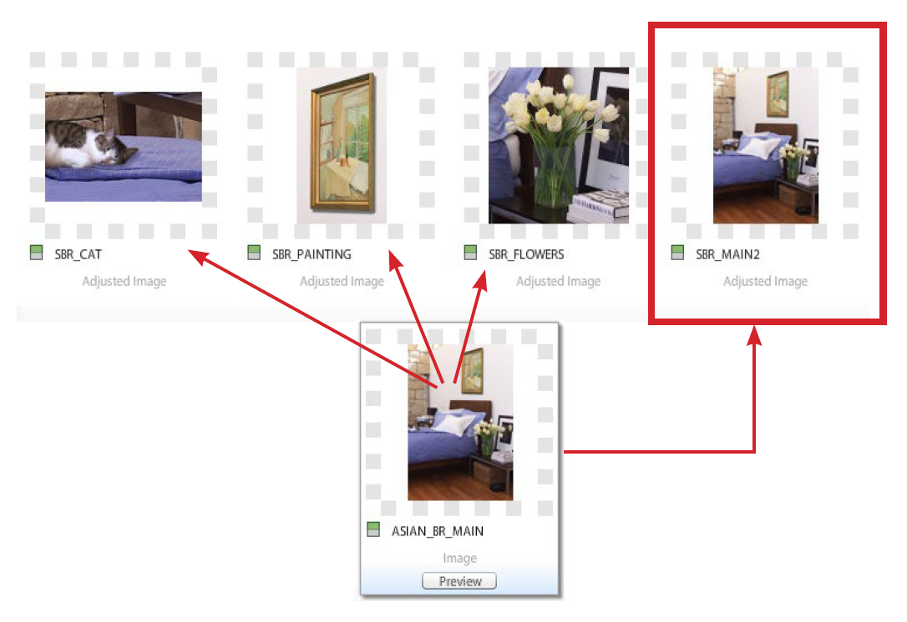

# Ritaglio, immagini regolate e destinazioni di zoom {#crop-adjusted-zoom-targets}

Uno dei punti di forza principali del concetto di immagine principale di Dynamic Media Classic è la possibilità di riutilizzare la risorsa immagine per molti utilizzi. In genere, per visualizzare i dettagli o i campioni è necessario creare versioni separate e ritagliate di ogni immagine. Quando si utilizza Dynamic Media Classic, è possibile eseguire le stesse attività sul singolo master e salvare le versioni ritagliate come nuovi file fisici o come derivati virtuali che non occupano spazio di archiviazione.

Entro la fine di questa sezione dell’esercitazione saprai come:

- Ritagliare le immagini in Dynamic Media Classic e salvarle come nuovi file master o come immagini virtuali. [Ulteriori informazioni](https://experienceleague.adobe.com/docs/dynamic-media-classic/using/master-files/cropping-image.html?lang=it).
- Salvate le immagini regolate virtuali e utilizzatele al posto delle risorse principali. [Ulteriori informazioni](https://experienceleague.adobe.com/docs/dynamic-media-classic/using/master-files/adjusting-image.html?lang=it).
- Crea destinazioni di zoom sulle immagini per evidenziarle. [Ulteriori informazioni](https://experienceleague.adobe.com/docs/dynamic-media-classic/using/zoom/creating-zoom-targets-guided-zoom.html?lang=it).

## Ritaglio

Dynamic Media Classic dispone di alcuni strumenti di modifica delle immagini convenientemente disponibili nell’interfaccia utente, tra cui lo strumento di ritaglio. È possibile ritagliare l&#39;immagine master in Dynamic Media Classic per diversi motivi. Ad esempio:

- Non si dispone dell&#39;accesso al file originale. Si desidera visualizzare l&#39;immagine con un ritaglio o proporzioni diverse, ma non si dispone del file originale sul computer o si lavora da casa. In questo caso puoi accedere a Dynamic Media Classic, trovare l’immagine, ritagliarla e salvarla, oppure salvarla come nuova versione.
- Per rimuovere lo spazio vuoto in eccesso. L&#39;immagine è stata fotografata con troppo spazio bianco, il che rende il prodotto piccolo. Desideri che le immagini in miniatura riempiscano il più possibile l’area di lavoro.
- Per creare immagini regolate, copie virtuali delle immagini che non occupano spazio su disco. Alcune aziende hanno regole di business che richiedono di tenere copie separate della stessa immagine, ma con un nome diverso. Oppure potresti volere una versione ritagliata e non ritagliata della stessa immagine.
- Per creare nuove immagini da un&#39;immagine di origine. Ad esempio, potrebbe essere utile creare dei campioni di colore o un dettaglio dell&#39;immagine principale. Puoi eseguire questa operazione in Adobe Photoshop e caricarla separatamente o utilizzare lo strumento Ritaglio in Dynamic Media Classic.

>[!NOTE]
>
>Tutti gli URL nelle seguenti discussioni di ritaglio sono solo a scopo illustrativo; non sono collegamenti live.

### Utilizzo dello strumento di ritaglio

Puoi accedere allo strumento di ritaglio in Dynamic Media Classic dalla pagina Dettagli di una risorsa o facendo clic sul pulsante **Modifica**. È possibile utilizzare lo strumento per ritagliare in due modi:

- Modalità di ritaglio predefinita in cui vengono trascinati i quadratini di ridimensionamento della finestra di ritaglio o i valori nella casella Dimensione. Scopri come [Ritagliare manualmente](https://experienceleague.adobe.com/docs/dynamic-media-classic/using/master-files/cropping-image.html?lang=it#select-an-area-to-crop).
- Rifila. Usate questa opzione per rimuovere spazio vuoto aggiuntivo attorno all&#39;immagine calcolando il numero di pixel che non corrispondono all&#39;immagine. Scopri come [Ritagliare tramite Trimming](https://experienceleague.adobe.com/docs/dynamic-media-classic/using/master-files/cropping-image.html?lang=it#crop-to-remove-white-space-around-an-image).

### _Ritaglio manuale_

Quando salvi una versione ritagliata manualmente, l’immagine viene ritagliata in modo permanente; Dynamic Media Classic nasconde effettivamente i pixel aggiungendo un modificatore URL interno per ritagliare l’immagine. Durante la pubblicazione, tutti saranno informati che l’immagine è stata ritagliata. Tuttavia, puoi tornare all’Editor ritagli e rimuovere il ritaglio in un secondo momento.

È quindi possibile scegliere se salvare come nuova immagine principale o come visualizzazione aggiuntiva del master. Un nuovo master è un nuovo file fisico, ad esempio un TIFF o un JPEG, che occupa spazio di archiviazione. Una visualizzazione aggiuntiva è un&#39;immagine virtuale che non occupa spazio sul server. Non è consigliabile scegliere Sostituisci originale, in quanto sovrascriverà il master e renderà il ritaglio permanente. Se si salva come nuovo master o come visualizzazione aggiuntiva, è necessario scegliere un nuovo ID risorsa. Come altri ID risorsa, deve essere un nome univoco in Dynamic Media Classic.

### _Ritaglio ritaglio_

Se carichi un’immagine con troppo spazio vuoto (area di lavoro aggiuntiva) intorno al soggetto principale, quando viene ridimensionata sul web risulterà molto più piccola. Questo è particolarmente vero per le immagini in miniatura che sono di 150 pixel o più piccole — il soggetto della foto può perdersi in tutto lo spazio extra intorno ad essa.

Confrontare queste due versioni della stessa immagine.

L&#39;immagine sulla destra è resa molto più evidente rimuovendo lo spazio aggiuntivo intorno al prodotto. Il taglio può essere eseguito una immagine alla volta, utilizzando lo strumento Ritaglio, oppure come processo batch durante il caricamento. È consigliabile eseguire come processo batch se si desidera che tutte le immagini vengano ritagliate in modo coerente fino ai limiti dell&#39;oggetto principale. Ritaglia ritaglio fino al riquadro di delimitazione, ovvero il rettangolo che circonda l&#39;immagine.

>[!NOTE]
>
>Il ritaglio non crea trasparenza intorno all&#39;immagine. A tale scopo, è necessario incorporare un percorso di ritaglio nell&#39;immagine e utilizzare l&#39;opzione di caricamento **Crea maschera da percorso clip**.
>
>Inoltre, per ripristinare lo stato originale di un&#39;immagine dopo averla ritagliata dopo aver utilizzato l&#39;opzione **Salva**, visualizzare l&#39;immagine nella schermata Editor di ritaglio e selezionare il pulsante **Ripristina**.

### _Ritaglio al caricamento_

Come accennato in precedenza, puoi anche scegliere di ritagliare le immagini durante il caricamento. Per utilizzare il ritaglio di ritaglio durante il caricamento, fare clic sul pulsante **Opzioni processo** e in Opzioni ritaglio scegliere **Ritaglia**.

Dynamic Media Classic ricorderà questa opzione per il prossimo caricamento. Puoi ritagliare le immagini per questo caricamento, ma non per ogni caricamento. Un’altra opzione consiste nell’impostare un processo di caricamento FTP pianificato speciale e nell’inserire le opzioni di ritaglio. In questo modo, il processo viene eseguito solo quando è necessario ritagliare le immagini.

>[!IMPORTANT]
>
>Se imposti un ritaglio per il caricamento, Dynamic Media Classic inserirà un cookie per ricordare tale impostazione per la prossima volta. Come best practice, fai clic sul pulsante **Ripristina impostazioni predefinite società** prima del prossimo caricamento per cancellare le opzioni di ritaglio rimaste dall&#39;ultimo caricamento; in caso contrario, potresti ritagliare accidentalmente il prossimo batch di immagini.

### Ritaglio per URL

Anche se non è ovvio in Dynamic Media Classic, puoi anche ritagliare puramente tramite l’URL (o persino aggiungere il ritaglio a un predefinito immagine).

Ogni volta che si utilizza lo strumento Ritaglio, i valori URL vengono visualizzati nel campo in basso. Puoi prendere questi valori e applicarli direttamente a un’immagine come modificatori URL.

_Modificatori dei comandi di ritaglio nella parte inferiore dell&#39;editor di ritaglio_

Poiché la dimensione deve essere calcolata in base all’immagine quando utilizzi il ritaglio mediante il ritaglio, non può essere automatizzata tramite l’URL. Il ritaglio può essere eseguito solo al caricamento o applicando un’immagine alla volta.

### _Ritaglio nel predefinito immagine_

I predefiniti per immagini dispongono di un campo in cui è possibile aggiungere ulteriori comandi Image Server. Per aggiungere lo stesso ritaglio di cui sopra al predefinito immagine, modifica il predefinito e incolla o digita i valori nel campo Modificatori URL, quindi salva e pubblica.

_Aggiungere comandi di ritaglio (o qualsiasi comando) ai modificatori URL del predefinito immagine._

Il ritaglio farà ora parte di tale predefinito immagine e verrà applicato automaticamente ogni volta che viene utilizzato. Naturalmente, questo metodo dipende da tutte le immagini che richiedono la stessa quantità di ritaglio. Se le tue immagini non vengono tutte scattate nello stesso modo, questo metodo non funzionerebbe per te.

## Immagini regolate

Quando si utilizza lo strumento di ritaglio, è possibile scegliere di **salvare come visualizzazione aggiuntiva del master**. Una volta salvata, viene creato un nuovo tipo di risorsa Dynamic Media Classic, un&#39;immagine regolata. Un&#39;immagine regolata, detta anche derivata, è un&#39;immagine virtuale. Non si tratta in realtà di un&#39;immagine, ma di un riferimento al database, ad esempio un alias o un collegamento, all&#39;immagine master fisica.

### L&#39;immagine reale si alzerà`?`

Sapete qual è il master e quale è l&#39;immagine regolata?

Non dovresti essere in grado di distinguere senza guardare in Dynamic Media Classic e vedere il tipo di risorsa &quot;Immagine regolata&quot; per SBR_MAIN2.

Un&#39;immagine regolata non utilizza spazio su disco, in quanto esiste solo come riga nel database. È inoltre legato in modo permanente alla risorsa originale; se l’originale viene eliminato, viene eliminata anche l’Immagine modificata. Può essere costituita da un&#39;immagine intera e non ritagliata oppure solo da una parte di un&#39;immagine (un ritaglio).

Le immagini regolate vengono in genere create con lo strumento Ritaglio, ma possono essere create anche con gli altri editor di immagini, ovvero gli strumenti Regola e Contrasta.

Le immagini regolate richiedono un ID risorsa univoco. Quando vengono pubblicate (è necessario pubblicarle come qualsiasi altra risorsa), agiscono come qualsiasi altra immagine e vengono richiamate su un URL dal relativo ID risorsa. Nella pagina Dettagli puoi visualizzare le immagini regolate associate a un&#39;immagine principale nella scheda **Generato e derivati**.

_Viste regolate per l&#39;immagine principale ASIAN_BR_MAIN_

## Destinazioni di zoom

Le destinazioni di zoom si trovano anche nel menu **Modifica** e nella pagina **Dettagli** di un&#39;immagine. Consentono di impostare le &quot;aree calde&quot; per evidenziare specifiche funzioni di merchandising di un&#39;immagine zoom. Invece di creare immagini separate ritagliando un master di grandi dimensioni, il visualizzatore zoom può visualizzare i dettagli sopra l’immagine, insieme a una breve etichetta creata.

Poiché gli obiettivi di zoom sono essenzialmente una funzione di merchandising e richiedono la conoscenza dei punti di vendita di un prodotto, in genere vengono creati da una persona nel team Merchandising o Prodotto di un’azienda.

Il processo è molto semplice: fai clic sulla funzione, assegna un nome descrittivo e salva. I target possono essere copiati da un&#39;immagine all&#39;altra se sono simili, tuttavia il processo è manuale. In Dynamic Media Classic non è possibile automatizzare la creazione di destinazioni di zoom, in quanto ogni immagine è diversa e presenta caratteristiche diverse.

Un altro fattore nel decidere se utilizzare Zoom Target è la scelta del visualizzatore. Non tutti i tipi di visualizzatore possono visualizzare Destinazioni di zoom (ad esempio, il visualizzatore a comparsa non li supporta).

Scopri come [creare destinazioni di zoom](https://experienceleague.adobe.com/docs/dynamic-media-classic/using/zoom/creating-zoom-targets-guided-zoom.html?lang=it#creating-and-editing-zoom-targets).

### Utilizzo dello strumento Destinazione zoom

Questo è il flusso di lavoro per la creazione di destinazioni in Dynamic Media Classic.

1. Individua l&#39;immagine, fai clic sul pulsante **Modifica** e scegli **Destinazioni zoom**.
2. Verrà caricato l’Editor destinazione di zoom. L’immagine è visibile al centro, alcuni pulsanti nella parte superiore e un pannello di destinazione vuoto a destra. In basso a sinistra è selezionato un predefinito visualizzatore. L&#39;impostazione predefinita è &quot;Zoom1-Guidato&quot;.
3. Spostare la casella rossa con il mouse e fare clic per creare una nuova destinazione.

   - La casella rossa è l&#39;area di destinazione. Quando un utente fa clic su tale destinazione, questa si ingrandisce fino all’area all’interno della casella.
   - La dimensione di destinazione è determinata dalla dimensione di visualizzazione all&#39;interno del predefinito visualizzatore. Questo determina le dimensioni dell&#39;immagine di zoom principale. Vedere _Impostazione della dimensione di visualizzazione_, di seguito.

4. Il target appena creato diventa blu e sulla destra vengono visualizzate una versione in miniatura del target e il nome predefinito &quot;target-0&quot;.
5. Per rinominare la destinazione, fai clic sulla miniatura, digita un nuovo **Nome** e fai clic su **Invio** o **Scheda**. Se fai clic in un secondo momento, il tuo nome non verrà salvato.
6. Quando la destinazione è selezionata, la casella è circondata da linee tratteggiate verdi ed è possibile ridimensionarla e spostarla. Trascinate gli angoli per ridimensionare o trascinate la casella di destinazione per spostarla.

   - L&#39;immagine verrà caricata nel visualizzatore zoom personalizzato predefinito. Assicurati che il predefinito visualizzatore supporti le destinazioni di zoom: in generale, tutti i predefiniti standard con la parola &quot;Guidato&quot; sono stati progettati per essere utilizzati con le destinazioni di zoom. Per utilizzare le destinazioni, passa il cursore del mouse sulla miniatura di destinazione (o sull’icona del punto attivo) per visualizzare l’etichetta, quindi fai clic su di essa per visualizzare il visualizzatore che ingrandisce tale funzione.
   - Come per tutti gli altri lavori che esegui in Dynamic Media Classic, devi pubblicare per far sì che le destinazioni di zoom siano live sul web. Se utilizzi già un visualizzatore che supporta le destinazioni, queste verranno visualizzate immediatamente (una volta cancellata la cache). Tuttavia, se non utilizzi un visualizzatore abilitato per Zoom Target, questo rimarrà nascosto.

     

7. Inoltre, se devi rimuovere una destinazione, selezionala facendo clic sulla miniatura e premi il pulsante **Elimina destinazione** o premi il tasto DELETE sulla tastiera.
8. Continua a fare clic su per aggiungere nuove destinazioni, rinominare e/o ridimensionare dopo l’aggiunta.
9. Al termine, fare clic sul pulsante **Salva** e quindi su **Anteprima**.

### Impostazione delle dimensioni di visualizzazione nel predefinito visualizzatore zoom

Parliamo un momento da dove vengono le dimensioni delle destinazioni di zoom. All’interno del predefinito visualizzatore per il visualizzatore zoom è presente un’impostazione denominata dimensioni visualizzazione. La dimensione di visualizzazione è la dimensione dell&#39;immagine di zoom nel visualizzatore. È diverso dalle dimensioni dell’area di visualizzazione, che corrispondono alle dimensioni totali del visualizzatore, inclusi i componenti dell’interfaccia utente e il disegno.

Quando si crea una nuova destinazione, le dimensioni e le proporzioni derivano dalle dimensioni della vista. Ad esempio, se la dimensione di visualizzazione è 200 x 200, sarà possibile creare solo destinazioni quadrate con un&#39;area di zoom massima di 200 pixel. Le destinazioni possono essere più grandi di 200 pixel, ma sempre quadrate. ma questo significa anche che l&#39;immagine all&#39;interno del visualizzatore zoom è di soli 200 pixel — la dimensione del target zoom ha una relazione diretta con la dimensione del visualizzatore. In questo modo puoi decidere il design del visualizzatore prima di impostare i target.

Tuttavia, per impostazione predefinita le dimensioni della visualizzazione sono vuote (impostate su 0 x 0), poiché le dimensioni dell&#39;immagine della visualizzazione principale sono dinamiche e vengono derivate automaticamente in base alle dimensioni dell&#39;area di visualizzazione. Il problema è che se non impostate esplicitamente una dimensione di visualizzazione nel predefinito, lo strumento Destinazione zoom non saprà quale dimensione creare i target.

Quando caricate lo strumento Destinazione zoom, la dimensione della vista viene visualizzata accanto al nome del predefinito. Confrontare le dimensioni di visualizzazione tra il predefinito Zoom1-Guied incorporato e il predefinito ZT_AUTHORING personalizzato.

Potete vedere che il predefinito incorporato ha una dimensione di 900 x 550, il che significa che la destinazione non può mai ottenere più piccolo di quella piuttosto grande. Probabilmente è troppo grande — se avete un&#39;immagine di 2000 pixel, potete chiamare solo una caratteristica che è almeno di 900 pixel. L’utente può eseguire manualmente lo zoom avanti, ma non puoi guidarli più da vicino. Impostando una dimensione di visualizzazione a 350 x 350, le destinazioni possono ingrandirsi o ingrandirsi. Tuttavia, se nel visualizzatore desiderate un&#39;immagine con zoom più grande, dovete creare un nuovo predefinito perché il vostro è bloccato a 350 pixel.

### Creazione o modifica di un predefinito visualizzatore che supporta le destinazioni di zoom

Per impostare le dimensioni della visualizzazione, crea o modifica un predefinito visualizzatore che supporta le destinazioni di zoom.

1. Nel predefinito visualizzatore, vai all&#39;opzione **Impostazioni zoom**.
2. Impostate i valori di larghezza e altezza.
3. Salva il predefinito e chiudilo. Se desideri utilizzare questo predefinito sul sito live, dovrai pubblicare in seguito.
4. Passate allo strumento Destinazione zoom e scegliete il predefinito modificato in basso a sinistra. Vedrai immediatamente la nuova dimensione di visualizzazione riflessa nelle destinazioni.
