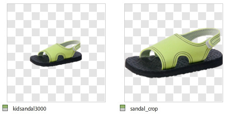
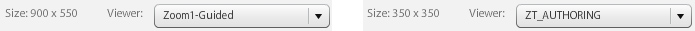

# Ritaglio, immagini regolate e destinazioni di zoom {#crop-adjusted-zoom-targets}

Uno dei punti di forza del concetto di immagine principale Dynamic Media Classic è che potete riadattare la risorsa immagine per molti usi. In genere, per visualizzare i dettagli o per i campioni è necessario creare versioni separate e ritagliate di ogni immagine. Quando utilizzate Dynamic Media Classic, potete eseguire le stesse operazioni sul singolo master e salvare le versioni ritagliate come nuovi file fisici o come derivati virtuali che non richiedono spazio di archiviazione.

Alla fine di questa sezione dell&#39;esercitazione potrai imparare a:

- Ritagliate le immagini in Dynamic Media Classic e salvatele come nuovi file principali o come immagini virtuali. [Per saperne di più](https://docs.adobe.com/help/en/dynamic-media-classic/using/master-files/cropping-image.html).
- Salvate le immagini virtuali regolate e utilizzatele al posto delle risorse principali. [Per saperne di più](https://docs.adobe.com/content/help/en/dynamic-media-classic/using/master-files/adjusting-image.html).
- Create destinazioni di zoom sulle immagini per visualizzarne le aree di luce. [Per saperne di più](https://docs.adobe.com/content/help/en/dynamic-media-classic/using/zoom/creating-zoom-targets-guided-zoom.html).

## Ritaglio

Dynamic Media Classic dispone di alcuni strumenti di modifica delle immagini disponibili comodamente nell’interfaccia utente, incluso lo strumento Ritaglio. È possibile ritagliare l’immagine principale in Dynamic Media Classic per diversi motivi. Esempio:

- Non hai accesso al file originale. Si desidera visualizzare l&#39;immagine con un ritaglio o proporzioni diversi, ma non si dispone del file originale sul computer o si sta lavorando da casa. In questo caso potete passare a Dynamic Media Classic, trovare l’immagine, ritagliarla e salvarla, oppure salvarla come nuova versione.
- Per rimuovere lo spazio bianco in eccesso. L&#39;immagine è stata fotografata con troppo spazio bianco, il che rende il prodotto troppo piccolo. Desiderate che le miniature riempiano il quadro il più possibile.
- Per creare immagini regolate, copie virtuali di immagini che non occupano spazio su disco. Alcune aziende hanno regole aziendali che impongono di conservare copie separate della stessa immagine, ma con un nome diverso. Oppure desiderate una versione ritagliata e non ritagliata della stessa immagine.
- Per creare nuove immagini da un’immagine sorgente. Ad esempio, potete creare campioni di colore o un dettaglio dell’immagine principale. Potete eseguire questa operazione in  Adobe Photoshop e caricarla separatamente oppure usare lo strumento Ritaglia in Dynamic Media Classic.

>[!NOTE]
>
>Tutti gli URL nelle seguenti discussioni sul ritaglio sono solo a scopo illustrativo; non sono collegamenti dinamici.

### Utilizzo dello strumento taglierina

Per accedere allo strumento Ritaglio in Dynamic Media Classic, dalla pagina Dettagli di una risorsa oppure fate clic sul pulsante **Modifica**. Potete usare lo strumento per ritagliare in due modi:

- Modalità di ritaglio predefinita in cui si trascinano le maniglie della finestra di ritaglio o i valori del tipo nella casella Dimensioni. Scopri come [Ritagliare manualmente](https://docs.adobe.com/content/help/en/dynamic-media-classic/using/master-files/cropping-image.html#select-an-area-to-crop).
- Rifila. Usate questa opzione per rimuovere spazi bianchi aggiuntivi intorno all’immagine calcolando il numero di pixel che non corrispondono all’immagine. Scoprite come [Ritagliare tagliando](https://docs.adobe.com/content/help/en/dynamic-media-classic/using/master-files/cropping-image.html#crop-to-remove-white-space-around-an-image).

### _Ritaglio manuale_

Quando salvate una versione ritagliata manualmente, l’immagine viene ritagliata in modo permanente; Dynamic Media Classic sta effettivamente nascondendo i pixel aggiungendo un modificatore URL interno per ritagliare l’immagine. Quando pubblicate, tutti vedranno che l’immagine viene ritagliata, ma potrete tornare all’Editor di ritaglio e rimuovere il ritaglio in un momento successivo.

Potete quindi scegliere se salvare come nuova immagine principale o come visualizzazione aggiuntiva del master. Un nuovo master è un nuovo file fisico (come TIFF o JPEG) che occupa spazio di archiviazione. Una visualizzazione aggiuntiva è un&#39;immagine virtuale che non occupa spazio sul server. Non è consigliabile scegliere Sostituisci originale, in quanto sovrascriverà il master e renderà il ritaglio permanente. Se salvate come nuovo elemento principale o come visualizzazione aggiuntiva, dovete scegliere un nuovo ID risorsa. Come per gli altri ID risorsa, questo deve essere un nome univoco in Dynamic Media Classic.

### _Ritaglio ritaglio_

Se caricate un’immagine con troppi spazi bianchi (area di lavoro extra) intorno al soggetto principale dell’immagine, questa verrà ridimensionata sul Web. Ciò è particolarmente vero per le miniature di immagini con un massimo di 150 pixel. il soggetto della foto potrebbe perdersi in tutto lo spazio extra intorno.

Confrontate queste due versioni della stessa immagine.

L&#39;immagine a destra è resa molto più evidente rimuovendo lo spazio aggiuntivo intorno al prodotto. Il ritaglio può essere eseguito una sola immagine alla volta, utilizzando lo strumento Ritaglio o come processo batch durante il caricamento. È consigliabile eseguire come processo batch se si desidera che tutte le immagini vengano ritagliate in modo coerente fino ai limiti dell&#39;oggetto principale. Ritagliare i ritagli fino al rettangolo di selezione — il rettangolo che circonda l’immagine.

>[!NOTE]
>
>L’opzione Rifila non crea trasparenza intorno all’immagine. A tal fine, è necessario incorporare un tracciato di ritaglio nell&#39;immagine e utilizzare l&#39;opzione di caricamento **Crea maschera da tracciato clip**.
>
>Inoltre, per ripristinare lo stato originale di un&#39;immagine dopo averla ritagliata quando è stata utilizzata l&#39;opzione **Salva**, visualizzate l&#39;immagine nella schermata Editor di ritaglio e fate clic sul pulsante **Ripristina**.

### _Ritaglio durante il caricamento_

Come già detto, potete anche scegliere di ritagliare le immagini mentre le caricate. Per utilizzare il ritaglio durante il caricamento, fate clic sul pulsante **Opzioni processo** e, in Opzioni di ritaglio, scegliete **Rifila**.

Dynamic Media Classic ricorda questa opzione per il caricamento successivo. Anche se desiderate ritagliare le immagini per questo caricamento, potreste non desiderare che vengano ritagliate per ogni caricamento. Un&#39;altra opzione consiste nell&#39;impostare uno speciale processo di caricamento FTP pianificato e inserire qui le opzioni di ritaglio. In questo modo, il processo viene eseguito solo quando è necessario ritagliare le immagini.

>[!IMPORTANT]
>
>Se impostate un ritaglio per il caricamento, Dynamic Media Classic inserirà un cookie per ricordare tale impostazione per la prossima volta. Come procedura ottimale, fate clic sul pulsante **Ripristina impostazioni predefinite società** prima del caricamento successivo per eliminare tutte le opzioni di ritaglio che restano dall&#39;ultimo caricamento; in caso contrario, è possibile ritagliare accidentalmente il successivo batch di immagini.

### Ritaglio per URL

Anche se non è ovvio in Dynamic Media Classic, potete ritagliare solo tramite l’URL (o persino aggiungere ritaglio a un predefinito per immagini).

Ogni volta che usate lo strumento Ritaglio, i valori URL vengono visualizzati nel campo in basso. Potete prendere questi valori e applicarli direttamente a un’immagine come modificatori URL.

_imageCrop nella parte inferiore dell’Editor di ritaglio_

Poiché le dimensioni devono essere calcolate in base alle singole immagini quando si utilizza il ritaglio mediante il ritaglio, non possono essere automatizzate tramite l’URL. Il ritaglio può essere eseguito solo al momento del caricamento o applicando un’immagine alla volta.

### _Ritaglio nel predefinito per immagini_

I predefiniti per immagini dispongono di un campo in cui potete aggiungere ulteriori comandi Image Server. Per aggiungere lo stesso ritaglio di cui sopra al predefinito per immagini, modificate il predefinito e incollate o digitate i valori nel campo Modificatori URL, quindi salvate e pubblicate.

_imageAggiungete i comandi di ritaglio (o qualsiasi comando) ai modificatori URL del predefinito per immagini._

Il ritaglio fa ora parte del predefinito per immagini e viene applicato automaticamente ogni volta che viene utilizzato. Naturalmente, questo metodo dipende da tutte le immagini che richiedono la stessa quantità di ritaglio. Se le immagini non vengono riprodotte nello stesso modo, questo metodo non funzionerebbe per voi.

## Immagini regolate

Quando si utilizza lo strumento Ritaglio, è possibile scegliere **Salva come visualizzazione aggiuntiva di Master**. Una volta salvati, verrà creato un nuovo tipo di risorsa Dynamic Media Classic — un’immagine regolata. Un’immagine regolata, detta anche derivata, è un’immagine virtuale. Non è affatto un&#39;immagine; è un riferimento al database (come un alias o una scelta rapida) all&#39;immagine principale fisica.

### L&#39;immagine vera si prega di alzarsi`?`

È possibile sapere qual è il master e quale è l&#39;immagine regolata?

Non si deve essere in grado di dirlo senza guardare in Dynamic Media Classic e vedere il tipo di risorsa &quot;Immagine regolata&quot; per SBR_MAIN2.

Un’immagine regolata non utilizza spazio su disco, poiché esiste solo come elemento di riga nel database. È inoltre legato in modo permanente all’attività originale; se l’originale viene eliminato, viene eliminata anche l’immagine regolata. Può essere costituita da un’intera immagine non ritagliata o solo da una parte di un’immagine (ritaglio).

Generalmente si creano immagini regolate con lo strumento taglierina; tuttavia possono essere creati anche con altri editor di immagini — gli strumenti Regola e Nitidezza.

Le immagini regolate richiedono un ID risorsa univoco. Quando pubblicati (è necessario pubblicare come qualsiasi altra risorsa), questi vengono utilizzati come qualsiasi altra immagine e vengono richiamati su un URL dal relativo ID risorsa. Nella pagina Dettagli, potete visualizzare le immagini regolate associate a un&#39;immagine principale nella scheda **Generate &amp; Derivatives**.

_imageVisualizzazioni regolate per l&#39;immagine principale ASIAN_BR_MAIN_

## Destinazioni di zoom

Le destinazioni di zoom sono disponibili anche nella pagina **Edit** e **Details** di un&#39;immagine. Consentono di impostare &quot;aree sensibili&quot; per evidenziare specifiche funzioni merchandising di un’immagine di zoom. Invece di creare immagini separate ritagliando una pagina master di grandi dimensioni, il visualizzatore zoom può fornire i dettagli sopra l’immagine, insieme a un’etichetta breve creata.

Poiché le destinazioni di zoom sono essenzialmente una funzione di merchandising e richiedono la conoscenza dei punti di vendita di un prodotto, in genere vengono create da una persona del team Merchandising o Product di una società.

Il processo è molto semplice — fate clic sulla feature, assegnatele un nome descrittivo e salvate. Le destinazioni possono essere copiate da un&#39;immagine all&#39;altra se sono simili, ma il processo è manuale. In Dynamic Media Classic non è possibile automatizzare la creazione di destinazioni di zoom, poiché ogni immagine è diversa e presenta funzioni diverse.

Un altro fattore per decidere se usare le destinazioni di zoom è la scelta del visualizzatore. Non tutti i tipi di visualizzatore possono visualizzare le destinazioni di zoom (ad esempio, il visualizzatore a comparsa non le supporta).

Scoprite come [Creare destinazioni di zoom](https://docs.adobe.com/content/help/en/dynamic-media-classic/using/zoom/creating-zoom-targets-guided-zoom.html#creating-and-editing-zoom-targets).

### Utilizzo dello strumento Destinazione di zoom

Questo è il flusso di lavoro per la creazione di destinazioni in Dynamic Media Classic.

1. Individuate l&#39;immagine, fate clic sul pulsante **Modifica** e scegliete **Destinazioni di zoom**.
2. Verrà caricato l’Editor destinazioni di zoom. Vedrete l&#39;immagine al centro, alcuni pulsanti in alto e un pannello di destinazione vuoto a destra. In basso a sinistra, viene selezionato un predefinito per visualizzatori. Il valore predefinito è &quot;Zoom1-Guided&quot;.
3. Spostate la casella rossa con il mouse e fate clic per creare una nuova destinazione.

   - La casella rossa è l&#39;area di destinazione. Quando un utente fa clic su tale destinazione, esegue lo zoom nell’area all’interno della casella.
   - La dimensione di destinazione è determinata dalla dimensione della visualizzazione all’interno del predefinito per visualizzatori. Questo determina la dimensione dell’immagine di zoom principale. Vedere _Impostazione delle dimensioni di visualizzazione_, di seguito.

4. Vedrete la destinazione appena creata diventare blu, e a destra vedrete una versione in miniatura della destinazione, così come il nome predefinito&quot;target-0&quot;.
5. Per rinominare la destinazione, fate clic sulla relativa miniatura, digitate un nuovo **Nome** e fate clic su **Invio** o **Tab** — se clicchi, il tuo nome non verrà salvato.
6. Quando la destinazione è selezionata, la casella presenta delle linee tratteggiate verdi intorno ad essa, che possono essere ridimensionate e spostate. Trascinate gli angoli per ridimensionare oppure trascinate la casella di destinazione per spostarla.

   - L’immagine verrà caricata nel visualizzatore zoom personalizzato predefinito. Accertatevi che il predefinito per visualizzatori supporti le destinazioni di zoom — in generale, tutti i predefiniti standard con la parola &quot;-Guided&quot; sono stati progettati per essere utilizzati con le destinazioni di zoom. Per usare le destinazioni, passate il mouse sulla miniatura di destinazione (o sull’icona del punto di attivazione) per visualizzare l’etichetta, quindi fate clic su di essa per visualizzare lo zoom del visualizzatore in quella funzione.
   - Come per tutte le altre attività svolte in Dynamic Media Classic, per poter essere live sul Web è necessario pubblicare le destinazioni di zoom. Se usate già un visualizzatore che supporta le destinazioni, queste verranno visualizzate immediatamente (dopo che la cache è stata cancellata). Tuttavia, se non utilizzate un visualizzatore abilitato per Destinazione di zoom, questi rimarranno nascosti.

      

7. Inoltre, se è necessario rimuovere una destinazione, selezionarla facendo clic sulla relativa miniatura, quindi premere il tasto **Elimina destinazione** o premere il tasto DELETE sulla tastiera.
8. Continuate a fare clic per aggiungere nuove destinazioni, rinominare e/o ridimensionare dopo l’aggiunta.
9. Al termine, fare clic sul pulsante **Salva**, quindi su **Anteprima**.

### Impostazione della dimensione di visualizzazione nel predefinito per visualizzatori zoom

Vediamo ora da dove provengono le dimensioni delle destinazioni di zoom. All’interno del predefinito per visualizzatori per visualizzatori zoom è disponibile un’impostazione denominata dimensione visualizzazione. Le dimensioni di visualizzazione corrispondono alle dimensioni dell’immagine di zoom all’interno del visualizzatore. È diversa dalle dimensioni dell’area di visualizzazione, ossia la dimensione totale del visualizzatore, inclusi i componenti e le immagini dell’interfaccia utente.

Quando create una nuova destinazione, le sue dimensioni e proporzioni vengono derivate dalle dimensioni della visualizzazione. Ad esempio, se le dimensioni della visualizzazione sono 200 x 200, sarà possibile eseguire solo destinazioni quadrate, con un&#39;area di zoom massima di 200 pixel. Le destinazioni possono essere più grandi di 200 pixel, ma sempre quadrate. Ciò significa anche che l’immagine all’interno del visualizzatore zoom è di soli 200 pixel — le dimensioni della destinazione di zoom dipendono direttamente dalle dimensioni del visualizzatore. Prima di impostare le destinazioni, potete quindi decidere quale sarà il design del visualizzatore.

Tuttavia, per impostazione predefinita la dimensione della visualizzazione è vuota (impostata su 0 x 0), poiché la dimensione dell’immagine della visualizzazione principale è dinamica e viene derivata automaticamente in base alle dimensioni dell’area di visualizzazione. Il problema è che se non impostate esplicitamente una dimensione di visualizzazione nel predefinito, lo strumento Destinazione di zoom non sarà in grado di determinare la dimensione delle destinazioni.

Quando caricate lo strumento Destinazione di zoom, accanto al nome del predefinito viene visualizzata la dimensione della visualizzazione. Confrontate le dimensioni di visualizzazione tra il predefinito Zoom1 incorporato e il predefinito ZT_AUTHORING personalizzato.

Potete vedere che il predefinito incorporato ha una dimensione di 900 x 550, il che significa che la destinazione non può mai essere più piccola di quella piuttosto grande. Probabilmente è troppo grande — se disponete di un’immagine da 2000 pixel, potete richiamare solo una feature di lunghezza minima di 900 pixel. L’utente può effettuare lo zoom manualmente, ma non può guidarli più da vicino. Impostando una dimensione di visualizzazione su 350 x 350, le destinazioni di zoom possono avvicinarsi abbastanza o essere ridimensionate più grandi. Tuttavia, se desiderate un’immagine di zoom più grande nel visualizzatore, dovrete creare un nuovo predefinito perché il vostro è bloccato a 350 pixel.

### Creazione o modifica di un predefinito per visualizzatori che supporta le destinazioni di zoom

Per impostare le dimensioni di visualizzazione, create o modificate un predefinito per visualizzatori che supporta le destinazioni di zoom.

1. Nel predefinito per visualizzatori, passate all&#39;opzione **Impostazioni zoom**.
2. Impostare Larghezza e Altezza.
3. Salvate il predefinito e chiudete. Se desiderate usare questo predefinito sul vostro sito Web, in seguito dovrete pubblicarlo anche voi.
4. Selezionate lo strumento destinazione di zoom e scegliete il predefinito modificato in basso a sinistra. Le nuove dimensioni di visualizzazione verranno immediatamente visualizzate nelle destinazioni.
