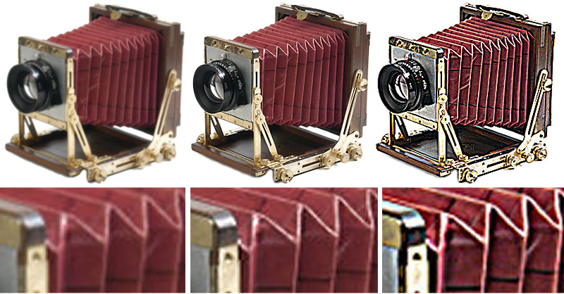

# Predefiniti immagini {#image-presets}

Un predefinito per immagini è essenzialmente una ricetta che contiene tutte le impostazioni necessarie per creare un’immagine con dimensioni, formato, qualità e nitidezza specifiche. I predefiniti per immagini sono un componente chiave del ridimensionamento dinamico.

Se osservate gli URL di qualsiasi cliente di Dynamic Media Classic, probabilmente vedrete un predefinito per immagini in uso. Cerca $name$ alla fine dell’URL (con qualsiasi parola o parola sostituita da name).

I predefiniti per immagini riducono l’URL e, invece di compilare diverse istruzioni Image Serving per ogni richiesta, potete scrivere un singolo predefinito per immagini. Ad esempio, questi due URL producono la stessa immagine JPEG da 300 x 300 con nitidezza, ma il secondo utilizza un predefinito per immagini:

Il valore effettivo dei predefiniti per immagini è che l’amministratore società può aggiornare la definizione di tale predefinito per immagini e influenzare ogni immagine che utilizza tale formato: senza modificare alcun codice Web. I risultati delle modifiche apportate a un predefinito per immagini verranno visualizzati dopo che la cache dell’URL sarà stata cancellata.

>[!IMPORTANT]
>
>Quando si ridimensiona un’immagine, le proporzioni, il rapporto tra la larghezza e l’altezza dell’immagine, devono sempre essere proporzionali in modo che l’immagine non venga distorta.

Un predefinito per immagini ha un simbolo di dollaro ($) su entrambi i lati del nome e segue il punto interrogativo (?) separatore.

>[!TIP]
>
>Create un predefinito per immagini per ciascuna dimensione di immagine univoca sul sito. Ad esempio, se avete bisogno di un&#39;immagine da 350x350 per la pagina dei dettagli del prodotto, un&#39;immagine da 120x120 per le pagine di ricerca e ricerca e un&#39;immagine da 90x90 per un elemento di cross-selling/featured, avete bisogno di tre predefiniti per immagini, che siano 500 immagini o 500000000000000000000000000000000000000000000000000000000000000000000000000000

- Ulteriori informazioni su [Predefiniti immagine](https://docs.adobe.com/content/help/en/dynamic-media-classic/using/image-sizing/setting-image-presets.html).
- Scoprite come [creare un predefinito per immagini](https://docs.adobe.com/content/help/en/dynamic-media-classic/using/image-sizing/setting-image-presets.html#creating-an-image-preset).

## Predefiniti immagine e nitidezza

In genere, i predefiniti per immagini ridimensionano un’immagine e ogni volta che ridimensionate un’immagine dalle dimensioni originali, occorre aggiungere la nitidezza. Questo perché il ridimensionamento causa l’unione di molti pixel e la loro fusione in uno spazio più piccolo, rendendo l’immagine più morbida e sfocata. La nitidezza aumenta il contrasto tra i bordi e le aree di contrasto elevato di un’immagine.

Prevediamo che le immagini ad alta risoluzione caricate in Dynamic Media Classic non necessitano di nitidezza se visualizzate a dimensioni intere. quando viene applicato lo zoom in. Tuttavia, con qualsiasi dimensione ridotta, in genere è consigliabile applicare la nitidezza.

>[!TIP]
>
>Rendere le immagini sempre più nitide! Dovrete quindi aggiungere la nitidezza a ogni predefinito per immagini (e al predefinito per visualizzatori, di cui parleremo più avanti).
>
>Se le immagini non hanno un aspetto positivo, è possibile che siano state rese più nitide o che la qualità iniziale sia stata scarsa.

L’entità della nitidezza da aggiungere è completamente soggettiva. Ad alcune persone piacciono le immagini più morbide, mentre ad altre piacciono molto nitide. È facile migliorare un’immagine eseguendo una combinazione di filtri di nitidezza su un’immagine. Tuttavia, è anche facile esagerare e rendere un&#39;immagine troppo nitida.

L’immagine seguente mostra tre livelli di nitidezza. Da destra a sinistra non è disponibile nitidezza, ma solo la giusta quantità e troppo.

Dynamic Media Classic consente tre tipi di nitidezza: Nitidezza semplice, modalità di ricampionamento e Maschera di contrasto.

Ulteriori informazioni sulle [opzioni di nitidezza per contenuti multimediali dinamici classici](https://docs.adobe.com/content/help/en/dynamic-media-classic/using/master-files/sharpening-image.html#sharpening_an_image).

## Risorse aggiuntive

[Guida](https://www.adobe.com/content/dam/www/us/en/experience-manager/pdfs/dynamic-media-image-preset-guide.pdf) ai predefiniti per immagini. Impostazioni da usare per ottimizzare la qualità dell’immagine e la velocità di caricamento.

[L&#39;Immagine È Tutto Parte 2: Non è mai solo una sfocatura — Qualità contro velocità](https://theblog.adobe.com/image-is-everything-part-2-its-never-just-a-blur-quality-versus-speed/). Post di blog sull’utilizzo dei predefiniti per immagini per la distribuzione di immagini di alta qualità e a caricamento rapido.

[L&#39;Immagine È Tutti I Webinar](https://dynamicmediaseries2019.enterprise.adobeevents.com/). Collegamenti alle registrazioni di tutti e tre i webinar della serie _Image Is Tutto_. [Webinar 2 ](https://seminars.adobeconnect.com/p6lqaotpjnd3) descrive i predefiniti per immagini.
