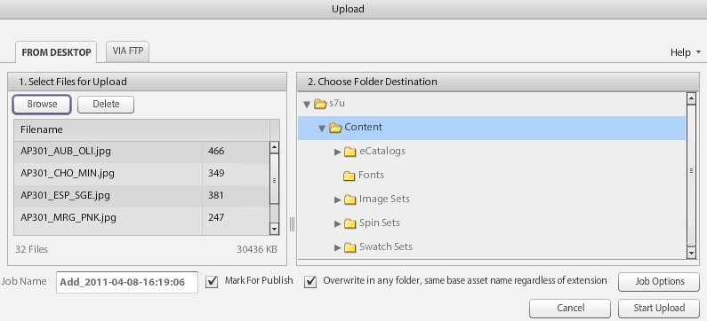
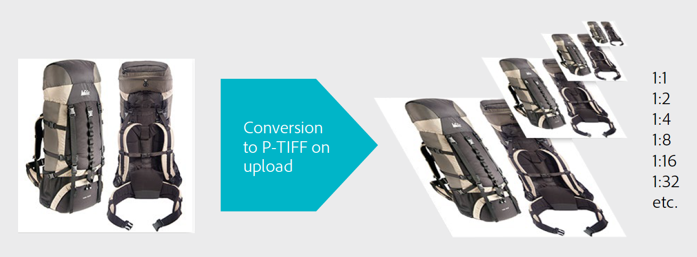

# Flusso di lavoro principale di Dynamic Media Classic e Anteprima delle risorse {#main-workflow}

Dynamic Media supporta un processo di creazione (e caricamento), authoring (e pubblicazione) e distribuzione del flusso di lavoro. Per iniziare, carica le risorse e quindi fai qualcosa con quelle risorse, ad esempio crea un set di immagini, e infine pubblica per renderle live. Il passaggio Build è facoltativo per alcuni flussi di lavoro. Ad esempio, se l’obiettivo è quello di eseguire solo il ridimensionamento dinamico e lo zoom sulle immagini o convertire e pubblicare video per lo streaming, non sono necessari passaggi di creazione.

Il flusso di lavoro nelle soluzioni Dynamic Media Classic consiste in tre passaggi principali:

1. Creare (e caricare) SourceContent
2. Creare (e pubblicare) risorse
3. Fornire risorse

## Passaggio 1: Creare (e caricare)

Questo è l’inizio del flusso di lavoro. In questo passaggio, raccogli o crea il contenuto sorgente che si adatta al flusso di lavoro che stai utilizzando e lo carica in Dynamic Media Classic. Il sistema supporta più tipi di file per immagini, video e font, ma anche per PDF, Adobe Illustrator e Adobe InDesign.

Vedi l&#39;elenco completo dei [Tipi di file supportati](https://experienceleague.adobe.com/docs/dynamic-media-classic/using/upload-publish/uploading-files.html#supported-asset-file-formats).

Puoi caricare il contenuto sorgente in diversi modi:

- Direttamente dal desktop o dalla rete locale. [Scopri come](https://experienceleague.adobe.com/docs/dynamic-media-classic/using/upload-publish/uploading-files.html#upload-files-using-sps-desktop-application).
- Da un server FTP Dynamic Media Classic. [Scopri come](https://experienceleague.adobe.com/docs/dynamic-media-classic/using/upload-publish/uploading-files.html#upload-files-using-via-ftp).

La modalità predefinita è Da Desktop, dove puoi cercare i file nella rete locale e avviare il caricamento.

>[!TIP]
>
>Non aggiungere manualmente le cartelle. Esegui invece un caricamento da FTP e utilizza il **Includi sottocartelle** per ricreare la struttura delle cartelle in Dynamic Media Classic.

Le due opzioni di caricamento più importanti sono abilitate per impostazione predefinita — **Contrassegna per pubblicazione**, di cui abbiamo già discusso, e **Sovrascrittura**. Sovrascrivi significa che se il file caricato ha lo stesso nome di un file già presente nel sistema, il nuovo file sostituirà la versione esistente. Se deselezioni questa opzione, il file potrebbe non essere caricato.

### Opzioni Di Sovrascrivi Durante Il Caricamento Delle Immagini

Esistono quattro varianti dell’opzione Sovrascrivi immagine che possono essere impostate per l’intera azienda e che spesso vengono fraintese. In breve, impostando le regole in modo da sovrascrivere più frequentemente le risorse con lo stesso nome oppure con minore frequenza le sovrascritture (in tal caso la nuova immagine verrà rinominata con estensione &quot;-1&quot; o &quot;-2&quot;).

- **Sovrascrivi nella cartella corrente, nome/estensione dell&#39;immagine di base**.
Questa opzione è la regola più rigida per la sostituzione. Richiede di caricare l&#39;immagine di sostituzione nella stessa cartella dell&#39;originale e che l&#39;immagine di sostituzione abbia la stessa estensione del nome file dell&#39;originale. Se tali requisiti non sono soddisfatti, viene creato un duplicato.

- **Sovrascrivi nella cartella corrente, lo stesso nome della risorsa di base indipendentemente dall&#39;estensione**.
Richiede di caricare l&#39;immagine sostitutiva nella stessa cartella dell&#39;originale, tuttavia l&#39;estensione del nome file può essere diversa dall&#39;originale. Ad esempio, sedia.tif sostituisce sedia.jpg.

- **Sovrascrivi in qualsiasi cartella, nome/estensione come risorsa base**.
Richiede che l&#39;immagine sostitutiva abbia la stessa estensione del nome del file dell&#39;immagine originale (ad esempio, sedia.jpg deve sostituire sedia.jpg, non sedia.tif ). Tuttavia, puoi caricare l’immagine di sostituzione in una cartella diversa dall’originale. L&#39;immagine aggiornata si trova nella nuova cartella; non è più possibile trovare il file nella posizione originale.

- **Sovrascrivi in qualsiasi cartella, nome come risorsa base, ignora estensione**.
Questa opzione è la regola di sostituzione più inclusiva. Puoi caricare un’immagine sostitutiva in una cartella diversa dall’originale, caricare un file con un’estensione diversa del nome del file e sostituire il file originale. Se il file originale si trova in una cartella diversa, l&#39;immagine sostitutiva si trova nella nuova cartella in cui è stata caricata.

Ulteriori informazioni sulle [Opzione Sovrascrivi immagini](https://experienceleague.adobe.com/docs/dynamic-media-classic/using/setup/application-setup.html#using-the-overwrite-images-option).

Sebbene non sia necessario, durante il caricamento utilizzando uno dei due metodi descritti sopra, puoi specificare le Opzioni processo per quel particolare caricamento, ad esempio per pianificare un caricamento ricorrente, impostare le opzioni di ritaglio al momento del caricamento e molte altre. Questi possono essere utili per alcuni flussi di lavoro, quindi vale la pena considerare se possono essere per i vostri.

Ulteriori informazioni [Opzioni processo](https://experienceleague.adobe.com/docs/dynamic-media-classic/using/upload-publish/uploading-files.html#upload-options).

Il caricamento è il primo passaggio necessario in qualsiasi flusso di lavoro perché Dynamic Media Classic non può funzionare con contenuti che non sono già presenti nel suo sistema. Dietro le quinte durante il caricamento, il sistema registra ogni risorsa caricata con il database Dynamic Media Classic centralizzato, assegna un ID e lo copia nell’archivio. Inoltre, il sistema converte i file immagine in un formato che consente il ridimensionamento dinamico e lo zoom e converte i file video in formato MP4 Web-friendly.

### Concetto: Ecco cosa succede alle immagini quando le caricate su Dynamic Media Classic

Quando carichi un’immagine di qualsiasi tipo in Dynamic Media Classic, questa viene convertita in un formato immagine principale denominato TIFF piramide o P-TIFF. Un P-TIFF è simile al formato di un&#39;immagine bitmap TIFF a più livelli, tranne per il fatto che invece di livelli diversi, il file contiene più dimensioni (risoluzioni) della stessa immagine.

Quando l&#39;immagine viene convertita, Dynamic Media Classic prende una &quot;istantanea&quot; delle dimensioni complete dell&#39;immagine, la ridimensiona di metà e la salva, la ridimensiona di nuovo di metà e la salva, e così via fino a quando non viene riempita con anche multipli delle dimensioni originali. Ad esempio, un TIFF P da 2000 pixel ha dimensioni di 1000, 500, 250 e 125 pixel (e dimensioni inferiori) nello stesso file. Il file P-TIFF è il formato di quella che in Dynamic Media Classic viene chiamata &quot;immagine principale&quot;.

Quando si richiede un&#39;immagine di determinate dimensioni, la creazione di P-TIFF consente al server di immagini per Dynamic Media Classic di trovare rapidamente le dimensioni successive più grandi e ridimensionarle. Ad esempio, se carichi un’immagine da 2000 pixel e richiedi un’immagine da 100 pixel, Dynamic Media Classic trova la versione da 125 pixel e la ridimensiona a 100 pixel anziché scalarla da 2000 a 100 pixel. Questo rende il funzionamento molto veloce. Inoltre, quando si ingrandisce un’immagine, questo consente al visualizzatore zoom di richiedere solo un riquadro dell’immagine che viene ingrandito, anziché l’intera immagine a risoluzione piena. Questo è il modo in cui il formato immagine principale, il file P-TIFF, supporta sia il dimensionamento dinamico che lo zoom.

Allo stesso modo, è possibile caricare il video sorgente principale su Dynamic Media Classic, e al momento del caricamento Dynamic Media Classic può ridimensionarlo automaticamente e convertirlo in formato web MP4.

### Regole generali per determinare la dimensione ottimale per le immagini caricate

**Carica le immagini nelle dimensioni più grandi che ti servono.**

- Se devi effettuare lo zoom, carica un’immagine ad alta risoluzione di un intervallo di 1500-2500 pixel nella dimensione più lunga. Considera quanti dettagli desideri fornire, la qualità delle immagini sorgente e le dimensioni del prodotto che stai visualizzando. Ad esempio, caricate un&#39;immagine da 1000 pixel per un anello piccolo, ma un&#39;immagine da 3000 pixel per un&#39;intera scena della stanza.
- Se non è necessario eseguire lo zoom, caricalo con la dimensione esatta visualizzata. Ad esempio, se disponi di logo o immagini splash/banner da posizionare sulle pagine, caricale esattamente con le loro dimensioni 1:1 e chiamale esattamente con quelle dimensioni.

**Non campionare mai le immagini o ingrandirle prima di caricarle in Dynamic Media Classic.** Ad esempio, non campionare un&#39;immagine più piccola per renderla un&#39;immagine da 2000 pixel. Non avrà un buon aspetto. Rendi le tue immagini il più possibile perfette prima del caricamento.

**Le dimensioni dello zoom non sono minime, ma per impostazione predefinita i visualizzatori non eseguono lo zoom oltre il 100%.** Se l&#39;immagine è troppo piccola, non ne ingrandisce affatto o solo una piccola quantità per evitare che appaia male.

**Anche se non esiste un minimo per le dimensioni dell’immagine, si sconsiglia di caricare immagini giganti.** Un&#39;immagine gigante può essere considerata più di 4000 pixel. Il caricamento di immagini di queste dimensioni può mostrare potenziali difetti come granelli di polvere o peli nell&#39;immagine. Tali immagini occupano più spazio sul server Dynamic Media Classic, il che può causare il superamento dei limiti di archiviazione contratti.

Ulteriori informazioni [Caricamento dei file](https://experienceleague.adobe.com/docs/dynamic-media-classic/using/upload-publish/uploading-files.html#uploading-your-files).

## Passaggio 2: Autore (e pubblicazione)

Dopo aver creato e caricato i contenuti, creerai nuove risorse rich media dalle risorse caricate eseguendo uno o più flussi di lavoro secondari. Questo include tutti i diversi tipi di set collection (set di immagini, campioni, set 360 gradi e set di file multimediali diversi), nonché i modelli. Include anche video. Approfondiremo i dettagli di ogni tipo di set di raccolta immagini e di contenuti multimediali in un secondo momento. Tuttavia, in quasi tutti i casi, puoi iniziare selezionando una o più risorse (o non hai selezionato alcuna risorsa) e scegliere il tipo di risorsa da generare. Ad esempio, puoi selezionare un’immagine principale e alcune visualizzazioni dell’immagine e scegliere di creare un set di immagini, una raccolta di viste alternative dello stesso prodotto.

>[!IMPORTANT]
>
>Assicurati che tutte le risorse siano contrassegnate per la pubblicazione. Anche se per impostazione predefinita tutte le risorse sono contrassegnate automaticamente per la pubblicazione al momento del caricamento, tutte le nuove risorse create dal contenuto caricato dovranno essere contrassegnate anche per la pubblicazione.

Dopo aver creato la nuova risorsa, eseguirai un processo di pubblicazione. Puoi farlo manualmente o pianificare un lavoro di pubblicazione che viene eseguito automaticamente. La pubblicazione copia tutti i contenuti dalla sfera privata Dynamic Media Classic al pubblico e pubblica la sfera server dell’equazione. Il prodotto di un processo di pubblicazione Dynamic Media è un URL univoco per ciascuna risorsa pubblicata.

Il server a cui si pubblica dipende dal tipo di contenuto e dal flusso di lavoro. Ad esempio, tutte le immagini vanno al server di immagini e lo streaming video al server FMS. Per comodità parleremo di una &quot;pubblicazione&quot; come singolo evento su un singolo server.

La pubblicazione pubblica tutti i contenuti contrassegnati per la pubblicazione, non solo il contenuto. Un singolo amministratore generalmente pubblica per conto di tutti anziché di singoli utenti che eseguono una pubblicazione. L’amministratore può pubblicare in base alle esigenze oppure impostare un lavoro ricorrente su base giornaliera, settimanale o anche ogni 10 minuti che verrà pubblicato automaticamente. Pubblica in base a una pianificazione adatta alla tua attività.

>[!TIP]
>
>Automatizza i tuoi lavori di pubblicazione e pianifica una pubblicazione completa da eseguire ogni giorno alle 12:00 o in qualsiasi momento in ritardo alla sera.

### Concetto: Informazioni sull’URL di Dynamic Media Classic

Il prodotto finale di un flusso di lavoro Dynamic Media Classic è un URL che punta alla risorsa (sia che si tratti di un set di immagini o di un set di video adattivo). Questi URL sono molto prevedibili e seguono lo stesso pattern. Nel caso delle immagini, ogni immagine viene generata dall’immagine master P-TIFF.

Di seguito è riportata la sintassi per l’URL di un’immagine con un paio di esempi:

Nell’URL, tutto a sinistra del punto interrogativo è il percorso virtuale di un’immagine specifica. Tutto a destra del punto interrogativo è un modificatore Image Server, un&#39;istruzione per come elaborare l&#39;immagine. In presenza di più modificatori, questi sono separati da e commerciale.

Nel primo esempio, il percorso virtuale dell&#39;immagine &quot;Zaino_A&quot; è `http://sample.scene7.com/is/image/s7train/BackpackA`. I modificatori Image Server ridimensionano l&#39;immagine a una larghezza di 250 pixel (da wid=250) e ricampionano l&#39;immagine utilizzando l&#39;algoritmo di interpolazione Lanczos, che si rende più nitida durante il ridimensionamento (da resMode=Sharp2).

Il secondo esempio applica ciò che è noto come &quot;predefinito immagine&quot; alla stessa immagine Zaino_A, come indicato da $!_template300$. I simboli $ su entrambi i lati dell&#39;espressione indicano che all&#39;immagine viene applicato un predefinito immagine, un set di modificatori immagine.

Una volta compreso come vengono combinati gli URL di Dynamic Media Classic, puoi comprendere come modificarli a livello di programmazione e come integrarli in modo più approfondito nel sito e nei sistemi di back-end.

### Concetto: Informazioni sul ritardo nella memorizzazione in cache

Le risorse appena caricate e pubblicate vengono immediatamente visualizzate, mentre le risorse aggiornate possono essere soggette a un ritardo di 10 ore nella memorizzazione in cache. Per impostazione predefinita, tutte le risorse pubblicate hanno almeno 10 ore di anticipo rispetto alla scadenza. Diciamo minimo, perché ogni volta che l&#39;immagine viene visualizzata, inizia un orologio che non scade finché non sono trascorse 10 ore in cui nessuno ha visto quell&#39;immagine. Questo periodo di 10 ore è il &quot;Time to Live&quot; per una risorsa. Una volta che la cache scade per quella risorsa, è possibile distribuire la versione aggiornata.

In genere non si tratta di un problema a meno che non si sia verificato un errore e l’immagine/risorsa abbia lo stesso nome della versione pubblicata in precedenza, ma si è verificato un problema con l’immagine. Ad esempio, hai caricato accidentalmente una versione a bassa risoluzione o il tuo art director non ha approvato l&#39;immagine. In questo caso, vuoi richiamare l’immagine originale e sostituirla con una nuova versione utilizzando lo stesso ID risorsa.

Scopri come [Cancella manualmente la cache per gli URL da aggiornare](https://experienceleague.adobe.com/docs/experience-manager-cloud-service/assets/dynamicmedia/invalidate-cdn-cache-dynamic-media.html?lang=it).

>[!TIP]
>
>Per evitare problemi con il ritardo nella memorizzazione in cache, lavora sempre in anticipo — una sera, un giorno, due settimane, ecc. Crea in tempo per il QA/accettazione da parte delle parti interne per provare il tuo lavoro prima di rilasciare al pubblico. Anche lavorare una sera prima consente di apportare modifiche e ripubblicare quella sera. Al mattino sono trascorse 10 ore e la cache si aggiorna con l&#39;immagine corretta.

- Ulteriori informazioni [Creazione di un processo di pubblicazione](https://experienceleague.adobe.com/docs/dynamic-media-classic/using/upload-publish/publishing-files.html#creating-a-publish-job).
- Ulteriori informazioni [Pubblicazione](https://experienceleague.adobe.com/docs/dynamic-media-classic/using/upload-publish/publishing-files.html).

## Passaggio 3: Consegna

Il prodotto finale di un flusso di lavoro Dynamic Media Classic è un URL che punta alla risorsa. L’URL può puntare a una singola immagine, un set di immagini, un set 360 gradi o a un altro set di immagini o video. Devi prendere quell’URL e utilizzarlo, ad esempio devi modificare il tuo HTML affinché il `` anziché puntare a un’immagine proveniente dal sito corrente, i tag puntano all’immagine Dynamic Media Classic.

Nel passaggio Consegna , devi integrare tali URL nel sito web, nell’app mobile, nella campagna e-mail o in qualsiasi altro punto di contatto digitale in cui desideri visualizzare la risorsa.

Esempio di integrazione dell’URL Dynamic Media Classic per un’immagine in un sito web:

L’URL in rosso è l’unico elemento specifico di Dynamic Media Classic.

Il team IT o il partner di integrazione può assumere un ruolo guida nella scrittura e nella modifica del codice per integrare gli URL di Dynamic Media Classic nel sito. Adobe dispone di un team di consulenza che può contribuire a questo sforzo, fornendo sia indicazioni tecniche, creative o generali.

Per soluzioni più complesse, come i visualizzatori zoom o i visualizzatori che combinano lo zoom con viste alternative, in genere l’URL punta a un visualizzatore ospitato da Dynamic Media Classic e anche all’interno di tale URL è un riferimento a un ID risorsa.

Esempio di collegamento (in rosso) che apre un set di immagini in un visualizzatore in una nuova finestra a comparsa:

>[!IMPORTANT]
>
>Devi integrare gli URL Dynamic Media Classic nel tuo sito web, app mobile, e-mail e altri punti di contatto digitali — Dynamic Media Classic non può farlo per te!

## Anteprima delle risorse

Probabilmente desideri visualizzare in anteprima le risorse caricate o che stai creando o modificando per accertarti che siano visualizzate come desideri quando i clienti le visualizzano. Per accedere alla finestra Anteprima, fai clic su qualsiasi **Anteprima** sulla miniatura della risorsa, nella parte superiore della **Pannello Sfoglia/Genera** oppure **File > Anteprima**. In una finestra del browser, visualizzerà un’anteprima della risorsa attualmente presente nel pannello, che si tratti di un’immagine, un video o una risorsa creata come un set di immagini.

### Anteprima Dimensione dinamica (predefiniti immagine)

È possibile visualizzare in anteprima le immagini in più dimensioni utilizzando **Dimensioni** anteprima. Viene caricato un elenco dei predefiniti immagine disponibili. Discuteremo più avanti dei preset d&#39;immagine, ma penseremo a loro come &quot;ricette&quot; per caricare l&#39;immagine a una dimensione definita con una quantità specifica di nitidezza e qualità dell&#39;immagine.

### Anteprima zoom

È inoltre possibile utilizzare **Zoom** per visualizzare un&#39;anteprima dell&#39;immagine in uno dei molti predefiniti zoom, basati su diversi visualizzatori di zoom inclusi.

Ulteriori informazioni [Anteprima delle risorse](https://experienceleague.adobe.com/docs/dynamic-media-classic/using/managing-assets/previewing-asset.html).
