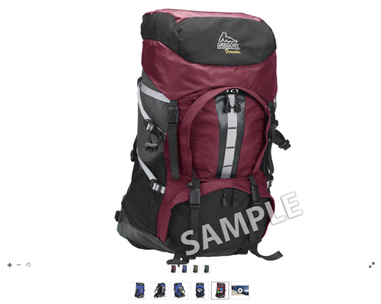

# Set di file multimediali diversi, immagine, campione, rotazione {#media-sets}

Oltre alle singole immagini per il dimensionamento dinamico e lo zoom, le raccolte di set Dynamic Media Classic consentono un&#39;esperienza online più ricca. In questa sezione dell’esercitazione verrà illustrato come creare i seguenti set di file multimediali avanzati in Dynamic Media Classic:

- Set immagini
- Set di campioni
- Set 360 gradi
- Set di file multimediali diversi

Inoltre, spiegherà come utilizzare i predefiniti per set di batch per automatizzare la creazione dei set tramite un caricamento.

## Tutto Quello Che Desideri Sempre Sapere Sui Set

Accanto al dimensionamento dinamico e allo zoom di base, i set sono probabilmente il sottoprodotto Dynamic Media Classic più utilizzato. I set sono essenzialmente risorse &quot;virtuali&quot; che non contengono immagini effettive, ma consistono in un set di relazioni con altre immagini e/o video. L&#39;attrattiva principale dei set è che sono mini-applicazioni pronte &quot;fuori dalla mensola&quot;. Con questo intendiamo che ogni visualizzatore set contiene la propria logica e interfaccia in modo che tutto ciò che devi fare è chiamarli sul sito. Inoltre, richiedono solo di tenere traccia di un singolo ID risorsa per set, anziché dover gestire autonomamente tutte le risorse e le relazioni dei membri.

Quando crei un set, questo viene gestito come una risorsa separata che deve essere contrassegnata per la pubblicazione e pubblicata prima che possa essere servita da un URL. Devono essere pubblicate anche tutte le attività dei membri.

### Tipi di set

Scopriamo i quattro tipi di set che puoi creare in Dynamic Media Classic: Set di file multimediali diversi, immagine, campione, rotazione e set di file multimediali diversi.

## Set immagini

Questo è il tipo di set più comune. In genere lo si utilizza per le visualizzazioni alternative dello stesso elemento. È costituito da più immagini caricate nel visualizzatore facendo clic sulla miniatura associata dell’immagine.

_Esempio di set di immagini_

L&#39;URL del set di immagini sopra riportato potrebbe apparire come:

- Ulteriori informazioni sui set di immagini con [Guida rapida ai set di immagini](https://experienceleague.adobe.com/docs/dynamic-media-classic/using/image-sets/quick-start-image-sets.html).
- Scopri come [Creare un set di immagini](https://experienceleague.adobe.com/docs/dynamic-media-classic/using/image-sets/creating-image-set.html#creating-an-image-set).

### Set di campioni

Questo tipo di set viene in genere utilizzato per visualizzare viste colorate dello stesso elemento. È costituito da coppie di immagini e campioni di colore.

La differenza principale tra un campione e un set di immagini è che i set di campioni utilizzano un’immagine diversa come campione cliccabile, mentre i set di immagini utilizzano una versione miniatura cliccabile dell’immagine originale.

I set di campioni non colorano le immagini (un errore comune). Le immagini vengono semplicemente scambiate, esattamente come in un set di immagini. Le immagini mini campione avrebbero potuto essere create con Photoshop, ogni colore avrebbe potuto essere fotografato separatamente, o lo strumento Ritaglio in Dynamic Media Classic avrebbe potuto essere utilizzato per creare un campione da una delle immagini colorate.

_Esempio di set di campioni_

L’URL del set di campioni di cui sopra potrebbe essere visualizzato come:

- Ulteriori informazioni sui set di campioni con [Guida rapida ai set di campioni](https://experienceleague.adobe.com/docs/dynamic-media-classic/using/swatch-sets/quick-start-swatch-sets.html).
- Scopri come [Creare un set di campioni](https://experienceleague.adobe.com/docs/dynamic-media-classic/using/swatch-sets/creating-swatch-set.html#creating-a-swatch-set).

### Set 360 gradi

Questo set viene generalmente utilizzato per visualizzare una visualizzazione a 360 gradi di un elemento. Come i Set di campioni, i Set 360 gradi non usano magia 3D — il vero lavoro è creare molte foto di un&#39;immagine da tutti i lati. Il visualizzatore consente semplicemente di passare da un&#39;immagine all&#39;altra come un&#39;animazione stop-motion.

I set 360 gradi possono essere ruotati in una direzione lungo un singolo asse oppure, se creati alternativamente come set 360 gradi 2D, ruotati su più assi. Ad esempio, un&#39;auto può essere ruotata mentre tutte le ruote sono a terra, e poi può essere &quot;capovolto&quot; e ruotato anche sulle sue ruote posteriori. Per un set 360 gradi 2D impostato correttamente, il numero di immagini per riga per ogni asse deve essere lo stesso. In altre parole, se girate su due assi, è necessario raddoppiare il numero di immagini di una rotazione ad angolo singolo.

_Esempio di set 360 gradi_

L’URL del set 360 gradi riportato sopra potrebbe essere visualizzato come:

- Ulteriori informazioni sui set 360 gradi con [Avvio rapido ai set 360 gradi](https://experienceleague.adobe.com/docs/dynamic-media-classic/using/spin-sets/quick-start-spin-sets.html).
- Scopri come [Creare un set 360 gradi](https://experienceleague.adobe.com/docs/dynamic-media-classic/using/spin-sets/creating-spin-set.html#creating-a-spin-set).

## Set di file multimediali diversi

Questo è un insieme combinato. Consente di combinare uno qualsiasi dei set precedenti, nonché di aggiungere video, in un singolo visualizzatore. In questo flusso di lavoro, puoi prima creare uno qualsiasi dei set di componenti e poi assemblarli in un set di file multimediali diversi.

_Esempio di set di file multimediali diversi_

L&#39;URL del set di file multimediali diversi sopra riportato potrebbe apparire come:

- Ulteriori informazioni sui set di file multimediali diversi con [Guida rapida ai set di file multimediali diversi](https://experienceleague.adobe.com/docs/dynamic-media-classic/using/mixed-media-sets/quick-start-mixed-media-sets.html).

- Scopri come [Creare un set di file multimediali diversi](https://experienceleague.adobe.com/docs/dynamic-media-classic/using/mixed-media-sets/creating-mixed-media-set.html#creating-a-mixed-media-set).

Per visualizzare un&#39;immagine per lo zoom, un set o un video sul tuo sito web, chiamala in un &quot;visualizzatore&quot; di Dynamic Media Classic. Dynamic Media Classic include visualizzatori per risorse rich media quali set di campioni, set 360 gradi, video e molti altri.

Ulteriori informazioni [Visualizzatori per AEM Assets e Dynamic Media Classic](https://experienceleague.adobe.com/docs/dynamic-media-developer-resources/library/viewers-aem-assets-dmc/c-html5-s7-aem-asset-viewers.html).

## Predefiniti set di batch

Finora abbiamo discusso su come creare manualmente i set utilizzando la funzione Dynamic Media Classic Build. Tuttavia, è possibile automatizzare la creazione di set di immagini e set 360 gradi utilizzando un predefinito per set di batch, purché si disponga di una convenzione di denominazione standardizzata.

Ogni predefinito è un set di istruzioni autonomo con un nome univoco che definisce come creare il set utilizzando immagini che corrispondono alle convenzioni di denominazione definite. Nel predefinito, definisci innanzitutto le convenzioni di denominazione per le risorse da raggruppare in un set. È quindi possibile creare un Batch Set Preset per fare riferimento a queste immagini.

Mentre è possibile creare il predefinito da solo (si trovano in **Configurazione > Impostazione applicazione > Predefiniti set di batch** ), come best practice, è necessario che il team di consulenza o il supporto tecnico sia configurato per te. Ecco perché:

- I predefiniti per set di batch possono essere complessi da configurare, basati su espressioni regolari e, a meno che tu non sia uno sviluppatore, questa sintassi potrebbe non essere familiare o creare confusione.
- Una volta creati, vengono attivati per impostazione predefinita. Nessuna funzione di annullamento. Se inizi a caricare migliaia di immagini e il tuo predefinito non è configurato correttamente, potresti ritrovarti con centinaia o migliaia di set interrotti che devi trovare ed eliminare manualmente.

In precedenza era stata suggerita una semplice convenzione di denominazione che sarebbe molto facile da integrare in un Batch Set Preset. Tuttavia, poiché i predefiniti sono molto flessibili, possono gestire strategie di denominazione complesse. In breve, le immagini che appartengono a un set devono essere legate tra loro da un nome comune, spesso corrisponde al numero SKU o all’ID prodotto. In Dynamic Media Classic puoi assegnargli una convenzione di denominazione predefinita per tutte le immagini da utilizzare per un predefinito, oppure creare più predefiniti, ognuno con regole di denominazione diverse.

I predefiniti per set di batch vengono applicati solo al momento del caricamento; non possono essere eseguite dopo il caricamento delle immagini. È quindi importante pianificare la convenzione di denominazione e ottenere un predefinito costruito prima di iniziare a caricare tutte le immagini.

Una volta creati i predefiniti, l&#39;amministratore della società può scegliere se sono attivi o inattivi. Attivo significa che verranno visualizzati nella pagina di caricamento in **Opzioni processo**, mentre i predefiniti inattivi rimarranno nascosti.

Scopri come [Creare un predefinito per set di batch](https://experienceleague.adobe.com/docs/dynamic-media-classic/using/setup/application-setup.html#creating-a-batch-set-preset).

### Utilizzo dei predefiniti per set di batch durante il caricamento

Di seguito è illustrato l’utilizzo dei predefiniti per set di batch al momento del caricamento dopo la loro creazione:

1. Fai clic su **Carica** e scegli **Da desktop** o **Tramite FTP**.
2. Fai clic su **Opzioni processo**.
3. Apri **Predefiniti set di batch** e controlla o deseleziona il predefinito per utilizzarlo con il caricamento.
4. Al termine del caricamento, cerca nella cartella i set finiti.

Ulteriori informazioni [Predefiniti set di batch](https://experienceleague.adobe.com/docs/dynamic-media-classic/using/setup/application-setup.html#batch-set-presets).
