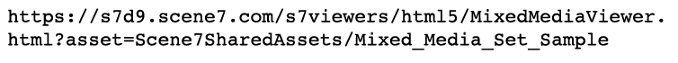

# Set di file multimediali diversi, come immagini, campioni e rotazioni {#media-sets}

Le raccolte di set di Dynamic Media Classic consentono un’esperienza online più ricca, andando oltre le singole immagini per il dimensionamento dinamico e lo zoom. Questa sezione del tutorial illustra come creare i seguenti set di contenuti rich media in Dynamic Media Classic:

- Set immagini
- Set campioni
- Set 360 gradi
- Set di file multimediali diversi

Spiega anche come utilizzare i predefiniti per set di batch per automatizzare la creazione di set tramite un caricamento.

## Tutto Quello Che Hai Sempre Voluto Sapere Sui Set

Oltre al dimensionamento dinamico e allo zoom di base, i set sono probabilmente il sottoprodotto Dynamic Media Classic più utilizzato. I set sono essenzialmente risorse &quot;virtuali&quot; che non contengono immagini effettive, ma sono costituiti da un set di relazioni con altre immagini e/o video. L&#39;attrattiva principale dei set è che si tratta di mini-applicazioni pronte &quot;fuori dagli scaffali&quot;. Con questo intendiamo che ogni visualizzatore di set contiene la propria logica e interfaccia in modo che tutto quello che devi fare è chiamarli sul sito. Inoltre, richiedono solo di tenere traccia di un singolo ID risorsa per set, anziché dover gestire autonomamente tutte le risorse e le relazioni dei membri.

Quando crei un set, questo viene gestito come una risorsa separata che deve essere contrassegnata per la pubblicazione e la pubblicazione prima di poter essere trasmessa da un URL. È necessario pubblicare anche tutte le risorse dei suoi membri.

### Tipi di set

Scopri i quattro tipi di set che è possibile creare in Dynamic Media Classic: Set di immagini, Campioni, Rotazioni e Multimediali diversi.

## Set immagini

Si tratta del tipo di set più comune. In genere viene utilizzato per le visualizzazioni alternative dello stesso elemento. È costituito da più immagini caricate nel visualizzatore facendo clic sulla miniatura associata dell&#39;immagine.

_Esempio di set di immagini_

L’URL per il set di immagini precedente potrebbe essere visualizzato come:

- Ulteriori informazioni sui set di immagini con [Guida rapida ai set di immagini](https://experienceleague.adobe.com/docs/dynamic-media-classic/using/image-sets/quick-start-image-sets.html).
- Scopri come [Creare un set di immagini](https://experienceleague.adobe.com/docs/dynamic-media-classic/using/image-sets/creating-image-set.html#creating-an-image-set).

### Set campioni

Questo tipo di set viene in genere utilizzato per visualizzare le viste colorate dello stesso elemento. È costituito da coppie di immagini e campioni di colore.

La differenza principale tra un set di campioni e un set di immagini consiste nel fatto che i set di campioni utilizzano un&#39;immagine diversa come campione su cui è possibile fare clic, mentre i set di immagini utilizzano una versione miniatura miniatura miniatura miniatura e su cui è possibile fare clic dell&#39;immagine originale.

I set di campioni non colorano le immagini (un equivoco comune). Le immagini vengono semplicemente scambiate, esattamente come in un set di immagini. Le mini immagini campione avrebbero potuto essere create utilizzando Photoshop, ogni colore avrebbe potuto essere fotografato separatamente o lo strumento Ritaglia in Dynamic Media Classic avrebbe potuto essere utilizzato per creare un campione da una delle immagini colorate.

_Esempio di un set di campioni_

L’URL per il set di campioni di cui sopra potrebbe essere visualizzato come:

- Ulteriori informazioni sui set di campioni sono disponibili con [Guida rapida ai set di campioni](https://experienceleague.adobe.com/docs/dynamic-media-classic/using/swatch-sets/quick-start-swatch-sets.html).
- Scopri come [Creare un set di campioni](https://experienceleague.adobe.com/docs/dynamic-media-classic/using/swatch-sets/creating-swatch-set.html#creating-a-swatch-set).

### Set 360 gradi

Questo set viene in genere utilizzato per mostrare una visualizzazione a 360 gradi di un elemento. Come per i set campione, i set 360 gradi non usano magie 3D, ma il vero lavoro consiste nel creare molte foto di un&#39;immagine da tutti i lati. Il visualizzatore consente di passare da un&#39;immagine all&#39;altra come un&#39;animazione stop-motion.

I set 360 gradi possono essere ruotati in una direzione lungo un singolo asse oppure, se creati in modo alternativo come set 360 gradi 2D, ruotati su più assi. Ad esempio, una macchina può essere ruotata mentre tutte le ruote sono a terra, e poi può essere &quot;capovolta&quot; in alto e ruotata anche sulle sue ruote posteriori. Per un set 360 gradi 2D impostato correttamente, il numero di immagini per riga per ciascun asse deve essere lo stesso. In altre parole, se ruotate su due assi, è necessario un numero di immagini doppio rispetto a una rotazione angolare singola.

_Esempio di set 360 gradi_

L’URL per il set 360 gradi precedente potrebbe essere visualizzato come:

- Ulteriori informazioni sui set 360 gradi con [Guida rapida ai set 360 gradi](https://experienceleague.adobe.com/docs/dynamic-media-classic/using/spin-sets/quick-start-spin-sets.html).
- Scopri come [Creare un set 360 gradi](https://experienceleague.adobe.com/docs/dynamic-media-classic/using/spin-sets/creating-spin-set.html#creating-a-spin-set).

## Set di file multimediali diversi

Questo è un set combinato. Consente di combinare uno qualsiasi dei set precedenti, nonché di aggiungere video, in un singolo visualizzatore. In questo flusso di lavoro crei prima uno qualsiasi dei set di componenti, quindi assemblali in un set di file multimediali diversi.

_Esempio di set di file multimediali diversi_

L’URL per il set di file multimediali diversi di cui sopra potrebbe essere visualizzato come:

- Ulteriori informazioni sui set di file multimediali diversi con [Guida rapida ai set di file multimediali diversi](https://experienceleague.adobe.com/docs/dynamic-media-classic/using/mixed-media-sets/quick-start-mixed-media-sets.html).

- Scopri come [Creare un set di file multimediali diversi](https://experienceleague.adobe.com/docs/dynamic-media-classic/using/mixed-media-sets/creating-mixed-media-set.html#creating-a-mixed-media-set).

Per visualizzare un&#39;immagine per lo zoom, un set o un video sul sito Web, è necessario chiamarla in un &quot;visualizzatore&quot; di Dynamic Media Classic. In Dynamic Media Classic sono inclusi i visualizzatori per le risorse rich media come i set di campioni, i set 360 gradi, i video e molti altri.

Ulteriori informazioni su [Visualizzatori per AEM Assets e Dynamic Media Classic](https://experienceleague.adobe.com/docs/dynamic-media-developer-resources/library/viewers-aem-assets-dmc/c-html5-s7-aem-asset-viewers.html).

## Predefiniti set di batch

Finora abbiamo discusso su come creare i set manualmente utilizzando la funzione Build di Dynamic Media Classic. Tuttavia, è possibile automatizzare la creazione di set di immagini e set 360 gradi utilizzando un predefinito per set di batch, purché si disponga di una convenzione di denominazione standard.

Ogni predefinito è un set di istruzioni indipendente con nome univoco che definisce come creare il set utilizzando immagini che corrispondono alle convenzioni di denominazione definite. Nel predefinito puoi innanzitutto definire le convenzioni di denominazione per le risorse da raggruppare in un set. È quindi possibile creare un predefinito per set di batch per fare riferimento a queste immagini.

Mentre è possibile creare il predefinito da soli (si trovano in **Impostazione > Impostazione applicazione > Predefiniti set di batch** ), come best practice è necessario che il team di consulenza o il supporto tecnico siano configurati per te. Ecco il motivo:

- I predefiniti per set di batch possono essere complessi da impostare, poiché si basano su espressioni regolari e questa sintassi può risultare sconosciuta o confusa a meno che tu non sia uno sviluppatore.
- Una volta creati, vengono attivati per impostazione predefinita. Non è disponibile la funzione &quot;annulla&quot;. Se inizi a caricare migliaia di immagini e il predefinito non è configurato correttamente, potresti ritrovare centinaia o migliaia di set interrotti da eliminare manualmente.

In precedenza è stata suggerita una semplice convenzione di denominazione che sarebbe molto semplice da creare in un predefinito per set di batch. Tuttavia, poiché i predefiniti sono molto flessibili, possono gestire strategie di denominazione complesse. In breve, le immagini che appartengono a un set devono essere legate insieme da un nome comune, spesso è il numero SKU o l’ID prodotto. In Dynamic Media Classic è possibile impostare una convenzione di denominazione predefinita per tutte le immagini da utilizzare per un predefinito oppure creare più predefiniti, ciascuno con regole di denominazione diverse.

I predefiniti per set di batch vengono applicati solo al caricamento; non possono essere eseguiti dopo il caricamento delle immagini. È quindi importante pianificare la convenzione di denominazione e creare un predefinito prima di iniziare a caricare tutte le immagini.

Una volta creati i predefiniti, l’amministratore della società può scegliere se sono attivi o inattivi. Attivo significa che apparirà sulla pagina di caricamento in **Opzioni processo**, mentre i predefiniti inattivi rimarranno nascosti.

Scopri come [Creare un predefinito per set di batch](https://experienceleague.adobe.com/docs/dynamic-media-classic/using/setup/application-setup.html#creating-a-batch-set-preset).

### Utilizzo dei predefiniti per set di batch al caricamento

Di seguito è illustrato l’utilizzo dei predefiniti per set di batch al caricamento, una volta creati:

1. Clic **Carica** e scegliere **Da desktop** o **Tramite FTP**.
2. Clic **Opzioni processo**.
3. Apri **Predefiniti set di batch** e selezionare o deselezionare il predefinito per utilizzarlo con il caricamento.
4. Al termine del caricamento, cerca i set finiti nella cartella.

Ulteriori informazioni su [Predefiniti set di batch](https://experienceleague.adobe.com/docs/dynamic-media-classic/using/setup/application-setup.html#batch-set-presets).
