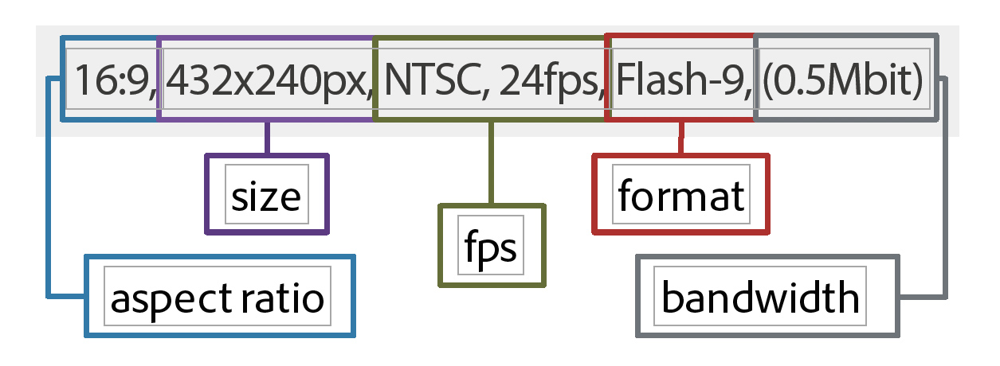

# Panoramica video {#video-overview}

Dynamic Media Classic offre la conversione automatica dei video in fase di caricamento, lo streaming video su dispositivi desktop e mobili e set di video adattivi ottimizzati per la riproduzione in base al dispositivo e alla larghezza di banda. Una delle cose più importanti del video è che il flusso di lavoro è semplice, è progettato in modo che chiunque possa usarlo, anche se non ha familiarità con la tecnologia video.

Alla fine di questa sezione dell’esercitazione saprai come:

- Caricare e codificare video (transcodificare) in formati e dimensioni diversi
- Scegli tra i predefiniti video disponibili per il caricamento
- Aggiungere o modificare un predefinito di codifica video
- Anteprima di video in un visualizzatore video
- Distribuire video su siti web e mobili
- Aggiungere didascalie e marcatori capitolo al video
- Personalizzare e pubblicare i visualizzatori video per utenti desktop e mobili

>[!NOTE]
>
>Tutti gli URL di questo capitolo sono a solo scopo illustrativo; non sono collegamenti in diretta.

## Panoramica video di Dynamic Media Classic

Diamo un&#39;idea migliore delle possibilità di usare i video con Dynamic Media Classic.

### Funzionalità e funzionalità

La piattaforma video Dynamic Media Classic offre tutte le parti della soluzione video: il caricamento, la conversione e la gestione dei video; la possibilità di aggiungere sottotitoli e marcatori capitolo a un video; e la possibilità di utilizzare i predefiniti per una riproduzione semplice.

Consente di pubblicare facilmente video adattivi di alta qualità per lo streaming su più schermi, tra cui desktop, iOS, Android™, BlackBerry® e dispositivi mobili Windows. Un Adaptive Video Set raggruppa versioni dello stesso video codificate con diversi bit rate e formati come 400 kbps, 800 kbps e 1000 kbps. Il computer desktop o il dispositivo mobile rileva la larghezza di banda disponibile.

Inoltre, la qualità video viene commutata in modo dinamico automaticamente se le condizioni di rete cambiano sul desktop o sul dispositivo mobile. Inoltre, se un cliente entra in modalità a schermo intero su un desktop, il set video adattivo risponde utilizzando una risoluzione migliore, migliorando in tal modo l’esperienza di visualizzazione del cliente. L’utilizzo di Adaptive Video Sets offre la migliore riproduzione possibile per i clienti che riproducono video Dynamic Media Classic su schermi e dispositivi multipli.

### Gestione video

Lavorare con i video può essere più complesso che lavorare con immagini statiche digitali. Con i video, si tratta di numerosi formati e standard e dell&#39;incertezza che il pubblico è in grado di riprodurre le clip. Dynamic Media Classic semplifica il lavoro con i video, fornendo molti potenti strumenti &quot;sotto il cofano&quot;, ma eliminando la complessità di lavorare con loro.

Dynamic Media Classic riconosce e può lavorare con molti formati di origine diversi disponibili. Tuttavia, leggere il video è solo una parte dello sforzo — è anche necessario convertire il video in un formato web-friendly. Dynamic Media Classic si occupa di questo problema consentendo di convertire il video in video H.264.

Convertire il video da soli può diventare complicato utilizzando i molti strumenti professionali ed entusiasti disponibili. Dynamic Media Classic offre semplici predefiniti ottimizzati per diverse impostazioni di qualità. Tuttavia, se desideri qualcosa di più personalizzato, puoi anche creare i tuoi predefiniti.

Se hai molti video, ti accorgerai della possibilità di gestire tutte le tue risorse insieme alle tue immagini e agli altri contenuti multimediali in Dynamic Media Classic. Puoi organizzare, catalogare ed eseguire ricerche nelle risorse, incluse le risorse video, con un solido supporto per i metadati XMP.

### Riproduzione video

Simile al problema della conversione del video per renderlo web-friendly e accessibile, è il problema di implementazione e distribuzione del video sul tuo sito. Scegliere se acquistare un lettore o costruirne uno proprio, rendendolo compatibile per vari dispositivi e schermi, e quindi mantenere i giocatori può essere un&#39;occupazione a tempo pieno.

Anche in questo caso, l&#39;approccio di Dynamic Media Classic è quello di consentire di scegliere il predefinito e il visualizzatore adatto alle tue esigenze. Sono disponibili diverse opzioni di visualizzazione e una libreria di numerosi predefiniti.

È possibile distribuire facilmente i video al web e ai dispositivi mobili, poiché Dynamic Media Classic supporta video HTML5, il che significa che è possibile indirizzare gli utenti che eseguono vari browser, nonché gli utenti della piattaforma Android™ e iOS. I video in streaming consentono una riproduzione fluida di contenuti più lunghi o ad alta definizione, mentre i video HTML5 progressivi hanno dei predefiniti ottimizzati per i piccoli schermi.

I predefiniti visualizzatore per i video sono parzialmente configurabili a seconda del tipo di visualizzatore.

Come tutti i visualizzatori, l&#39;integrazione avviene tramite un singolo URL Dynamic Media Classic per visualizzatore o video.

>[!NOTE]
>
>Come best practice, utilizza i visualizzatori video Dynamic Media Classic HTML5. I predefiniti utilizzati nei visualizzatori video HTML5 sono lettori video affidabili. Combinando in un singolo lettore la possibilità di progettare i componenti di riproduzione utilizzando HTML5 e CSS, di incorporare la riproduzione e di utilizzare lo streaming adattivo e progressivo a seconda delle funzionalità del browser, estenderai la portata dei contenuti rich media agli utenti desktop, tablet e mobile e garantirai un’esperienza video semplificata.

Un&#39;ultima nota sul video Dynamic Media Classic che può essere applicata ad alcuni clienti: non tutte le aziende possono avere la conversione automatica, lo streaming o i predefiniti video abilitati per il proprio account. Se per qualche motivo non riesci ad accedere agli URL per lo streaming video, questo potrebbe essere il motivo. Puoi caricare e pubblicare video scaricati progressivamente e accedere a tutti i visualizzatori video. Tuttavia, per sfruttare tutte le funzionalità video di Dynamic Media Classic, contatta il tuo Account Manager o il tuo Sales Manager per abilitare queste funzioni.

Ulteriori informazioni [Video in Dynamic Media Classic](https://experienceleague.adobe.com/docs/dynamic-media-classic/using/video/quick-start-video.html).

## Video 101

### Concetti e terminologia video di base

Prima di iniziare, discutiamo alcuni termini con i quali dovresti essere familiare per poter lavorare con i video. Questi concetti non sono specifici di Dynamic Media Classic, e se vuoi gestire i video per un sito web professionale, faresti bene a ricevere ulteriori informazioni sull&#39;argomento. Consigliamo alcune risorse alla fine di questa sezione.

- **Codifica/transcodifica.** La codifica è il processo di applicazione della compressione video per convertire i dati video grezzi e non compressi in un formato che semplifica il lavoro con. La transcodifica, pur essendo simile, si riferisce alla conversione da un metodo di codifica a un altro.

   - I file video master creati con software di editing video sono spesso troppo grandi e non nel formato corretto per la distribuzione a destinazioni online. In genere sono codificati per la riproduzione rapida sul desktop e per la modifica, ma non per la distribuzione sul web.
   - Per convertire i video digitali nel formato e nelle specifiche appropriati per la riproduzione su schermi diversi, i file video vengono transcodificati in file di dimensioni più piccole ed efficienti, ottimali per la distribuzione sul web e su dispositivi mobili.

- **Compressione video.** Ridurre la quantità di dati utilizzati per rappresentare le immagini video digitali, ed è una combinazione di compressione spaziale dell&#39;immagine e compensazione temporale del movimento.

   - La maggior parte delle tecniche di compressione sono a perdita, il che significa che buttano fuori i dati per ottenere una dimensione più piccola.
   - Ad esempio, il video DV viene compresso relativamente poco e consente di modificare facilmente le riprese originali, anche se è troppo grande per essere utilizzato sul web o anche su un DVD.

- **Formati di file.** Il formato è un contenitore, simile a un file ZIP, che determina il modo in cui i file vengono organizzati nel file video, ma in genere non il modo in cui vengono codificati.

   - I formati di file comuni per i video di origine includono Windows Media (WMV), QuickTime (MOV), Microsoft® AVI e MPEG, tra gli altri. I formati pubblicati da Dynamic Media Classic sono MP4.
   - Un file video di solito contiene più tracce — una traccia video (senza audio) e una o più tracce audio (senza video) — che sono correlate e sincronizzate.
   - Il formato del file video determina l&#39;organizzazione di queste diverse tracce di dati e metadati.

- **Codec.** Un codec video descrive l’algoritmo con cui un video viene codificato utilizzando la compressione. L&#39;audio viene codificato anche tramite un codec audio.

   - I codec riducono al minimo la quantità di informazioni necessarie per riprodurre il video. Invece delle informazioni su ogni singolo fotogramma, vengono memorizzate solo le informazioni sulle differenze tra un fotogramma e quello successivo.
   - Poiché la maggior parte dei video cambia poco da un fotogramma all&#39;altro, i codec consentono elevati tassi di compressione, che si traducono in dimensioni di file più piccole.
   - Un lettore video decodifica il video in base al codec e visualizza sullo schermo una serie di immagini o fotogrammi.
   - I codec video comuni includono H.264, On2 VP6 e H.263.

- **Risoluzione.** Altezza e larghezza del video in pixel.

   - Le dimensioni del video sorgente sono determinate dalla fotocamera e dall&#39;uscita dal software di editing. Una telecamera HD crea video ad alta risoluzione 1920 x 1080; tuttavia, per riprodurre senza problemi sul web, si può effettuare il downsample (ridimensionamento) in una risoluzione più piccola come 1280 x 720, 640 x 480 o inferiore.
   - La risoluzione ha un impatto diretto sulle dimensioni del file e sulla larghezza di banda necessaria per riprodurre il video.

- **Rapporto di formato del display.** Rapporto tra la larghezza e l&#39;altezza di un video. Quando le proporzioni del video non corrispondono alle proporzioni del lettore, è possibile che vengano visualizzate &quot;barre nere&quot; o spazi vuoti. Due rapporti di formato comuni utilizzati per visualizzare il video sono:

   - 4:3 (1,33:1). Utilizzato per quasi tutti i contenuti televisivi a definizione standard.
   - 16:9 (1,78:1). Utilizzato per quasi tutti i contenuti televisivi ad alta definizione (HDTV) e a schermo intero.

- **Bit rate/velocità dati.** La quantità di dati codificati per creare un secondo di riproduzione video (in kilobit al secondo).

   - Generalmente, più basso è il bit rate, più auspicabile è per il web perché può essere scaricato più rapidamente. Tuttavia può anche significare che la qualità è bassa a causa della perdita di compressione.
   - Un buon codec dovrebbe bilanciare il bit rate basso con una buona qualità.

- **Frame rate (frame al secondo o FPS).** Il numero di fotogrammi, o immagini fisse, per ogni secondo di video. In genere, la TV nordamericana (NTSC) viene trasmessa in 29,97 fps; La TV europea e asiatica (PAL) viene trasmessa in 25 fps; e i film (analogici e digitali) sono generalmente in 24 (23.976) FPS.

   - Per rendere le cose più confuse, ci sono anche fotogrammi progressivi e interlacciati. Ogni fotogramma progressivo contiene un intero fotogramma dell&#39;immagine, mentre i fotogrammi interlacciati contengono ogni altra riga di pixel in un fotogramma dell&#39;immagine. I fotogrammi vengono quindi riprodotti rapidamente e sembrano fondersi insieme. La pellicola utilizza un metodo di scansione progressiva, mentre il video digitale è generalmente interlacciato.
   - In generale, non importa se il materiale video sorgente è interlacciato o meno: Dynamic Media Classic manterrà il metodo di scansione nel video convertito.
   - Distribuzione in streaming/progressiva. Lo streaming video è l’invio di contenuti multimediali in un flusso continuo che può essere riprodotto al momento dell’arrivo, mentre i video scaricati progressivamente vengono scaricati come qualsiasi altro file da un server e memorizzati localmente nel browser.

Speriamo che questo primer ti aiuti a capire le varie opzioni coinvolte nell&#39;utilizzo dei video Dynamic Media Classic.

## Flusso di lavoro video

Quando lavori con un video in Dynamic Media Classic, segui un flusso di lavoro di base simile a quello delle immagini.

1. Per iniziare, carica i file video in Dynamic Media Classic. Per eseguire questa operazione, apri la **Menu Strumenti** nella parte inferiore del pannello dell&#39;estensione Dynamic Media Classic, e scegli **Carica in Dynamic Media Classic > File nel nome della cartella** oppure **Carica in Dynamic Media Classic > Cartelle nel nome della cartella**. Per &quot;Nome cartella&quot; si intende qualsiasi cartella che stai cercando con l&#39;estensione. I file video possono essere di grandi dimensioni, pertanto consigliamo di utilizzare l’FTP per caricare file di grandi dimensioni. Come parte del caricamento, scegli uno o più predefiniti video per la codifica dei video. Il video può essere transcodificato in video MP4 al momento del caricamento. Per ulteriori informazioni sull’utilizzo e la creazione dei predefiniti di codifica, consultate l’argomento Predefiniti video di seguito. Scopri [Caricamento e codifica di video](https://experienceleague.adobe.com/docs/dynamic-media-classic/using/video/uploading-encoding-videos.html).
2. Seleziona o seleziona e modifica un predefinito per visualizzatori video e visualizza l’anteprima del video. È possibile scegliere un predefinito visualizzatore predefinito o personalizzare il proprio predefinito. Se stai eseguendo il targeting degli utenti di dispositivi mobili, non è necessario eseguire alcuna operazione qui perché le piattaforme mobili non richiedono un visualizzatore o un predefinito. Ulteriori informazioni [Anteprima dei video in un visualizzatore video](https://experienceleague.adobe.com/docs/dynamic-media-classic/using/video/previewing-videos-video-viewer.html) e [Aggiunta o modifica di un predefinito per visualizzatori video](https://experienceleague.adobe.com/docs/dynamic-media-classic/using/video/previewing-videos-video-viewer.html#adding-or-editing-a-video-viewer-preset).
3. Esegui una pubblicazione video, ottieni l&#39;URL e integralo. La differenza principale tra questo passaggio per il flusso di lavoro video e il flusso di lavoro immagine è che si esegue una pubblicazione video speciale invece (o forse e) della pubblicazione standard Image Serving. L’integrazione dei visualizzatori video sul desktop funziona esattamente come l’integrazione dei visualizzatori di immagini, ma per i dispositivi mobili è ancora più semplice: tutto ciò di cui hai bisogno è l’URL del video stesso.

### Informazioni sulla transcodifica

La transcodifica è stata definita in precedenza come processo di conversione da un metodo di codifica a un altro. Nel caso di Dynamic Media Classic, è il processo di conversione del video sorgente dal formato corrente in MP4. Questo è necessario prima che il video venga visualizzato nel browser desktop o su un dispositivo mobile.

Dynamic Media Classic è in grado di gestire tutte le transcodifica per voi, un enorme vantaggio. Puoi transcodificare il video da solo e caricare i file già convertiti in MP4, ma questo può essere un processo complesso che richiede un software sofisticato. A meno che tu non sappia cosa stai facendo, in genere non ottieni buoni risultati al tuo primo tentativo.

Non solo Dynamic Media Classic converte i file per voi, ma lo rende anche facile fornendo predefiniti di facile utilizzo. Non c&#39;è bisogno di sapere molto sul lato tecnico di questo processo — tutto ciò che dovreste sapere è approssimativamente le dimensioni finali che volete uscire dal sistema e un senso della larghezza di banda che gli utenti finali hanno.

Anche se i predefiniti predefiniti sono utili e rispondono alla maggior parte delle esigenze, talvolta si desidera qualcosa di più personalizzato. In questo caso puoi creare un predefinito di codifica personalizzato. In Dynamic Media Classic, un predefinito di codifica è denominato Predefinito video. Questo è spiegato più avanti in questo capitolo.

### Informazioni sullo streaming

Un&#39;altra caratteristica importante da notare è lo streaming video, una caratteristica standard della piattaforma video Dynamic Media Classic. I supporti in streaming vengono ricevuti e presentati costantemente agli utenti finali durante la distribuzione. Ciò è significativo e auspicabile per diversi motivi.

In genere, lo streaming richiede una larghezza di banda inferiore rispetto al download progressivo, perché viene distribuita solo la parte del video visualizzata. Il server di streaming video Dynamic Media Classic e i visualizzatori utilizzano il rilevamento automatico della larghezza di banda per fornire il miglior flusso possibile per una connessione Internet dell&#39;utente.

Con lo streaming, la riproduzione del video inizia prima di quanto avviene con altri metodi. Inoltre, consente un utilizzo più efficiente delle risorse di rete perché solo le parti del video visualizzate vengono inviate al client.

L&#39;altro metodo di consegna è il download progressivo. Rispetto allo streaming video, il download progressivo offre un solo vantaggio: non è necessario un server di streaming per la distribuzione del video. Ed è qui che entra in gioco Dynamic Media Classic — Dynamic Media Classic ha un server di streaming integrato nella piattaforma, quindi non c&#39;è bisogno di problemi o costi aggiuntivi per mantenere questo hardware dedicato.

Il video di download progressivo può essere servito da qualsiasi normale server web. Anche se questo può essere conveniente e potenzialmente conveniente, ricorda che i download progressivi hanno capacità di ricerca e navigazione limitate e gli utenti possono accedere e riutilizzare i contenuti. In alcune situazioni, ad esempio la riproduzione dietro firewall di rete rigidi, la distribuzione in streaming può essere bloccata; in questi casi, può essere auspicabile il ripristino della consegna progressiva.

Il download progressivo è una buona scelta per gli hobbisti o i siti web che hanno requisiti di traffico ridotti; se non gli dispiace se il loro contenuto è memorizzato nella cache del computer di un utente; se devono solo fornire video di breve durata (inferiori a 10 minuti); o se i loro visitatori non possono ricevere video in streaming per qualche motivo.

Se hai bisogno di funzioni avanzate e di un controllo sulla distribuzione dei video e/o se hai bisogno di visualizzare i video a un pubblico più ampio (ad esempio, più di 100 visualizzatori simultanei), di tracciare e segnalare l’utilizzo o la visualizzazione di statistiche, o se desideri offrire ai tuoi visualizzatori la migliore esperienza di riproduzione interattiva.

Infine, se sei preoccupato di proteggere i contenuti multimediali per problemi di proprietà intellettuale o di gestione dei diritti, lo streaming fornisce una distribuzione più sicura dei video, perché i file multimediali non vengono salvati nella cache del cliente quando vengono trasmessi in streaming.

## Predefiniti per video

Quando carichi il video, scegli uno o più predefiniti contenenti le impostazioni per la conversione del video master in un formato web-friendly tramite la codifica. I predefiniti per video sono disponibili in due varianti: Predefiniti video adattivi e Predefiniti per codifica singola.

Vedi [Predefiniti video disponibili](https://experienceleague.adobe.com/docs/dynamic-media-classic/using/setup/application-setup.html#video-presets-for-encoding-video-files).

I predefiniti per video adattivi sono attivati per impostazione predefinita, il che significa che sono disponibili per la codifica. Se desideri utilizzare un predefinito di codifica singolo, è necessario attivarlo per visualizzarlo nell’elenco dei predefiniti per video.

Scopri come [Attivare o disattivare i predefiniti per video](https://experienceleague.adobe.com/docs/dynamic-media-classic/using/video/uploading-encoding-videos.html#activating-or-deactivating-video-encoding-presets).

Puoi scegliere uno dei numerosi predefiniti forniti con Dynamic Media Classic oppure crearne uno personalizzato; tuttavia, per impostazione predefinita non è selezionato alcun predefinito da caricare. In altre parole, **se non selezioni un predefinito video al momento del caricamento, il video non verrà convertito e potrebbe non essere pubblicato**. Tuttavia puoi convertire il video in modalità offline e caricarlo e pubblicarlo correttamente. I predefiniti per video sono necessari solo se desideri che Dynamic Media Classic esegua la conversione per te.

Al momento del caricamento, seleziona un predefinito video scegliendo **Opzioni video** nel pannello Opzioni processo . È quindi possibile scegliere se si desidera codificare per Computer, Mobile o Tablet.

- Il computer è per uso desktop. Qui troverai generalmente predefiniti più grandi (come HD) che richiedono una larghezza di banda maggiore.
- Mobile e Tablet creano video MP4 per dispositivi quali iPhone e smartphone Android™. L’unica differenza tra Mobile e Tablet è che i predefiniti Tablet hanno generalmente una larghezza di banda più elevata, in quanto si basano sull’utilizzo WiFi. I predefiniti per dispositivi mobili sono ottimizzati per un utilizzo 3G più lento.

### Domande da porsi prima di scegliere un predefinito

Quando scegli un predefinito, devi conoscere il pubblico e le riprese sorgente. Cosa sai del tuo cliente? Come guardano il video — con un monitor o un dispositivo mobile?

Qual è la risoluzione del tuo video? Se scegli un predefinito più grande dell&#39;originale, puoi ottenere un video sfocato/pixelato. Va bene se il video è più grande del predefinito, ma non scegliere un predefinito più grande del video sorgente.

Qual è il suo rapporto di formato? Se si vedono delle barre nere intorno al video convertito, si è scelto il rapporto di formato errato. Dynamic Media Classic non è in grado di rilevare automaticamente queste impostazioni perché prima di caricare dovrebbe esaminare il file.

### Breakdown delle opzioni video

I predefiniti per video determinano in che modo il video viene codificato specificando queste impostazioni. Se non conosci questi termini, consulta l’argomento Concetti video e Terminologia di base di cui sopra.

- **Proporzioni.** Standard 4:3 o wide-screen 16:9.
- **Dimensione.** È la stessa risoluzione del display e viene misurata in pixel. Questo è relativo al rapporto di formato. Con un rapporto di 16:9, un video è di 432 x 240 pixel, mentre a 4:3 è di 320 x 240 pixel.
- **FPS.** I frame rate standard sono 30 frame al secondo, 25 frame al secondo o 24 frame al secondo (fps), a seconda dello standard video NTSC, PAL o Film. Questa impostazione non ha importanza, perché Dynamic Media Classic utilizza sempre lo stesso frame rate del video sorgente.
- **Formato.** Questo è MP4.
- **Larghezza di banda.** Questa è la velocità di connessione desiderata dall&#39;utente di destinazione. Hanno una connessione internet veloce o lenta? In genere utilizzano computer desktop o dispositivi mobili? Questo è anche collegato alla risoluzione (dimensione), perché più grande è il video, più larghezza di banda è necessaria.

### Determinare la velocità dati o il &quot;Bit rate&quot; per il video

Il calcolo del bit rate del video è uno dei fattori meno noti per il serving di un video sul web, ma potenzialmente il più importante perché influisce direttamente sull’esperienza dell’utente. Se imposti il bit rate troppo alto, avrai una qualità video elevata ma prestazioni scadenti. Gli utenti con connessioni Internet più lente sono costretti ad attendere mentre il video si ferma continuamente durante la riproduzione. Tuttavia, se lo si imposta troppo in basso, la qualità ne risente. All’interno del predefinito per video, Dynamic Media Classic suggerisce una gamma di dati a seconda della larghezza di banda di destinazione. È un buon punto di partenza.

Tuttavia, se volete capirlo da soli, avrete bisogno di un calcolatore del bit rate. Si tratta di uno strumento comunemente utilizzato dai professionisti del video e dagli appassionati per stimare la quantità di dati che si inserisce in un dato flusso o pezzo di supporto (come un DVD).

## Creazione di un predefinito video personalizzato

A volte può essere necessario un predefinito video speciale che non corrisponda alle impostazioni dei predefiniti video di codifica incorporati. Questo potrebbe accadere se si dispone di video personalizzati di dimensioni specifiche, ad esempio un video creato da un software di animazione 3D o un video ritagliato dalle dimensioni originali. Forse volete sperimentare con diverse impostazioni di larghezza di banda per offrire video di qualità superiore o inferiore. In ogni caso, crea un predefinito video per codifica singola personalizzato.

### Flusso di lavoro predefinito per video

1. I predefiniti video si trovano in **Configurazione > Impostazione applicazione > Predefiniti video**. Qui trovi un elenco di tutti i predefiniti di codifica disponibili per la tua azienda.

   - Ogni account video in streaming dispone di decine di predefiniti e se crei dei tuoi predefiniti personalizzati puoi visualizzarli anche qui.
   - Puoi filtrare per tipo utilizzando il menu a discesa. I predefiniti sono suddivisi in Computer, Mobile e Tablet.
      

2. La colonna Attivo consente di scegliere se visualizzare tutti i predefiniti al momento del caricamento o solo quelli scelti. Se ti trovi negli Stati Uniti, deseleziona i predefiniti PAL europei e, se usi in Gran Bretagna/EMEA, deseleziona i predefiniti NTSC.
3. Fai clic sul pulsante **Aggiungi** per creare un predefinito personalizzato. Viene aperto il pannello Aggiungi predefinito video . Il processo è simile alla creazione di un predefinito per immagini.
4. Per prima cosa, dategli un **Nome predefinito** da visualizzare nell’elenco dei predefiniti. Nell’esempio precedente, questo predefinito è per i video tutorial sull’acquisizione da schermo.
5. La **Descrizione** è facoltativo, ma fornisce agli utenti una descrizione comandi che descrive lo scopo di questo predefinito.
6. La **Suffisso file di codifica** viene aggiunto alla fine del nome del video che si sta creando qui. Ricorda che avrai a disposizione sia un video principale che questo video codificato, derivato dal master, e che nessuna due risorsa in Dynamic Media Classic può avere lo stesso ID risorsa.
7. **Dispositivo di riproduzione** è il luogo in cui si sceglie il formato di file video desiderato (Computer, Mobile o Tablet). Ricordate che Mobile e Tablet producono lo stesso formato MP4. Dynamic Media Classic deve solo sapere in quale categoria collocare il predefinito; tuttavia, la differenza teorica è che i predefiniti Tablet sono tipicamente per una connessione Internet più veloce perché tutti supportano WiFi.
8. **Velocità dati di Target** è qualcosa che dovrai capire da solo, tuttavia puoi vedere un intervallo suggerito sull&#39;immagine qui sotto. In alternativa, puoi trascinare il cursore sulla larghezza di banda approssimativa del target. Per una figura più precisa, utilizzare un calcolatore del bit rate. Ci sono un po&#39; di tentativi ed errori coinvolti.

   

9. Imposta il file di origine **Rapporto di formato**. Questa impostazione è direttamente legata alla dimensione, sotto. Se scegli _Personalizzato_, dovrai immettere manualmente sia la larghezza che l’altezza.
10. Se scegli una proporzione, imposta un valore per **Dimensione della risoluzione** e Dynamic Media Classic compila automaticamente l’altro valore. Tuttavia, per una proporzione personalizzata, compila entrambi i valori. Le dimensioni devono essere in linea con la velocità dati. Se si imposta una velocità dati bassa e una dimensione elevata, la qualità risulterebbe scarsa.
11. Fai clic su **Salva** per salvare il predefinito. A differenza di ogni altro predefinito, a questo punto non è necessario pubblicare, perché i predefiniti sono solo per il caricamento di file. Successivamente, dovrai pubblicare i video codificati, ma i predefiniti sono solo per uso interno di Dynamic Media Classic.
12. Per verificare che il predefinito video sia nell’elenco di caricamento, vai a **Carica**. Scegli **Opzioni processo** ed espandersi **Opzioni video**. Il predefinito è elencato nella categoria relativa al dispositivo di riproduzione scelto (Computer, Mobile o Tablet).

Ulteriori informazioni [Aggiunta o modifica di un predefinito video](https://experienceleague.adobe.com/docs/dynamic-media-classic/using/video/uploading-encoding-videos.html#adding-or-editing-a-video-encoding-preset).

## Aggiungere sottotitoli al video

A volte può essere utile aggiungere sottotitoli al video, ad esempio quando è necessario fornire il video a visualizzatori in più lingue, ma non si desidera duplicare l’audio in un’altra lingua o registrare di nuovo il video in lingue diverse. Inoltre, l’aggiunta di sottotitoli offre una maggiore accessibilità per chi ha problemi di udito e utilizza sottotitoli codificati. Dynamic Media Classic semplifica l’aggiunta di sottotitoli ai video.

Scopri come [Aggiungere sottotitoli al video](https://experienceleague.adobe.com/docs/dynamic-media-classic/using/video/adding-captions-video.html).

## Aggiungi i marcatori capitolo al video

Per i video di lunga forma, gli utenti apprezzeranno probabilmente la capacità e la comodità offerte dalla navigazione nel video con i marcatori capitolo. Dynamic Media Classic consente di aggiungere facilmente al video i marcatori capitolo.

Scopri come [Aggiungere marcatori capitolo al video](https://experienceleague.adobe.com/docs/dynamic-media-classic/using/video/adding-chapter-markers-video.html).

## Argomenti dell’implementazione video

### URL di pubblicazione e copia

L’ultimo passaggio nel flusso di lavoro di Dynamic Media Classic consiste nel pubblicare il contenuto video. Tuttavia il video ha un proprio lavoro di pubblicazione, denominato pubblicazione del server video, che si trova in Avanzate.

Scopri come [Pubblicare il video](https://experienceleague.adobe.com/docs/dynamic-media-classic/using/video/deploying-video-websites-mobile-sites.html#publishing-video).

Dopo aver eseguito la pubblicazione di un video, è possibile ottenere un URL per accedere ai video e a qualsiasi predefinito visualizzatore Dynamic Media Classic preconfigurato in un browser web. Tuttavia, se si personalizza o si crea un proprio predefinito visualizzatore video, è necessario eseguire una pubblicazione separata del server immagini.

- Scopri come [Collegamento di un URL a un sito mobile o a un sito web](https://experienceleague.adobe.com/docs/dynamic-media-classic/using/video/deploying-video-websites-mobile-sites.html#linking-a-video-url-to-a-mobile-site-or-a-website).
- Scopri come [Incorporare il visualizzatore video in una pagina web](https://experienceleague.adobe.com/docs/dynamic-media-classic/using/video/deploying-video-websites-mobile-sites.html#embedding-the-video-viewer-on-a-web-page).

Puoi anche distribuire il video utilizzando un lettore video di terze parti o personalizzato.

Scopri come [Distribuzione di video con un lettore video di terze parti](https://experienceleague.adobe.com/docs/dynamic-media-classic/using/video/deploying-video-websites-mobile-sites.html#deploying-video-using-a-third-party-video-player).

Inoltre, se desideri utilizzare anche le miniature video, l’immagine estratta dal video, devi eseguire una pubblicazione su Image Server. Questo perché l&#39;immagine miniatura del video si trova sul server immagini, mentre il video stesso si trova sul server video. Le miniature video possono essere utilizzate nei risultati di ricerca video, nelle playlist video e come &quot;fotogramma poster&quot; iniziale visualizzato nel visualizzatore video prima della riproduzione del video.

Ulteriori informazioni [Utilizzo delle miniature video](https://experienceleague.adobe.com/docs/dynamic-media-classic/using/video/deploying-video-websites-mobile-sites.html#working-with-video-thumbnails).

### Selezione e personalizzazione di un predefinito per visualizzatori

La procedura per selezionare e personalizzare un predefinito per visualizzatori è la stessa utilizzata per le immagini. Puoi creare un predefinito o modificare un predefinito esistente e salvarlo con un nuovo nome, apportare modifiche ed eseguire una pubblicazione di Image Server. Tutti i predefiniti per visualizzatori vengono pubblicati sul server di immagini e non solo sui predefiniti per le immagini. Per visualizzare i predefiniti nuovi o modificati, è quindi necessario eseguire una pubblicazione delle immagini.

>[!TIP]
>
>Esegui una pubblicazione di Image Server dopo la pubblicazione del server video per pubblicare tutte le miniature associate ai tuoi video.

## Ottimizzazione dei motori di ricerca video

L’ottimizzazione SEO (Search Engine Optimization) è il processo che consente di migliorare la visibilità di un sito web o di una pagina web nei motori di ricerca. Mentre i motori di ricerca eccellono nel raccogliere informazioni sui contenuti basati su testo, non possono acquisire informazioni adeguate sui video a meno che queste informazioni non siano loro fornite. Utilizzando Dynamic Media Classic Video SEO, puoi utilizzare i metadati per fornire ai motori di ricerca le descrizioni dei tuoi video. La funzione Video SEO (SEO video) consente di creare video Sitemap e feed RSS (mRSS) multimediali.

- **Video Sitemap**. Comunica a Google esattamente dove e quale contenuto video si trova su un sito. Pertanto, i video sono completamente ricercabili su Google. Ad esempio, una mappa del sito video può specificare il tempo di esecuzione e le categorie di video.
- **Feed mRSS**. Utilizzato dagli editori di contenuti per alimentare i file multimediali in Yahoo! Ricerca video. Google supporta sia il protocollo di feed Video Sitemap che Media RSS (mRSS) per l’invio di informazioni ai motori di ricerca.

Quando crei Video Sitemap e feed mRSS, decidi quali campi di metadati includere dai file video. In questo modo, descrivi i tuoi video ai motori di ricerca in modo che i motori di ricerca possano indirizzare più accuratamente il traffico verso i video sul tuo sito web.

Una volta creata la mappa del sito o il feed, Dynamic Media Classic può pubblicarlo automaticamente, pubblicarlo manualmente o semplicemente generare un file modificabile in un secondo momento. Inoltre, Dynamic Media Classic può generare e pubblicare automaticamente questo file ogni giorno.

Al termine del processo, invii il file o l’URL al motore di ricerca. Questa attività viene eseguita al di fuori di Dynamic Media Classic; tuttavia ne discutiamo brevemente qui di seguito.

### Requisiti per i file Sitemap/mRSS

Affinché Google e altri motori di ricerca non rifiutino i file, devono essere nel formato corretto e includere alcune informazioni. Dynamic Media Classic genera un file formattato correttamente; tuttavia, se le informazioni non sono disponibili per alcuni dei tuoi video, non sono incluse nel file .

I campi obbligatori sono Pagina di destinazione (l’URL della pagina che serve il video, non l’URL del video stesso), Titolo e Descrizione. Ogni video deve avere una voce per questi elementi, altrimenti non verrà incluso nel file generato. I campi facoltativi sono Tag e Categoria.

Esistono altri due campi obbligatori: URL contenuto, URL della risorsa video stessa e Miniatura, URL di una miniatura del video. Tuttavia, Dynamic Media Classic inserirà automaticamente tali valori.

Il flusso di lavoro consigliato è quello di incorporare questi dati nei video prima di caricarli utilizzando XMP metadati, e Dynamic Media Classic li estrarrà al momento del caricamento. Puoi utilizzare un&#39;applicazione come Adobe Bridge, inclusa in tutte le applicazioni Adobe Creative Cloud, per popolare i dati nei campi di metadati standard.

Seguendo questo metodo, non dovrai immettere manualmente questi dati utilizzando Dynamic Media Classic. Tuttavia, puoi anche utilizzare i predefiniti per metadati in Dynamic Media Classic, per inserire rapidamente gli stessi dati ogni volta.

Per ulteriori informazioni su tale argomento, consulta [Visualizzazione, aggiunta ed esportazione di metadati](https://experienceleague.adobe.com/docs/dynamic-media-classic/using/managing-assets/viewing-adding-exporting-metadata.html).

Una volta compilati i metadati, puoi visualizzarli nella Vista dettagli della risorsa video. Le parole chiave possono anche essere presenti, ma si trovano sotto la scheda Parole chiave .

- Ulteriori informazioni [Aggiunta di parole chiave](https://experienceleague.adobe.com/docs/dynamic-media-classic/using/managing-assets/viewing-adding-exporting-metadata.html#add-or-edit-keywords).
- Ulteriori informazioni [SEO video](https://experienceleague.adobe.com/docs/dynamic-media-classic/using/setup/video-seo-search-engine-optimization.html).
- Scopri [Impostazioni per Video SEO](https://experienceleague.adobe.com/docs/dynamic-media-classic/using/setup/video-seo-search-engine-optimization.html#choosing-video-seo-settings).

#### Configurazione dell’SEO video

L’impostazione di Video SEO inizia con la scelta del tipo di formato desiderato, del metodo di generazione e dei campi di metadati da inserire nel file.

1. Vai a **Configurazione > Impostazione applicazione > Video SEO > Impostazioni**.
2. Sulla **Modalità di generazione** scegliere un formato di file. Il valore predefinito è Disattivato, quindi per abilitarlo, scegli Video Sitemap, mRSS o Entrambi.
3. Scegli se generare automaticamente o manualmente. Per semplicità, è consigliabile impostarlo su **Modalità automatica**. Se scegli Automatico, imposta anche la **Contrassegna per pubblicazione** altrimenti i file non verranno live. I file Sitemap e RSS sono tipi di documento XML e devono essere pubblicati come qualsiasi altra risorsa. Utilizza una delle modalità manuali se non hai tutte le informazioni pronte ora o se desideri eseguire una sola generazione una tantum.
4. Popolare i tag metadati utilizzati nei file. Questo passaggio non è facoltativo. Come minimo, è necessario includere i tre campi contrassegnati da un asterisco (\*): **Pagina di destinazione** , **Titolo** e **Descrizione**. Per utilizzare i metadati per queste attività, trascina e rilascia i campi dal pannello Metadati a destra in un campo corrispondente sul modulo. Dynamic Media Classic compilerà automaticamente il campo segnaposto con i dati effettivi provenienti da ciascun video. Non è necessario utilizzare campi di metadati. È invece possibile digitare del testo statico, ma per ogni video verrà visualizzato lo stesso testo.
5. Dopo aver immesso le informazioni nei tre campi obbligatori, Dynamic Media Classic abiliterà la **Salva** e **Salva e genera** pulsanti. Fai clic su uno per salvare le impostazioni. Utilizzo **Salva** se siete in modalità automatica e desiderate che Dynamic Media Classic generi i file in un secondo momento. Utilizzo **Salva e genera** per creare il file immediatamente.

### Verifica e pubblicazione della mappa del sito video, del feed mRSS o di entrambi i file

I file generati verranno visualizzati nella directory principale (base) del tuo account.

Questi file devono essere pubblicati, poiché lo strumento SEO video non può eseguire una pubblicazione da solo. Se sono contrassegnati per la pubblicazione, vengono inviati ai server di pubblicazione alla successiva esecuzione di una pubblicazione.

Dopo la pubblicazione, i file sono disponibili in questo formato URL.

Esempio:

### Invio ai motori di ricerca

L’ultimo passaggio del processo consiste nell’inviare i file e/o gli URL ai motori di ricerca. Dynamic Media Classic non può eseguire questo passaggio per te; tuttavia, supponendo di inviare l’URL e non il file XML stesso, il feed dovrà essere aggiornato alla successiva generazione del file e al verificarsi di una pubblicazione.

Il metodo per l’invio al motore di ricerca varia, tuttavia per Google si utilizza Google Webmaster Tools. Una volta arrivati, vai a **Configurazione del sito > Mappe del sito** , quindi fai clic su **Inviare una mappa del sito** pulsante . Qui puoi inserire l’URL Dynamic Media Classic nei file SEO.

### Rapporto SEO video

Dynamic Media Classic fornisce un rapporto per mostrare quanti video sono stati inclusi correttamente nei file e, cosa più importante, che non sono stati inclusi a causa di errori. Per accedere al rapporto, vai a **Configurazione > Impostazione applicazione > Video SEO > Report**.

## Implementazione mobile per video MP4

Dynamic Media Classic non include i predefiniti per visualizzatori per dispositivi mobili perché i visualizzatori non sono necessari per riprodurre video su dispositivi mobili supportati. Se si effettua la codifica nel formato H.264 MP4, tramite conversione al caricamento o pre-codifica sul desktop, i tablet e gli smartphone supportati sono in grado di riprodurre i video senza bisogno di un visualizzatore. Questa funzione è supportata sui dispositivi Android e iOS (iPhone e iPad).

Il motivo per cui non è richiesto alcun visualizzatore è perché entrambe le piattaforme hanno supporto nativo H.264. È possibile incorporare il video in una pagina web di HTML5 oppure incorporare il video nell’applicazione stessa, mentre i sistemi operativi Android e iOS forniscono un controller per la riproduzione del video.

Per questo motivo, Dynamic Media Classic non fornisce un URL a un visualizzatore per dispositivi mobili, ma fornisce invece un URL direttamente al video. Nella finestra Anteprima per un video MP4, sono presenti collegamenti per Desktop e Mobile. L’URL mobile punta al video pubblicato.

Una cosa importante da notare del video pubblicato è che l’URL elenca il percorso completo del video, non solo l’ID risorsa. Quando si tratta di immagini, l’immagine viene chiamata per il relativo ID risorsa, indipendentemente dalla struttura della cartella. Tuttavia, per il video, è necessario specificare anche la struttura delle cartelle. Negli URL di cui sopra, il video viene memorizzato nel percorso:

Questo può anche essere espresso come nome dell&#39;azienda/percorso della cartella/nome del video.

### Metodo n. 1: Riproduzione browser - Codice HTML5

Per incorporare il video MP4 in una pagina web, utilizza il tag video HTML5.

Questo metodo funzionerà anche per il web desktop, tuttavia si possono incontrare problemi con il supporto del browser — non tutti i browser web desktop supportano nativamente video H.264, incluso Firefox.

### Metodo n. 2: Riproduzione di app su iOS — Media Player Framework

In alternativa, è possibile incorporare il video Dynamic Media Classic MP4 nel codice dell&#39;applicazione mobile. Di seguito è riportato un esempio generico per iOS che utilizza il framework di Media Player fornito solo a scopo illustrativo:

## Risorse aggiuntive

Guarda il [Generatore di competenze Dynamic Media: Video in Dynamic Media Classic](https://seminars.adobeconnect.com/p2ueiaswkuze) webinar on-demand per informazioni su come utilizzare le funzioni video in Dynamic Media Classic.
