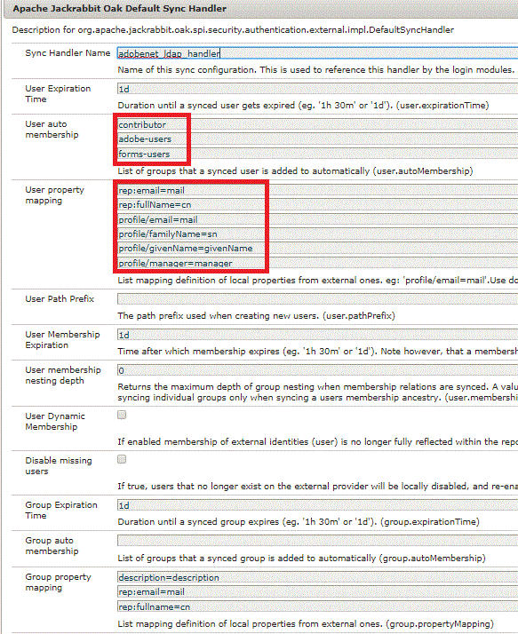

# Utilizzo di LDAP con AEM Forms Workflow

Assegnazione dell&#39;attività del flusso di lavoro di AEM Forms al manager dell&#39;autore dell&#39;invio.

Quando si utilizza un modulo adattivo nel flusso di lavoro AEM, è necessario assegnare dinamicamente un’attività al manager dell’autore dell’invio del modulo. Per eseguire questo caso d’uso, dovremo configurare l’AEM con Ldap.

I passaggi necessari per configurare AEM con LDAP sono descritti in [dettagli qui.](https://helpx.adobe.com/experience-manager/6-5/sites/administering/using/ldap-config.html)

Ai fini del presente articolo, allego i file di configurazione utilizzati per configurare l’AEM con Adobe Ldap. Questi file sono inclusi nel pacchetto che può essere importato utilizzando Gestione pacchetti.

Nella schermata seguente, recuperiamo tutti gli utenti appartenenti a un particolare centro di costo. Se desideri recuperare tutti gli utenti nel tuo LDAP, non puoi utilizzare il filtro aggiuntivo.


Nella schermata seguente, assegniamo i gruppi agli utenti recuperati da LDAP all’AEM. Osserva il gruppo forms-users assegnato agli utenti importati. L’utente deve essere membro di questo gruppo per interagire con AEM Forms. La proprietà manager viene memorizzata anche nel nodo profile/manager in AEM.



Dopo aver configurato il protocollo LDAP e aver importato gli utenti in AEM, possiamo creare un flusso di lavoro che assegnerà l’attività al manager dei mittenti. Ai fini di questo articolo, abbiamo sviluppato un semplice flusso di lavoro di approvazione in un unico passaggio.

Nel primo passaggio del flusso di lavoro, il valore di initialstep viene impostato su No. La regola business nel modulo adattivo disabilita il pannello &quot;Dettagli mittente&quot; e mostra il pannello &quot;Approvato da&quot; in base al valore del passaggio iniziale.

Il secondo passaggio assegna l&#39;attività al manager dell&#39;autore della sottomissione. Il manager dell’autore dell’invio utilizza il codice personalizzato.


```java
public String getParticipant(WorkItem workItem, WorkflowSession wfSession, MetaDataMap arg2) throws WorkflowException{
resourceResolver = wfSession.adaptTo(ResourceResolver.class);
UserManager userManager = resourceResolver.adaptTo(UserManager.class);
Authorizable workflowInitiator = userManager.getAuthorizable(workItem.getWorkflow().getInitiator());
.
.
String managerPorperty = workflowInitiator.getProperty("profile/manager")[0].getString();
.
.

}
```

Lo snippet di codice è responsabile del recupero dell’ID dei manager e dell’assegnazione dell’attività al manager.

Acquisiamo la persona che ha avviato il flusso di lavoro. Viene quindi ottenuto il valore della proprietà manager.

A seconda di come la proprietà manager viene memorizzata nel proprio LDAP, potrebbe essere necessario eseguire alcune modifiche delle stringhe per ottenere l&#39;ID manager.

Leggi questo articolo per implementare il tuo [SelettorePartecipante .](https://helpx.adobe.com/experience-manager/using/dynamic-steps.html)

Per eseguire il test nel sistema (ad Adobe, i dipendenti possono utilizzare questo esempio preconfigurato)

* [Scarica e distribuisci il bundle setvalue](/help/forms/assets/common-osgi-bundles/SetValueApp.core-1.0-SNAPSHOT.jar). Questo è il bundle OSGI personalizzato per impostare la proprietà del manager.
* [Scaricare e installare DevelopingWithServiceUserBundle](/help/forms/assets/common-osgi-bundles/DevelopingWithServiceUser.jar)
* [Importa le risorse associate a questo articolo in AEM utilizzando il gestore di pacchetti](assets/aem-forms-ldap.zip).Come parte di questo pacchetto sono inclusi i file di configurazione LDAP, il flusso di lavoro e un modulo adattivo.
* Configurare AEM con il proprio LDAP utilizzando le credenziali LDAP appropriate.
* Accedi all’AEM utilizzando le credenziali LDAP.
* Apri [timeoffrequestform](http://localhost:4502/content/dam/formsanddocuments/helpx/timeoffrequestform/jcr:content?wcmmode=disabled)
* Compila il modulo e invia.
* Il manager dell&#39;autore dell&#39;invio dovrebbe ottenere il modulo per la revisione.

>[!NOTE]
>
>Questo codice personalizzato per l’estrazione del nome del manager è stato testato rispetto a LDAP Adobe. Se esegui questo codice su un LDAP diverso, dovrai modificare o scrivere la tua implementazione getParticipant per ottenere il nome del manager.
