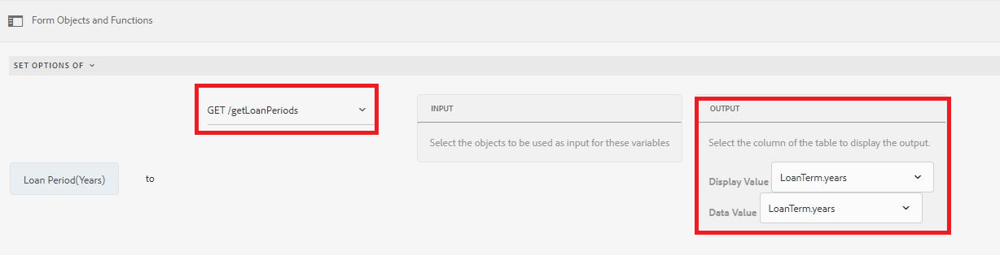

# Aggiunta dinamica di elementi al componente gruppo di scelta

AEM Forms 6.5 ha introdotto la possibilità di aggiungere in modo dinamico elementi a un componente per un gruppo di scelta Forms adattivo come CheckBox, Pulsante di scelta e Elenco immagini.

[Questa funzionalità è disponibile dal vivo sul server](https://forms.enablementadobe.com/content/samples/samples.html?query=0#collapse1) Samples. Cerca la scheda degli elementi della casella di controllo dinamica e fai clic su &quot;Prova&quot;


Puoi aggiungere elementi utilizzando l’editor visivo e l’editor di codice, a seconda del caso d’uso.

**Utilizzando l’editor visivo:** puoi compilare gli elementi del gruppo di scelta dai risultati di una chiamata di funzione o di un servizio. Ad esempio, puoi impostare gli elementi del gruppo di scelta utilizzando la risposta di una chiamata API REST.

Nella schermata seguente, stiamo impostando le opzioni di Periodo di prestito (anni) ai risultati di una chiamata di servizio chiamata getLoanPeriods.



**Utilizzando l&#39;editor** di codice: Quando si desidera impostare in modo dinamico gli elementi del gruppo di scelta in base ai valori immessi nel modulo. Ad esempio, lo snippet di codice seguente imposta gli elementi della casella di controllo sui valori immessi nei campi del nome del richiedente e del coniuge del modulo adattivo.

Nello snippet di codice, stiamo impostando gli elementi di WorkingMembers che è un componente casella di controllo. La matrice per gli elementi viene generata in modo dinamico recuperando i valori dei campi di testo nomecandidato e coniuge dei moduli adattivi

```javascript
 
 if(MaritalStatus.value=="Married")
  {
WorkingMembers.items =["spouse="+spouse.value,"applicant="+applicantName.value];
  }
else
  {
    WorkingMembers.items =["applicant="+applicantName.value];
  }
```

I dati presentati sono i seguenti

```xml
<afUnboundData>

<data>

<applicantName>John Jacobs</applicantName>

<MaritalStatus>Married</MaritalStatus>

<spouse>Gloria Rios</spouse>

<WorkingMembers>spouse,applicant</WorkingMembers>

</data>

</afUnboundData>
```

**Aggiunta di elementi tramite l’editor di regole**

>[!VIDEO](https://video.tv.adobe.com/v/26847?quality=12&learn=on)

**Aggiunta di elementi tramite l’editor di codice**

>[!VIDEO](https://video.tv.adobe.com/v/26848?quality=12&learn=on)

Per provare questo sul tuo sistema:

**Utilizzo dell’editor di codice per aggiungere elementi**

* [Scaricare le risorse](assets/usingthecodeeditor.zip)
* [Apri Forms E Documenti](http://localhost:4502/aem/forms.html/content/dam/formsanddocuments)
* Fai clic su &quot;Crea | Caricamento file&quot; e carica il file scaricato nel passaggio precedente
* [Anteprima dei moduli](http://localhost:4502/content/dam/formsanddocuments/simpleform/jcr:content?wcmmode=disabled)
* Immettere il nome del candidato e selezionare lo stato civile da sposare
* Inserire il nome del coniuge
* Fai clic su Avanti
* Dovresti vedere la casella di controllo compilata con il nome del richiedente e con il nome del coniuge se lo stato civile è sposato

**Utilizzo dell’editor visivo per aggiungere elementi**

* [Scaricare le risorse](assets/usingthevisualeditor.zip)
* Installa Tomcat se non lo hai già. [Le istruzioni per l&#39;installazione di tomcat sono disponibili qui](https://experienceleague.adobe.com/docs/experience-manager-learn/forms/ic-print-channel-tutorial/introduction.html)
* [Distribuisci il file SampleRest.war contenuto in questo file zip nel tuo Tomcat](assets/sample-rest.zip)
* [Apri Forms E Documenti](http://localhost:4502/aem/forms.html/content/dam/formsanddocuments)
* Fai clic su &quot;Crea | Caricamento file&quot; e carica il file scaricato nel passaggio precedente
* [Anteprima dei moduli](http://localhost:4502/content/dam/formsanddocuments/amortizationschedule/jcr:content?wcmmode=disabled)
* Inserire l&#39;importo del prestito e la tabulazione fuori dal campo. Questo attiverà la regola che visualizza il campo del periodo di prestito.
* Selezionare il periodo di prestito appropriato (gli elementi per il periodo di prestito sono compilati dalla chiamata di riserva)
* Selezionare il tasso di interesse e fare clic su &quot;Ottieni programma di ammortamento&quot;
* La tabella di ammortamento dovrebbe essere compilata. Il programma di ammortamento viene recuperato utilizzando una chiamata REST.

>[!NOTE]
> Si presume che tomcat sia in funzione sulla porta 8080 e AEM sulla porta 4502
