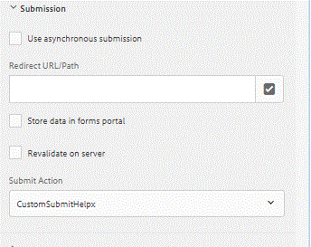

# Scrittura di un invio personalizzato in AEM Forms {#writing-a-custom-submit-in-aem-forms}

Modo semplice e rapido per creare un’azione di invio personalizzata per il modulo adattivo

Questo articolo illustra i passaggi necessari per creare un’azione di invio personalizzata per la gestione dell’invio di moduli adattivi.

* Accedi a crx
* Crea un nodo di tipo &quot;sling :folder&quot; sotto le app. Chiamiamo questo nodo CustomSubmitHelpx.
* Salva il nodo appena creato.
* Aggiungi le due seguenti proprietà al nodo appena creato
* NomeProprietà       | Valore proprietà
* guideComponentType | fd/af/components/guidesubmittype
* guideDataModel     | xfa,xsd,basic
* jcr:description   | CustomSubmitHelpx
* Salva le modifiche
* Crea un nuovo file denominato post.POST.jsp sotto il nodo CustomSubmitHelpx.Quando viene inviato un modulo adattivo, viene chiamato questo JSP. Puoi scrivere il codice JSP in base alle tue esigenze in questo file. Il codice seguente inoltra la richiesta al servlet.

```java
<%
%><%@include file="/libs/foundation/global.jsp"%>
<%@taglib prefix="cq" uri="http://www.day.com/taglibs/cq/1.0"%>
<%@ page import="org.apache.sling.api.request.RequestParameter,com.day.cq.wcm.api.WCMMode,com.adobe.forms.common.submitutils.CustomParameterRequest,com.adobe.aemds.guide.submitutils.*" %>

<%@ page import="org.apache.sling.api.request.RequestParameter,com.day.cq.wcm.api.WCMMode" %>
<%@page session="false" %>
<%

   com.adobe.aemds.guide.utils.GuideSubmitUtils.setForwardPath(slingRequest,"/bin/storeafsubmission",null,null);

%>
```

* Crea un file denominato addfields .jsp sotto il nodo CustomSubmitHelpx . Questo file consente di accedere al documento firmato.
* Aggiungi il codice seguente a questo file

```java
    <%@include file="/libs/fd/af/components/guidesglobal.jsp"%>

    <%@page import="org.slf4j.LoggerFactory" %>

    <%@page import="org.slf4j.Logger" %>

    <input type="hidden" id="useSignedPdf" name="_useSignedPdf" value=""/>;
```

* Salva le modifiche

Ora inizierai a vedere &quot;CustomSubmitHelpx&quot; nelle azioni di invio del modulo adattivo come mostrato in questa immagine.



