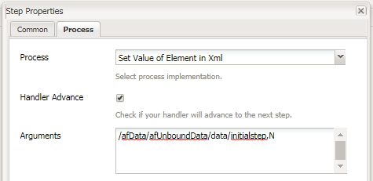

# Utilizzo di setvalue nel flusso di lavoro  AEM Forms

Impostate il valore di un elemento XML in dati Forms adattivi inviati in  flusso di lavoro AEM Forms OSGI.

LiveCycle utilizzato per avere un componente valore impostato che consente di impostare il valore di un elemento XML.

In base a questo valore, quando il modulo viene compilato con il codice XML è possibile nascondere o disabilitare alcuni campi o pannelli del modulo.

In  AEM Forms OSGI- sarà necessario scrivere un bundle OSGi personalizzato per impostare il valore in XML. Il bundle viene fornito come parte di questa esercitazione.
Utilizziamo Procedura nel flusso di lavoro AEM. Associamo il bundle OSGi &quot;Set Value of Element in XML&quot; a questo passaggio del processo.
È necessario trasmettere due argomenti al bundle set value. Il primo argomento è l&#39;XPath dell&#39;elemento XML il cui valore deve essere impostato. Il secondo argomento è il valore da impostare.
Ad esempio, nella schermata precedente, stiamo impostando il valore dell&#39;elemento step iniziale su &quot;N&quot;.
In base a questo valore, alcuni pannelli nell’Forms adattivo vengono nascosti o visualizzati.
Nel nostro esempio, abbiamo un semplice modulo di richiesta del tempo. L&#39;iniziatore di questo modulo compila il proprio nome e l&#39;ora delle date. Al momento dell&#39;invio, il modulo va a &quot;admin&quot; per la revisione. Quando l&#39;amministratore apre il modulo, i campi del primo pannello sono disabilitati. Questo perché abbiamo impostato il valore dell&#39;elemento step iniziale nell&#39;XML su &quot;N&quot;.

In base al valore dei campi del passaggio iniziale, viene visualizzato il secondo pannello in cui l&#39;amministratore può approvare o rifiutare la richiesta

Osservate le regole impostate per il campo &quot;Tempo di attesa richiesto da&quot; utilizzando l&#39;editor delle regole.

Per distribuire le risorse sul sistema locale, effettuate le seguenti operazioni:

* [Distribuzione del bundle Developingwithservice](/help/forms/assets/common-osgi-bundles/DevelopingWithServiceUser.jar)

* [Distribuite il bundle](/help/forms/assets/common-osgi-bundles/SetValueApp.core-1.0-SNAPSHOT.jar) di esempio. Questo è il pacchetto OSGI personalizzato che consente di impostare i valori di un elemento nei dati XML inviati

* [Scaricare ed estrarre il contenuto del file zip](assets/setvalueassets.zip)
* Posizionare il browser su [gestore pacchetti](http://localhost:4502/crx/packmgr/index.jsp)
* Importa e installa setValueWorkflow.zip. Questo include il modello di flusso di lavoro di esempio.
* Posizionare il browser su [Forms e Documenti](http://localhost:4502/aem/forms.html/content/dam/formsanddocuments)
* Fate clic su Crea | Caricamento file
* Caricate TimeOfRequestForm.zip
* Aprire la [TimeOffRequest](http://localhost:4502/content/dam/formsanddocuments/timeoffapplication/jcr:content?wcmmode=disabled)
* Compilate i 3 campi richiesti e inviate
* Accedi come amministratore in AEM (se non hai ancora effettuato l’accesso)
* Vai a [&quot;AEM Inbox&quot;](http://localhost:4502/aem/inbox)
* Aprire il modulo &quot;Ora di revisione della richiesta&quot;
* I campi del primo pannello sono disattivati. Questo perché il modulo viene aperto dal revisore. Inoltre, il pannello per approvare o rifiutare la richiesta è ora visibile

>[!NOTE]
>
>È possibile abilitare la registrazione di debug abilitando logger per
>com.aemforms.setvalue.core.SetValueinXml
>indicando il browser a http://localhost:4502/system/console/slinglog

>[!NOTE]
>
>Assicurarsi che il percorso del file di dati nelle opzioni di invio del modulo adattivo sia impostato su &quot;Data.xml&quot;. Questo perché il passaggio del processo cerca un file denominato Data.xml sotto la cartella payload
