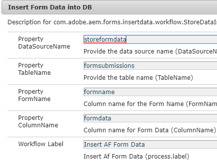

# Memorizzazione di invii di moduli adattivi nel database

Sono disponibili diversi modi per memorizzare i dati del modulo inviati nel database desiderato. Un’origine dati JDBC può essere utilizzata per memorizzare direttamente i dati nel database. È possibile scrivere un bundle OSGI personalizzato per memorizzare i dati nel database. Questo articolo utilizza un passaggio di processo personalizzato nel flusso di lavoro AEM per memorizzare i dati.
Il caso d’uso è quello di attivare un flusso di lavoro AEM in un modulo adattivo e un passaggio nel flusso di lavoro memorizza i dati inviati nel database.

**Segui i passaggi indicati di seguito per far sì che questo funzioni sul tuo sistema**

* [Scaricare il file Zip ed estrarne il contenuto sul disco rigido](assets/storeafdataindb.zip)

   * Importa StoreAFInDBWorkflow.zip in AEM utilizzando il gestore di pacchetti. Il pacchetto dispone di un flusso di lavoro di esempio che memorizza i dati AF in DB. Apri il modello di flusso di lavoro . Il flusso di lavoro ha un solo passaggio. Questo passaggio chiama il codice scritto nel bundle per memorizzare i dati AF nel database. Passo un solo argomento al processo. Si tratta del nome del modulo adattivo di cui vengono salvati i dati.
   * Distribuisci insertdata.core-0.0.1-SNAPSHOT.jar utilizzando la console web Felix. Questo bundle ha il codice per scrivere i dati del modulo inviati al database

* Vai a [ConfigMgr](http://localhost:4502/system/console/configMgr)

   * Cerca &quot;JDBC Connection Pool&quot;. Crea un nuovo pool di connessioni JDBC Day Commons. Specifica le impostazioni specifiche del database.

   * 
   * Cerca &quot;**Inserisci dati modulo in DB**&quot;
   * Specifica le proprietà specifiche del database.
      * DataSourceName:Nome dell&#39;origine dati configurata in precedenza.
      * TableName - Nome della tabella in cui si desidera memorizzare i dati AF
      * FormName - Nome della colonna che deve contenere il nome del modulo
      * ColumnName - Nome della colonna in cui sono contenuti i dati AF

   

* Creare un modulo adattivo.

* Associa il modulo adattivo a AEM Workflow(StoreAFValuesinDB) come mostrato nella schermata sottostante.

* Assicurati di specificare &quot;data.xml&quot; nel percorso del file di dati come mostrato nella schermata sottostante

   

* Anteprima del modulo e invio

* Se tutto è andato bene, è necessario visualizzare i dati del modulo memorizzati nella tabella e nella colonna specificate dall’utente

