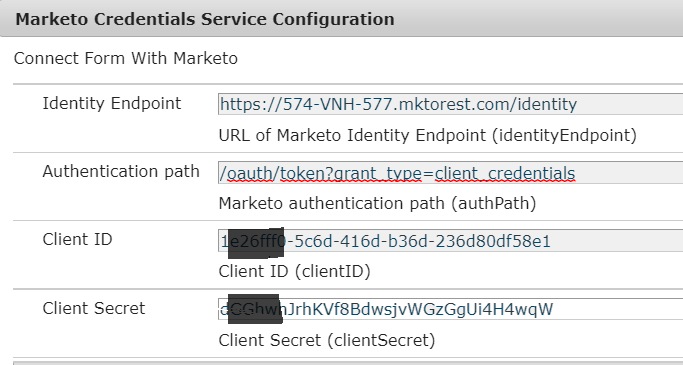

# Servizio di autenticazione Marketo

Le API REST di Marketo sono autenticate con OAuth 2.0 a 2 zampe. È necessario creare un’autenticazione personalizzata per eseguire l’autenticazione su Marketo. Questa autenticazione personalizzata viene generalmente scritta all&#39;interno di un bundle OSGI. Il codice seguente mostra l’autenticatore personalizzato utilizzato come parte di questa esercitazione.

## Servizio di autenticazione personalizzato

Il codice seguente crea l&#39;oggetto AuthenticationDetails che dispone del token access_token necessario per l&#39;autenticazione su Marketo

```java
package com.marketoandforms.core;
import org.osgi.service.component.annotations.Component;
import org.osgi.service.component.annotations.Reference;
 
import com.adobe.aemfd.dermis.authentication.api.IAuthentication;
import com.adobe.aemfd.dermis.authentication.exception.AuthenticationException;
import com.adobe.aemfd.dermis.authentication.model.AuthenticationDetails;
import com.adobe.aemfd.dermis.authentication.model.Configuration;
@Component(service={IAuthentication.class}, immediate=true)
public class MarketoAuthenticationService implements IAuthentication {
@Reference
MarketoService marketoService;
    @Override
    public AuthenticationDetails getAuthDetails(Configuration arg0) throws AuthenticationException
    {
        AuthenticationDetails auth = new AuthenticationDetails();
        auth.addHttpHeader("Cache-Control", "no-cache");
        auth.addHttpHeader("Authorization", "Bearer " + marketoService.getAccessToken());
        return auth
    }
 
    @Override
    public String getAuthenticationType() {
        // TODO Auto-generated method stub
        return "AemForms With Marketo";
    }
}
```

Il servizio MarketoAuthenticationService implementa l&#39;interfaccia IAuthAuthentication. Questa interfaccia fa parte dell’SDK client di AEM Forms. Il servizio ottiene il token di accesso e inserisce il token nell’intestazione HttpHeader di AuthenticationDetails. Una volta che le intestazioni HttpHeaders dell&#39;oggetto AuthenticationDetails vengono compilate, l&#39;oggetto AuthenticationDetails viene restituito al livello Dermis del modello dati modulo.

Presta attenzione alla stringa restituita dal metodo getAuthenticationType. Questa stringa viene utilizzata durante la configurazione dell&#39;origine dati.

### Ottieni token di accesso

Viene definita un&#39;interfaccia semplice con un metodo che restituisce l&#39;access_token. Il codice della classe che implementa questa interfaccia viene elencato più in basso nella pagina.

```java
package com.marketoandforms.core;
public interface MarketoService {
    String getAccessToken();
}
```

Il codice seguente è del servizio che restituisce l’access_token da utilizzare per effettuare le chiamate API REST. Il codice in questo servizio accede ai parametri di configurazione necessari per effettuare la chiamata GET. Come puoi vedere, passiamo il client_id,client_secret nell’URL del GET per generare il access_token. Questo access_token viene quindi restituito all&#39;applicazione chiamante.

```java
package com.marketoandforms.core.impl;
import java.io.IOException;
import org.apache.http.HttpEntity;
import org.apache.http.HttpResponse;
import org.apache.http.ParseException;
import org.apache.http.client.ClientProtocolException;
import org.apache.http.client.HttpClient;
import org.apache.http.client.methods.HttpGet;
import org.apache.http.impl.client.HttpClientBuilder;
import org.apache.http.util.EntityUtils;
import org.json.JSONException;
import org.osgi.service.component.annotations.Component;
import org.osgi.service.component.annotations.Reference;
import org.slf4j.Logger;
import org.slf4j.LoggerFactory;
import com.marketoandforms.core.*; 
@Component(service=MarketoService.class,immediate = true)
public class MarketoServiceImpl implements MarketoService {
    private final Logger log = LoggerFactory.getLogger(getClass());
@Reference
MarketoConfigurationService config;
    @Override
    public String getAccessToken()
    {
        String AUTH_URL = config.getAUTH_URL();
        String CLIENT_ID = config.getCLIENT_ID();
        String CLIENT_SECRET = config.getCLIENT_SECRET();
        String AUTH_PATH = config.getAUTH_PATH();
        HttpClient httpClient = HttpClientBuilder.create().build();
        String getURL = AUTH_URL+AUTH_PATH+"&client_id="+CLIENT_ID+"&client_secret="+CLIENT_SECRET;
        log.debug("The url to get the access token is "+getURL);
        HttpGet httpGet = new HttpGet(getURL);
        httpGet.addHeader("Cache-Control","no-cache");
        try {
            HttpResponse httpResponse = httpClient.execute(httpGet);
            HttpEntity httpEntity = httpResponse.getEntity();
            org.json.JSONObject responseJSON = new org.json.JSONObject(EntityUtils.toString(httpEntity))
            return (String)responseJSON.get("access_token");
        } catch (ClientProtocolException e) {
            // TODO Auto-generated catch block
            e.printStackTrace();
        } catch (IOException e) {
            // TODO Auto-generated catch block
            e.printStackTrace();
        } catch (ParseException e) {
            // TODO Auto-generated catch block
            e.printStackTrace();
        } catch (JSONException e) {
            // TODO Auto-generated catch block
            e.printStackTrace();
        }
        return null;
    }
}
```

La schermata seguente mostra le proprietà di configurazione che devono essere impostate. Queste proprietà di configurazione vengono lette nel codice elencato sopra per ottenere l&#39;access_token



### Configurazione

Il codice seguente è stato utilizzato per creare le proprietà di configurazione. Queste proprietà sono specifiche dell’istanza Marketo

```java
package com.marketoandforms.core;
 
import org.osgi.service.metatype.annotations.AttributeDefinition;
import org.osgi.service.metatype.annotations.ObjectClassDefinition;
 
@ObjectClassDefinition(name="Marketo Credentials Service Configuration", description = "Connect Form With Marketo")
public @interface MarketoConfiguration {
     @AttributeDefinition(name="Identity Endpoint", description="URL of Marketo Identity Endpoint")
     String identityEndpoint() default "";
      @AttributeDefinition(name="Authentication path", description="Marketo authentication path")
      String authPath() default "";
      @AttributeDefinition(name="Client ID", description="Client ID")
      String clientID() default "";
      @AttributeDefinition(name="Client Secret", description="Client Secret")
      String clientSecret() default "";
}
```

Il codice seguente legge le proprietà di configurazione e restituisce lo stesso tramite i metodi getter .

```java
package com.marketoandforms.core;
 
import org.osgi.service.component.annotations.Activate;
import org.osgi.service.component.annotations.Component;
import org.osgi.service.metatype.annotations.Designate;
import org.slf4j.Logger;
import org.slf4j.LoggerFactory;
@Component(immediate=true, service={MarketoConfigurationService.class})
@Designate(ocd=MarketoConfiguration.class)
public class MarketoConfigurationService {
    private final Logger log = LoggerFactory.getLogger(getClass());
    private MarketoConfiguration config;
    private String AUTH_URL;
    private String  AUTH_PATH;
    private String CLIENT_ID ;
    private String CLIENT_SECRET;
     @Activate
      protected final void activate(MarketoConfiguration config) {
        System.out.println("####In my marketo activating auth service");
        AUTH_URL = config.identityEndpoint();
        AUTH_PATH = config.authPath();
        CLIENT_ID = config.clientID();
        CLIENT_SECRET = config.clientSecret();
        log.info("clientID:" + CLIENT_ID);
        System.out.println("The client id is "+CLIENT_ID+"AUTH PATH"+AUTH_PATH);
      }
    public String getAUTH_URL() {
        return AUTH_URL;
    }
   public String getAUTH_PATH() {
        return AUTH_PATH;
    }
    public String getCLIENT_ID() {
        return CLIENT_ID;
    }

    public String getCLIENT_SECRET() {
        return CLIENT_SECRET;
    }
}
```

1. Crea e distribuisci il bundle sul server AEM.
1. [Posiziona il browser su configMgr](http://localhost:4502/system/console/configMgr) e cerca &quot;Marketo Credentials Service Configuration&quot; (Configurazione servizio credenziali)
1. Specifica le proprietà appropriate specifiche dell’istanza Marketo

## Passaggi successivi

[Creare un&#39;origine dati basata su servizio RESTful](./part3.md)

