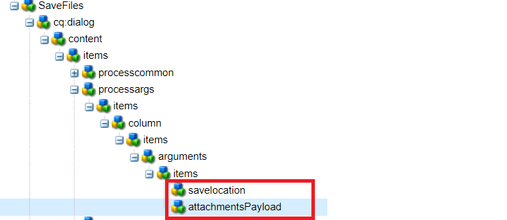

# Componente flusso di lavoro personalizzato

Questo tutorial è destinato ai clienti di AEM Forms che necessitano di creare un componente flusso di lavoro personalizzato. Il componente flusso di lavoro verrà configurato per eseguire il codice scritto nel passaggio precedente. Il componente del flusso di lavoro può specificare gli argomenti del processo per il codice. In questo articolo esploreremo il componente del flusso di lavoro associato al codice.

[Scaricare il componente del flusso di lavoro personalizzato](assets/saveFiles.zip)
Importare il componente del flusso di lavoro [utilizzo di gestione pacchetti](http://localhost:4502/crx/packmgr/index.jsp)

Il componente del flusso di lavoro personalizzato si trova in /apps/AEMFormsDemoListings/workflowcomponent/SaveFiles

Selezionare il nodo SaveFiles ed esaminarne le proprietà

**componentGroup** : il valore di questa proprietà determina la categoria del componente del flusso di lavoro.

**jcr:Titolo** : titolo del componente del flusso di lavoro.

**sling:resourceSuperType** Il valore di questa proprietà determinerà l’ereditarietà di questo componente. In questo caso ereditiamo dal componente processo

## cq:dialog

Le finestre di dialogo vengono utilizzate per consentire all’autore di interagire con il componente. La finestra cq:dialog si trova sotto il nodo SaveFiles

I nodi sotto il nodo elementi rappresentano le schede del componente attraverso le quali gli autori interagiscono con il componente. Le schede comuni e di processo sono nascoste. Sono visibili le schede Comuni e Argomenti.

Gli argomenti di processo per il processo si trovano sotto il nodo processargs

L’autore specifica gli argomenti come mostrato nella schermata seguente

I valori vengono memorizzati come proprietà del nodo di metadati. Ad esempio il valore **c:\formsallegati** verrà memorizzato nella proprietà saveToLocation del nodo di metadati

## cq:editConfig

Cq:EditConfig è semplicemente un nodo con il tipo primario cq:EditConfig e il nome cq:editConfig sotto la radice del componente. Il comportamento di modifica di un componente viene configurato aggiungendo un nodo cq:editConfig di tipo cq:EditConfig sotto il nodo del componente (di tipo cq:Component)

cq:formParameters (tipo di nodo nt:unstructured): definisce parametri aggiuntivi che vengono aggiunti al modulo della finestra di dialogo.

Osserva le proprietà del nodo cq:formParameters

Il valore della proprietà PROCESS indica il codice Java che verrà associato al componente del flusso di lavoro.
