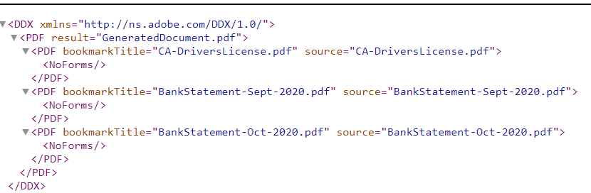

# Assemblare gli allegati del modulo

Questo articolo fornisce risorse per assemblare gli allegati dei moduli adattivi in un ordine specificato. Affinché questo codice di esempio funzioni, gli allegati del modulo devono essere in formato pdf. Di seguito è riportato il caso d’uso.
L’utente che compila un modulo adattivo allega al modulo uno o più documenti PDF.
All’invio del modulo, assembla gli allegati del modulo per generare un unico PDF. È possibile specificare l&#39;ordine di assemblaggio degli allegati per generare il PDF finale.

## Crea un componente OSGi che implementa l’interfaccia WorkflowProcess

Crea un componente OSGi che implementa [interfaccia com.adobe.granite.workflow.exec.WorkflowProcess](https://helpx.adobe.com/experience-manager/6-5/sites/developing/using/reference-materials/javadoc/com/adobe/granite/workflow/exec/WorkflowProcess.html). Il codice di questo componente può essere associato al componente della fase del processo nel flusso di lavoro AEM. Il metodo execute dell’interfaccia com.adobe.granite.workflow.exec.WorkflowProcess è implementato in questo componente.

Quando un modulo adattivo viene inviato per attivare un flusso di lavoro AEM, i dati inviati vengono memorizzati nel file specificato nella cartella del payload. Ad esempio, questo è il file di dati inviato. È necessario assemblare gli allegati specificati sotto il tag idcard e bankstatements.
.

### Ottieni i nomi dei tag

L’ordine degli allegati viene specificato come argomenti delle fasi del processo nel flusso di lavoro, come illustrato nella schermata seguente. Qui stiamo assemblando gli allegati aggiunti al campo idcard seguito da bankstatement


Il frammento di codice seguente estrae i nomi degli allegati dagli argomenti del processo

```java
String  []attachmentNames  = arg2.get("PROCESS_ARGS","string").toString().split(",");
```

### Crea DDX dai nomi degli allegati

Quindi è necessario creare [XML descrizione documento (DDX)](https://helpx.adobe.com/pdf/aem-forms/6-2/ddxRef.pdf) documento utilizzato dal servizio Assembler per assemblare i documenti. Di seguito è riportato il DDX creato dagli argomenti del processo. L&#39;elemento NoForms consente di appiattire i documenti basati su XFA prima che vengano assemblati. Si noti che gli elementi di origine PDF sono disposti nell&#39;ordine corretto specificato negli argomenti del processo.



### Crea mappa di documenti

Viene quindi creata una mappa di documenti con il nome dell’allegato come chiave e l’allegato come valore. È stato utilizzato il servizio Query Builder per eseguire query sugli allegati nel percorso del payload e creare la mappa dei documenti. Questa mappa del documento insieme al DDX è necessaria affinché il servizio assemblatore possa assemblare il PDF finale.

```java
public Map<String, Object> createMapOfDocuments(String payloadPath,WorkflowSession workflowSession )
{
  Map<String, String> queryMap = new HashMap<String, String>();
  Map<String,Object>mapOfDocuments = new HashMap<String,Object>();
  queryMap.put("type", "nt:file");
  queryMap.put("path",payloadPath);
  Query query = queryBuilder.createQuery(PredicateGroup.create(queryMap),workflowSession.adaptTo(Session.class));
  query.setStart(0);
  query.setHitsPerPage(30);
  SearchResult result = query.getResult();
  log.debug("Get result hits "+result.getHits().size());
  for (Hit hit : result.getHits()) {
    try {
          String path = hit.getPath();
          log.debug("The title "+hit.getTitle()+" path "+path);
          if(hit.getTitle().endsWith("pdf"))
           {
             com.adobe.aemfd.docmanager.Document attachmentDocument = new com.adobe.aemfd.docmanager.Document(path);
             mapOfDocuments.put(hit.getTitle(),attachmentDocument);
             log.debug("@@@@Added to map@@@@@ "+hit.getTitle());
           }
        }
    catch (Exception e)
       {
          log.debug(e.getMessage());
       }

}
return mapOfDocuments;
}
```

### Utilizzare AssemblerService per assemblare i documenti

Dopo aver creato il DDX e la mappa del documento, il passaggio successivo consiste nell&#39;utilizzare AssemblerService per assemblare i documenti.
Il codice seguente assembla e restituisce il PDF assemblato.

```java
private com.adobe.aemfd.docmanager.Document assembleDocuments(Map<String, Object> mapOfDocuments, com.adobe.aemfd.docmanager.Document ddxDocument)
{
    AssemblerOptionSpec aoSpec = new AssemblerOptionSpec();
    aoSpec.setFailOnError(true);
    AssemblerResult ar = null;
    try
    {
        ar = assemblerService.invoke(ddxDocument, mapOfDocuments, aoSpec);
        return (com.adobe.aemfd.docmanager.Document) ar.getDocuments().get("GeneratedDocument.pdf");
    }
    catch (OperationException e)
    {
        log.debug(e.getMessage());
    }
    return null;
    
}
```

### Salva il PDF assemblato nella cartella del payload

L’ultimo passaggio consiste nel salvare il PDF assemblato nella cartella del payload. È quindi possibile accedere a questo pdf nei passaggi successivi del flusso di lavoro per ulteriori elaborazioni.
Il seguente snippet di codice è stato utilizzato per salvare il file nella cartella del payload

```java
Session session = workflowSession.adaptTo(Session.class);
javax.jcr.Node payloadNode =  workflowSession.adaptTo(Session.class).getNode(workItem.getWorkflowData().getPayload().toString());
log.debug("The payload Path is "+payloadNode.getPath());
javax.jcr.Node assembledPDFNode = payloadNode.addNode("assembled-pdf.pdf", "nt:file"); 
javax.jcr.Node jcrContentNode =  assembledPDFNode.addNode("jcr:content", "nt:resource");
Binary binary =  session.getValueFactory().createBinary(assembledDocument.getInputStream());
jcrContentNode.setProperty("jcr:data", binary);
log.debug("Saved !!!!!!"); 
session.save();
```

Di seguito è riportata la struttura delle cartelle del payload dopo l’assemblaggio e l’archiviazione degli allegati del modulo.


### Per utilizzare questa funzionalità sul server AEM

* Scarica il file [Assembla modulo allegati modulo](assets/assemble-form-attachments-af.zip) al sistema locale.
* Importa il modulo da[Forms E Documenti](http://localhost:4502/aem/forms.html/content/dam/formsanddocuments) pagina.
* Scarica [workflow](assets/assemble-form-attachments.zip) e importare in AEM utilizzando Gestione pacchetti.
* Scarica il file [bundle personalizzato](assets/assembletaskattachments.assembletaskattachments.core-1.0-SNAPSHOT.jar)
* Distribuire e avviare il bundle utilizzando [console web](http://localhost:4502/system/console/bundles)
* Puntare il browser a [Modulo AssembleAttachments](http://localhost:4502/content/dam/formsanddocuments/assembleattachments/jcr:content?wcmmode=disabled)
* Aggiungere un allegato nel documento ID e un paio di documenti PDF alla sezione rendiconti bancari
* Invia il modulo per attivare il flusso di lavoro
* Controlla il di [cartella payload in crx](http://localhost:4502/crx/de/index.jsp#/var/fd/dashboard/payload) per il pdf assemblato

>[!NOTE]
> Se hai attivato il logger per il bundle personalizzato, il DDX e il file assemblato vengono scritti nella cartella dell’installazione dell’AEM.
