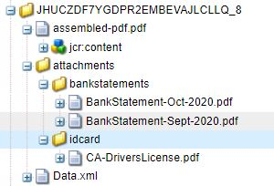

# Assemblare gli allegati del modulo

Questo articolo fornisce le risorse per assemblare gli allegati dei moduli adattivi in un ordine specificato. Affinché il codice di esempio funzioni, gli allegati del modulo devono essere in formato pdf. Esempio di utilizzo:
L&#39;utente che compila un modulo adattivo allega uno o più documenti pdf al modulo.
Durante l&#39;invio del modulo, assemblare gli allegati del modulo per generare un pdf. È possibile specificare l&#39;ordine in cui gli allegati vengono assemblati per generare il pdf finale.

## Creare un componente OSGi che implementa l’interfaccia WorkflowProcess

Create un componente OSGi che implementa l&#39;interfaccia [com.adobe.granite.workflow.exec.WorkflowProcess](https://helpx.adobe.com/experience-manager/6-5/sites/developing/using/reference-materials/javadoc/com/adobe/granite/workflow/exec/WorkflowProcess.html). Il codice contenuto in questo componente può essere associato al componente Fase processo nel flusso di lavoro AEM. Il metodo execute dell’interfaccia com.adobe.granite.workflow.exec.WorkflowProcess è implementato in questo componente.

Quando viene inviato un modulo adattivo per attivare un flusso di lavoro AEM, i dati inviati vengono memorizzati nel file specificato nella cartella payload. Ad esempio, questo è il file di dati inviato. Dobbiamo assemblare gli allegati specificati sotto il tag idcard e bankStatement.
.

### Ottenere i nomi dei tag

L&#39;ordine degli allegati è specificato come argomenti del passaggio del processo nel flusso di lavoro, come mostrato nella schermata sottostante. Qui stiamo assemblando gli allegati aggiunti al biglietto da visita seguito da resoconti bancari


Il frammento di codice seguente estrae i nomi degli allegati dagli argomenti di processo

```java
String  []attachmentNames  = arg2.get("PROCESS_ARGS","string").toString().split(",");
```

### Crea DDX dai nomi degli allegati

È quindi necessario creare un documento [Document Description XML (DDX)](https://helpx.adobe.com/pdf/aem-forms/6-2/ddxRef.pdf) che viene utilizzato dal servizio Assembler per assemblare i documenti. Di seguito è riportato il DDX creato dagli argomenti del processo. L&#39;elemento NoForms consente di appiattire i documenti basati su XFA prima che vengano assemblati. Tenere presente che gli elementi di origine PDF sono nell&#39;ordine corretto, come specificato negli argomenti di processo.


### Creare una mappa dei documenti

Viene quindi creata una mappa di documenti con il nome dell&#39;allegato come chiave e l&#39;allegato come valore. Il servizio Query Builder è stato utilizzato per interrogare gli allegati nel percorso di payload e creare la mappa dei documenti. Questa mappa del documento insieme al DDX è necessaria affinché il servizio assembler assembli il pdf finale.

```java
public Map<String, Object> createMapOfDocuments(String payloadPath,WorkflowSession workflowSession )
{
  Map<String, String> queryMap = new HashMap<String, String>();
  Map<String,Object>mapOfDocuments = new HashMap<String,Object>();
  queryMap.put("type", "nt:file");
  queryMap.put("path",payloadPath);
  Query query = queryBuilder.createQuery(PredicateGroup.create(queryMap),workflowSession.adaptTo(Session.class));
  query.setStart(0);
  query.setHitsPerPage(30);
  SearchResult result = query.getResult();
  log.debug("Get result hits "+result.getHits().size());
  for (Hit hit : result.getHits()) {
    try {
          String path = hit.getPath();
          log.debug("The title "+hit.getTitle()+" path "+path);
          if(hit.getTitle().endsWith("pdf"))
           {
             com.adobe.aemfd.docmanager.Document attachmentDocument = new com.adobe.aemfd.docmanager.Document(path);
             mapOfDocuments.put(hit.getTitle(),attachmentDocument);
             log.debug("@@@@Added to map@@@@@ "+hit.getTitle());
           }
        }
    catch (Exception e)
       {
          log.debug(e.getMessage());
       }

}
return mapOfDocuments;
}
```

### Utilizzare AssemblerService per assemblare i documenti

Dopo la creazione del DDX e della mappa del documento, il passaggio successivo consiste nell&#39;utilizzare AssemblerService per assemblare i documenti.
Il seguente codice assembla e restituisce il pdf assemblato.

```java
private com.adobe.aemfd.docmanager.Document assembleDocuments(Map<String, Object> mapOfDocuments, com.adobe.aemfd.docmanager.Document ddxDocument)
{
    AssemblerOptionSpec aoSpec = new AssemblerOptionSpec();
    aoSpec.setFailOnError(true);
    AssemblerResult ar = null;
    try
    {
        ar = assemblerService.invoke(ddxDocument, mapOfDocuments, aoSpec);
        return (com.adobe.aemfd.docmanager.Document) ar.getDocuments().get("GeneratedDocument.pdf");
    }
    catch (OperationException e)
    {
        log.debug(e.getMessage());
    }
    return null;
    
}
```

### Salvare il file pdf assemblato nella cartella payload

Il passo finale consiste nel salvare il pdf assemblato nella cartella payload. È quindi possibile accedere a questo pdf nei passaggi successivi del flusso di lavoro per un&#39;ulteriore elaborazione.
Il frammento di codice seguente è stato utilizzato per salvare il file nella cartella payload

```java
Session session = workflowSession.adaptTo(Session.class);
javax.jcr.Node payloadNode =  workflowSession.adaptTo(Session.class).getNode(workItem.getWorkflowData().getPayload().toString());
log.debug("The payload Path is "+payloadNode.getPath());
javax.jcr.Node assembledPDFNode = payloadNode.addNode("assembled-pdf.pdf", "nt:file"); 
javax.jcr.Node jcrContentNode =  assembledPDFNode.addNode("jcr:content", "nt:resource");
Binary binary =  session.getValueFactory().createBinary(assembledDocument.getInputStream());
jcrContentNode.setProperty("jcr:data", binary);
log.debug("Saved !!!!!!"); 
session.save();
```

Di seguito è riportata la struttura delle cartelle payload dopo che gli allegati del modulo sono stati assemblati e memorizzati.



### Per utilizzare questa funzionalità sul server AEM

* Scaricare il [Assembla modulo allegati](assets/assemble-form-attachments-af.zip) nel sistema locale.
* Importare il modulo dalla pagina [Forms and Documents](http://localhost:4502/aem/forms.html/content/dam/formsanddocuments).
* Scaricate [workflow](assets/assemble-form-attachments.zip) e importatelo in AEM utilizzando il gestore pacchetti.
* Scarica il [pacchetto personalizzato](assets/assembletaskattachments.assembletaskattachments.core-1.0-SNAPSHOT.jar)
* Distribuire e avviare il bundle utilizzando la [console Web](http://localhost:4502/system/console/bundles)
* Posizionare il browser su [AssembleAttachments Form](http://localhost:4502/content/dam/formsanddocuments/assembleattachments/jcr:content?wcmmode=disabled)
* Aggiungere un allegato nel documento ID e un paio di documenti pdf alla sezione dei rendiconti bancari
* Inviare il modulo per attivare il flusso di lavoro
* Controllare la cartella [payload del flusso di lavoro nel file crx](http://localhost:4502/crx/de/index.jsp#/var/fd/dashboard/payload) per il file pdf assemblato

>[!NOTE]
> Se avete abilitato logger per il bundle personalizzato, il DDX e il file assemblato viene scritto nella cartella dell&#39;installazione AEM.

