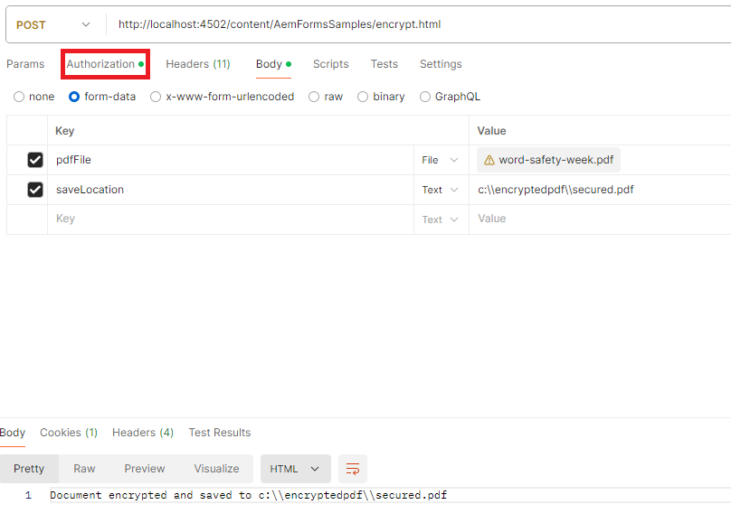

# Crittografa PDF con una password di autorizzazione

Per copiare, modificare o stampare un documento PDF è necessaria una password di autorizzazione, nota anche come password del proprietario o master. Scopri come utilizzare l&#39;API [DocAssuranceService](https://developer.adobe.com/experience-manager/reference-materials/6-5/forms/javadocs/index.html?com/adobe/fd/docassurance/client/api/DocAssuranceService.html) per applicare una password di autorizzazione a un PDF a livello di programmazione.

Il seguente codice JSP crittografa un PDF con una password di autorizzazione:

```java
<%--
     Encrypt PDF with permissions password
--%>
    <%@include file="/libs/foundation/global.jsp"%>
<%@ page import="com.adobe.fd.docassurance.client.api.EncryptionOptions,java.util.*,java.io.*,com.adobe.fd.encryption.client.*" %>
    <%@page session="false" %>
<%
    String filePath = request.getParameter("saveLocation");
    InputStream pdfIS = null;
    com.adobe.aemfd.docmanager.Document generatedDocument = null;
    // get the pdf file
    javax.servlet.http.Part pdfPart = request.getPart("pdfFile");
    pdfIS = pdfPart.getInputStream();
    com.adobe.aemfd.docmanager.Document pdfDocument = new com.adobe.aemfd.docmanager.Document(pdfIS);


// encrypt the document with permssions password. You can only print this document
    PasswordEncryptionOptionSpec poSpec = new PasswordEncryptionOptionSpec();    
    poSpec.setCompatability(PasswordEncryptionCompatability.ACRO_X);
    poSpec.setEncryptOption(PasswordEncryptionOption.ALL);
    List<PasswordEncryptionPermission> permissionList = new ArrayList<PasswordEncryptionPermission>();
    permissionList.add(PasswordEncryptionPermission.PASSWORD_PRINT_LOW);
    //hardcoding passwords into code is for demonstration purposes only.In real life scenarios the password is sourced from a secure location
    poSpec.setPermissionPassword("adobe");
    poSpec.setPermissionsRequested(permissionList);
    EncryptionOptions encryptionOptions = EncryptionOptions.getInstance();
    encryptionOptions.setEncryptionType(com.adobe.fd.docassurance.client.api.DocAssuranceServiceOperationTypes.ENCRYPT_WITH_PASSWORD);
    encryptionOptions.setPasswordEncryptionOptionSpec(poSpec);
    com.adobe.fd.docassurance.client.api.DocAssuranceService docAssuranceService = sling.getService(com.adobe.fd.docassurance.client.api.DocAssuranceService.class);
    com.adobe.aemfd.docmanager.Document securedDocument = docAssuranceService.secureDocument(pdfDocument,encryptionOptions,null,null,null);
    securedDocument.copyToFile(new java.io.File(filePath));
    out.println("Document encrypted and saved to " +filePath);
%>
```


**Per eseguire il test del pacchetto di esempio nel sistema**

[Scaricare e installare il pacchetto utilizzando Gestione pacchetti AEM](assets/encryptpdf.zip)

**Dopo aver installato il pacchetto, aggiungi i seguenti URL alla configurazione OSGi del filtro Adobe inserire nell&#39;elenco Consentiti Granite CSRF:**

1. [Accesso a configMgr](http://localhost:4502/system/console/configMgr)
1. Cerca Adobe di filtro CSRF Granite
1. Aggiungi il seguente percorso nelle sezioni escluse e salva
1. /content/AemFormsSamples/encrypt

## Verifica del campione

Esistono diversi modi per testare il codice di esempio. Il metodo più rapido e semplice consiste nell’utilizzare l’app Postman. Postman ti consente di effettuare richieste POST al server.Nella schermata seguente vengono mostrati i parametri di richiesta necessari per il funzionamento della richiesta post. Prima di inviare la richiesta, assicurati di specificare il tipo di autorizzazione appropriato.


