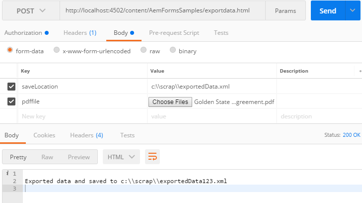

# Sviluppo con output e servizi Forms in AEM Forms{#developing-with-output-and-forms-services-in-aem-forms}

Utilizzo dell’API di output e del servizio Forms in AEM Forms

In questo articolo daremo un&#39;occhiata a quanto segue

* Servizio di output: in genere questo servizio viene utilizzato per unire dati xml con modello xdp o pdf per generare pdf appiattiti. Per ulteriori informazioni, consulta questo [javadoc](https://helpx.adobe.com/experience-manager/6-5/forms/javadocs/index.html?com/adobe/fd/output/api/OutputService.html) per il servizio Output.
* FormsService - Si tratta di un servizio molto versatile che consente di esportare/importare dati da e in file PDF. Per ulteriori informazioni, consulta questo [javadoc](https://developer.adobe.com/experience-manager/reference-materials/6-5/forms/javadocs/com/adobe/fd/forms/api/FormsService.html) per il servizio Forms.


Il seguente frammento di codice esporta i dati dal file PDF

```java
javax.servlet.http.Part pdfPart = request.getPart("pdffile");
String filePath = request.getParameter("saveLocation");
java.io.InputStream pdfIS = pdfPart.getInputStream();
com.adobe.aemfd.docmanager.Document pdfDocument = new com.adobe.aemfd.docmanager.Document(pdfIS);
com.adobe.fd.forms.api.FormsService formsservice = sling.getService(com.adobe.fd.forms.api.FormsService.class);
com.adobe.aemfd.docmanager.Document xmlDocument = formsservice.exportData(pdfDocument,com.adobe.fd.forms.api.DataFormat.Auto);
```

La riga 1 estrae il file pdf dalla richiesta

Line2 estrae saveLocation dalla richiesta

La riga 5 ottiene il blocco di FormsService

La riga 6 esporta i dati xml dal file PDF

**Per testare il pacchetto di esempio sul sistema**

[Scarica e installa il pacchetto utilizzando il gestore di pacchetti AEM](assets/outputandformsservice.zip)


**Dopo aver installato il pacchetto dovrai inserire nell&#39;elenco Consentiti i seguenti URL in Adobe Granite CSRF Filter.**

1. Segui i passaggi indicati di seguito per inserire nell&#39;elenco Consentiti i percorsi sopra menzionati.
1. [Accedi a configMgr](http://localhost:4502/system/console/configMgr)
1. Ricerca filtro CSRF Granite Adobe
1. Aggiungi i seguenti 3 percorsi nelle sezioni escluse e salva
1. /content/AemFormsSamples/mergedata
1. /content/AemFormsSamples/exportdata
1. /content/AemFormsSamples/outputservice
1. Cerca &quot;filtro Sling Referrer&quot;
1. Selezionare la casella di controllo &quot;Consenti vuoto&quot;. (Questa impostazione deve essere utilizzata solo a scopo di test) Esistono diversi modi per testare il codice di esempio. La più rapida e semplice è quella di utilizzare l&#39;app Postman. Postman consente di effettuare richieste POST al server. Installa l&#39;app Postman sul tuo sistema.
Avvia l’app e immetti il seguente URL per testare l’API dei dati di esportazione

Accertati di aver selezionato &quot;POST&quot; dall’elenco a discesa http://localhost:4502/content/AemFormsSamples/exportdata.html Assicurati di specificare &quot;Autorizzazione&quot; come &quot;Autenticazione di base&quot;. Specifica il nome utente e la password del server AEM Passa alla scheda &quot;Body&quot; e specifica i parametri della richiesta come mostrato nell&#39;immagine seguente

Quindi fai clic sul pulsante Invia

Il pacchetto contiene 3 campioni. Nei paragrafi seguenti viene spiegato quando utilizzare il servizio di output o Forms Service, l’url del servizio , i parametri di input previsti da ogni servizio

## Unisci dati e appiattisci output

* Utilizzare il servizio di output per unire i dati con il documento xdp o pdf per generare un pdf appiattito
* **URL POST**: http://localhost:4502/content/AemFormsSamples/outputservice.html
* **Parametri di richiesta -**

   * **xdp_or_pdf_file** : File xdp o pdf con cui si desidera unire i dati
   * **xmlfile**: File di dati xml unito con xdp_or_pdf_file
   * **saveLocation**: Posizione in cui salvare il documento di cui è stato effettuato il rendering nel file system. Ad esempio c:\\documents\\sample.pdf

### Importare dati in un file PDF

* Utilizzare FormsService per importare dati in un file PDF
* **URL POST** - http://localhost:4502/content/AemFormsSamples/mergedata.html
* **Parametri di richiesta:**

   * **pdffile** : File pdf con cui si desidera unire i dati
   * **xmlfile**: Il file di dati xml unito al file pdf
   * **saveLocation**: Posizione in cui salvare il documento di cui è stato effettuato il rendering nel file system. Esempio `c:\\outputsample.pdf`.

**Esportare dati dal file PDF**
* Utilizzare FormsService per esportare dati da PDF File
* **POST UR** L - http://localhost:4502/content/AemFormsSamples/exportdata.html
* **Parametri di richiesta:**

   * **pdffile** : Il file pdf da cui si desidera esportare i dati
   * **saveLocation**: Il percorso in cui salvare i dati esportati nel file system. Ad esempio c:\\documents\\exported_data.xml

[Puoi importare questa raccolta di postman per testare l’API](assets/document-services-postman-collection.json)
