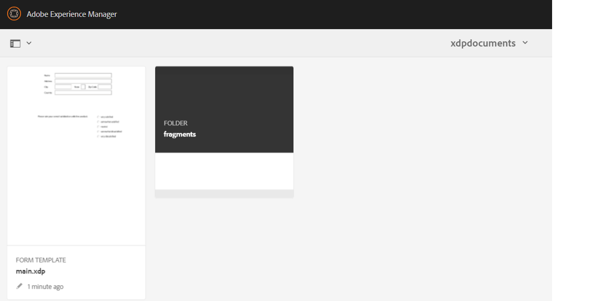

# Generazione di documenti PDF con frammenti tramite script ECMA{#developing-with-output-and-forms-services-in-aem-forms}


In questo articolo utilizzeremo il servizio di output per generare file pdf utilizzando frammenti xdp. L’xdp principale e i frammenti risiedono nell’archivio crx. È importante simulare la struttura delle cartelle del file system in AEM. Ad esempio, se utilizzi un frammento nella cartella Frammenti nell’XDP, devi creare una cartella denominata **frammenti** nella cartella di base in AEM. La cartella base conterrà il modello xdp di base. Ad esempio, se nel file system è presente la seguente struttura
* c:\xdptemplates - Conterrà il modello xdp di base
* c:\xdptemplates\fragments - Questa cartella conterrà frammenti e il modello principale farà riferimento al frammento come mostrato di seguito
  .
* La cartella xdpdocuments conterrà il modello di base e i frammenti in **frammenti** cartella

Puoi creare la struttura richiesta utilizzando [interfaccia utente per moduli e documenti](http://localhost:4502/aem/forms.html/content/dam/formsanddocuments)

Di seguito è riportata la struttura di cartelle per l’XDP di esempio che utilizza 2 frammenti



* Servizio di output: in genere questo servizio viene utilizzato per unire i dati xml con un modello xdp o un PDF per generare un PDF appiattito. Per ulteriori informazioni, consultare [javadoc](https://helpx.adobe.com/experience-manager/6-5/forms/javadocs/index.html?com/adobe/fd/output/api/OutputService.html) per il servizio di output. In questo esempio utilizziamo frammenti che risiedono nell’archivio crx.


Il seguente script ECMA è stato utilizzato per generare PDF. Si noti l&#39;utilizzo di ResourceResolver e ResourceResolverHelper nel codice. ResourceReolver è necessario perché il codice è in esecuzione al di fuori di qualsiasi contesto utente.

```java
var inputMap = processorContext.getInputMap();
var itr = inputMap.entrySet().iterator();
var entry = inputMap.entrySet().iterator().next();
var xmlData = inputMap.get(entry.getKey());
log.info("Got XML Data File");

var resourceResolverHelper = sling.getService(Packages.com.adobe.granite.resourceresolverhelper.ResourceResolverHelper);
var aemDemoListings = sling.getService(Packages.com.mergeandfuse.getserviceuserresolver.GetResolver);
log.info("Got service resolver");
var resourceResolver = aemDemoListings.getFormsServiceResolver();
//The ResourceResolverHelper execute's the following code within the context of the resourceResolver 
resourceResolverHelper.callWith(resourceResolver, {call: function()
       {
             //var statement = new Packages.com.adobe.aemfd.docmanager.Document("/content/dam/formsanddocuments/xdpdocuments/main.xdp",resourceResolver);
               var outputService = sling.getService(Packages.com.adobe.fd.output.api.OutputService);
            var pdfOutputOptions = new Packages.com.adobe.fd.output.api.PDFOutputOptions();
            pdfOutputOptions.setContentRoot("crx:///content/dam/formsanddocuments/xdpdocuments");
            pdfOutputOptions.setAcrobatVersion(Packages.com.adobe.fd.output.api.AcrobatVersion.Acrobat_11);
            var dataMergedDocument = outputService.generatePDFOutput("main.xdp",xmlData,pdfOutputOptions);
               //var dataMergedDocument = outputService.generatePDFOutput(statement,xmlData,pdfOutputOptions);
            processorContext.setResult("mergeddocument.pdf",dataMergedDocument);
            log.info("Generated the pdf document with fragments");
      }

 });
```

**Per testare il pacchetto di esempio sul sistema**
* [Distribuire il bundle DevelopingWithServiceUSer](assets/DevelopingWithServiceUser.jar)
* Aggiungi la voce **DevelopingWithServiceUser.core:getformsresourceresolver=fd-service** nella modifica del servizio mappatura utenti, come illustrato nella schermata seguente
  
* [Scarica e importa i file xdp di esempio e gli script ECMA](assets/watched-folder-fragments-ecma.zip).
Verrà creata una struttura di cartelle controllate nella cartella c:/fragmentsandoutputservice

* [Estrarre il file di dati di esempio](assets/usingFragmentsSampleData.zip) e inseriscilo nella cartella di installazione della cartella controllata (c:\fragmentsandoutputservice\install)

* Controlla la cartella dei risultati della configurazione della cartella controllata per il file pdf generato
