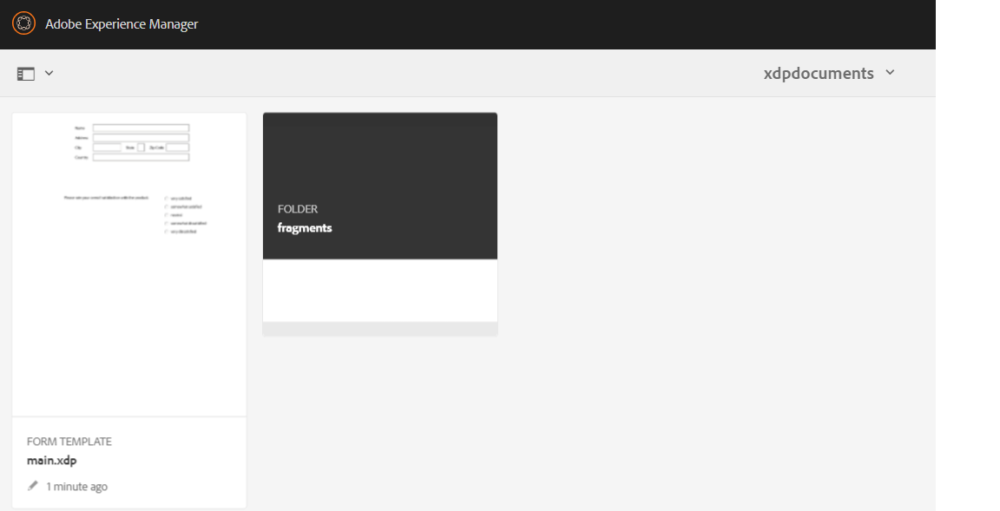

# Generazione di documenti pdf tramite frammenti{#developing-with-output-and-forms-services-in-aem-forms}


In questo articolo utilizzeremo il servizio di output per generare file pdf utilizzando frammenti xdp. L’xdp principale e i frammenti risiedono nell’archivio crx. È importante imitare la struttura delle cartelle del file system in AEM. Ad esempio, se utilizzi un frammento presente nella cartella frammenti dell’xdp, devi creare una cartella denominata **frammenti** sotto la cartella di base in AEM. La cartella base conterrà il modello xdp di base. Ad esempio, se nel file system è presente la struttura seguente
* c:\xdptemplates - This will contain your base xdp template
* c:\xdptemplates\fragments - This folder will contain fragments and the main template will reference the fragment as shown below
   .
* La cartella xdpdocuments conterrà il modello di base e i frammenti in **frammenti** cartella

È possibile creare la struttura richiesta utilizzando [interfaccia utente moduli e documenti](http://localhost:4502/aem/forms.html/content/dam/formsanddocuments)

Di seguito è riportata la struttura delle cartelle per l’xdp di esempio che utilizza 2 frammenti



* Servizio di output: in genere questo servizio viene utilizzato per unire dati xml con modello xdp o pdf per generare pdf appiattiti. Per ulteriori informazioni, consulta la [javadoc](https://helpx.adobe.com/experience-manager/6-5/forms/javadocs/index.html?com/adobe/fd/output/api/OutputService.html) per il servizio Output. In questo esempio utilizziamo frammenti che risiedono nell’archivio crx.


Il codice seguente è stato utilizzato per includere frammenti nel file PDF

```java
System.out.println("I am in using fragments POST.jsp");
// contentRootURI is the base folder. All fragments are relative to this folder
String contentRootURI = request.getParameter("contentRootURI");
String xdpName = request.getParameter("xdpName");
javax.servlet.http.Part xmlDataPart = request.getPart("xmlDataFile");
System.out.println("Got xml file");
String filePath = request.getParameter("saveLocation");
java.io.InputStream xmlIS = xmlDataPart.getInputStream();
com.adobe.aemfd.docmanager.Document xmlDocument = new com.adobe.aemfd.docmanager.Document(xmlIS);
com.adobe.fd.output.api.OutputService outputService = sling.getService(com.adobe.fd.output.api.OutputService.class);

if (outputService == null) {
  System.out.println("The output service is  null.....");
} else {
  System.out.println("The output service is  not null.....");

}
com.adobe.fd.output.api.PDFOutputOptions pdfOptions = new com.adobe.fd.output.api.PDFOutputOptions();
pdfOptions.setAcrobatVersion(com.adobe.fd.output.api.AcrobatVersion.Acrobat_11);

pdfOptions.setContentRoot(contentRootURI);

com.adobe.aemfd.docmanager.Document generatedDocument = outputService.generatePDFOutput(xdpName, xmlDocument, pdfOptions);
generatedDocument.copyToFile(new java.io.File(filePath));
out.println("Document genreated and saved to " + filePath);
```

**Per testare il pacchetto di esempio sul sistema**

* [Scarica e importa i file xdp di esempio in AEM](assets/xdp-templates-fragments.zip)
* [Scarica e installa il pacchetto utilizzando il gestore di pacchetti AEM](assets/using-fragments-assets.zip)
* [Il campione xdp e i frammenti possono essere scaricati da qui](assets/xdptemplates.zip)

**Dopo aver installato il pacchetto dovrai inserire nell&#39;elenco Consentiti i seguenti URL in Adobe Granite CSRF Filter.**

1. Segui i passaggi indicati di seguito per inserire nell&#39;elenco Consentiti i percorsi sopra menzionati.
1. [Accedi a configMgr](http://localhost:4502/system/console/configMgr)
1. Ricerca filtro CSRF Granite Adobe
1. Aggiungi il seguente percorso nelle sezioni escluse e salva
1. /content/AemFormsSamples/using fragments

Esistono diversi modi per testare il codice di esempio. La più rapida e semplice è quella di utilizzare l&#39;app Postman. Postman consente di effettuare richieste POST al server. Installa l&#39;app Postman sul tuo sistema.
Avvia l’app e immetti il seguente URL per testare l’API dei dati di esportazione

Accertati di aver selezionato &quot;POST&quot; dall’elenco a discesa http://localhost:4502/content/AemFormsSamples/usingfragments.html Assicurati di specificare &quot;Autorizzazione&quot; come &quot;Autenticazione di base&quot;. Specifica il nome utente e la password del server AEM Passa alla scheda &quot;Body&quot; e specifica i parametri della richiesta come mostrato nell&#39;immagine seguente

Quindi fai clic sul pulsante Invia

[Puoi importare questa raccolta di postman per testare l’API](assets/usingfragments.postman_collection.json)
