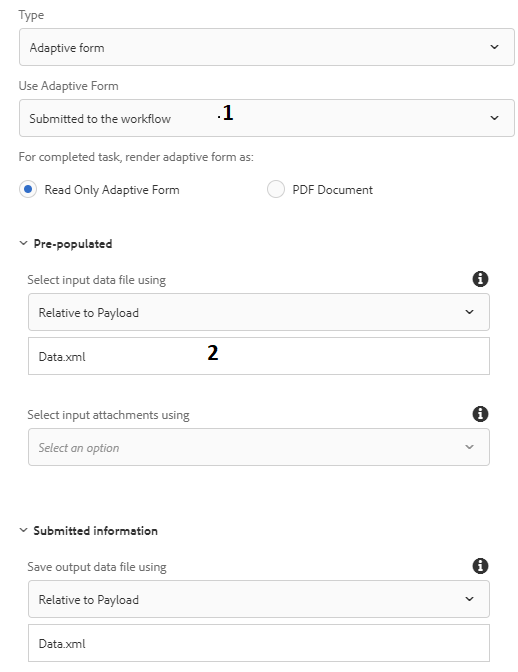
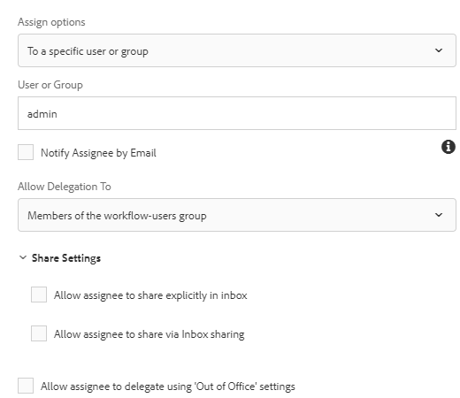

# Creazione di un flusso di lavoro per esaminare i dati inviati

I flussi di lavoro vengono generalmente utilizzati per indirizzare i dati inviati per la revisione e l&#39;approvazione. I flussi di lavoro vengono creati utilizzando l&#39;editor del flusso di lavoro in AEM. I flussi di lavoro possono essere attivati durante l&#39;invio del modulo adattivo. La procedura seguente illustra come creare il primo flusso di lavoro.

## Prerequisito

Verificare di disporre di un&#39;istanza funzionante di  AEM Forms. Seguite la guida [all&#39;](https://docs.adobe.com/content/help/en/experience-manager-65/forms/install-aem-forms/osgi-installation/installing-configuring-aem-forms-osgi.html) installazione per installare e configurare  AEM Forms

## Crea modello flusso di lavoro

* [Aprire i modelli di workflow](http://localhost:4502/libs/cq/workflow/admin/console/content/models.html)
* Fare clic su Crea -> Crea modello
* Specifica un titolo significativo e un nome, ad esempio _Rivedi dati_ inviati.
* Toccate delicatamente il flusso di lavoro appena creato e fate clic sull’icona _Modifica_ .
* Il flusso di lavoro viene aperto in modalità di modifica. Per impostazione predefinita, il flusso di lavoro include un componente denominato _Step1_. Selezionate questo componente e fate clic sull’icona Elimina per eliminare il componente.
* Sono elencati a sinistra i vari componenti del flusso di lavoro che possono essere utilizzati per creare il flusso di lavoro. Potete filtrare i componenti in base al tipo di _Forms Workflow_ .

## Crea variabile

* Fai clic sull&#39;icona della variabile per creare nuove variabili. Le variabili vengono utilizzate per memorizzare i valori.  AEM Forms offre diversi tipi di variabili che è possibile creare. Oggi verrà creata una variabile di tipo XML per contenere i dati inviati dal modulo adattivo. Create una nuova variabile denominata _submitData_ di tipo XML, come illustrato nell&#39;immagine seguente.

   >[!NOTE]
Se il modulo è basato su Modello dati modulo, i dati inviati sono in formato JSON e in tal caso si crea una variabile di tipo JSON per contenere i dati inviati.

* Fate clic sull&#39;icona _dei passaggi_ a sinistra per elencare i vari componenti del flusso di lavoro. Trascinate il componente _Imposta variabile_ sul flusso di lavoro a destra. Accertatevi di posizionare il componente _Imposta variabile_ sotto l’avvio del flusso.
   * Fate clic sul componente _Imposta variabile_ , quindi fate clic sull’icona _chiave inglese_ per aprire il foglio delle proprietà del componente.
   * Fare clic sulla scheda Mapping->Aggiungi mappatura->Mappa variabile. Impostate i valori come mostrato nella schermata sottostante.
      

## Aggiunta di componenti del flusso di lavoro

* Trascinare il componente _Assegna attività_ a destra sotto il componente _Imposta variabile_ .
   * Fare clic sul componente _Assegna attività_ , quindi fare clic sull&#39;icona _chiave inglese_ per aprire la finestra delle proprietà.
   * Fornire un Titolo significativo al componente Assegna attività.
   * Fare clic sulla scheda Forms e Documenti e impostare le seguenti proprietà come mostrato nella schermata
      

   * _1 Selezionando questa opzione, il flusso di lavoro non è associato a un modulo adattivo specifico._
   * _2 Il motore del flusso di lavoro cerca il file denominato Data.xml relativo al payload nell&#39;archivio_

   * Fare clic sulla scheda Assegnatario. Consente di assegnare l’attività a un utente dell’organizzazione. In questo caso assegneremo l&#39;attività all&#39;utente amministratore come mostrato nella schermata sottostante.
      
   * Salvate le modifiche facendo clic sull’icona _Fine_ del componente
* Fate clic su _Sincronizza_ per generare il modello di runtime del flusso di lavoro.
Il modello di workflow è ora pronto e può essere associato all&#39;azione di invio del modulo adattivo.

