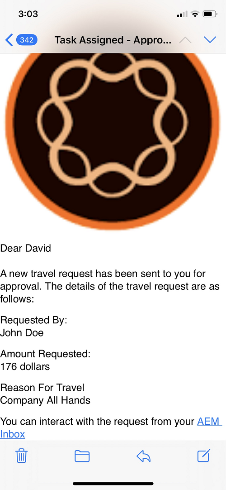

# Personalizzare la notifica di assegnazione attività

Il componente Assegna attività viene utilizzato per assegnare le attività ai partecipanti del flusso di lavoro. Quando un’attività viene assegnata a un utente o a un gruppo, viene inviata una notifica e-mail all’utente o ai membri del gruppo definiti.
Questa notifica di posta elettronica contiene in genere dati dinamici relativi all&#39;attività. Questi dati dinamici vengono recuperati utilizzando il sistema generato [proprietà dei metadati](https://experienceleague.adobe.com/docs/experience-manager-65/forms/publish-process-aem-forms/use-metadata-in-email-notifications.html#using-system-generated-metadata-in-an-email-notification).
Per includere i valori dei dati del modulo inviati nella notifica e-mail, è necessario creare una proprietà di metadati personalizzata e quindi utilizzare queste proprietà di metadati personalizzate nel modello e-mail


## Creazione di una proprietà di metadati personalizzata

L’approccio consigliato è quello di creare un componente OSGI che implementa il metodo getUserMetadata del [WorkitemUserMetadataService](https://helpx.adobe.com/experience-manager/6-5/forms/javadocs/com/adobe/fd/workspace/service/external/WorkitemUserMetadataService.html#getUserMetadataMap--)

Il codice seguente crea 4 proprietà di metadati(_firstName_,_lastName_,_motivo_ e _amountRequested_) e imposta il relativo valore dai dati inviati. Ad esempio, la proprietà metadata _firstName_ Il valore di è impostato sul valore dell&#39;elemento denominato firstName dai dati inviati. Il codice seguente presuppone che i dati inviati del modulo adattivo siano in formato xml. Forms adattivo basato su schema JSON o modello dati modulo genera dati in formato JSON.


```java
package com.aemforms.workitemuserservice.core;

import java.io.InputStream;
import java.util.HashMap;
import java.util.Map;

import javax.jcr.Session;
import javax.xml.parsers.DocumentBuilder;
import javax.xml.parsers.DocumentBuilderFactory;
import javax.xml.xpath.XPath;

import org.osgi.framework.Constants;
import org.osgi.service.component.annotations.Component;
import org.slf4j.Logger;
import org.slf4j.LoggerFactory;
import org.w3c.dom.*;


import com.adobe.fd.workspace.service.external.WorkitemUserMetadataService;
import com.adobe.granite.workflow.WorkflowSession;
import com.adobe.granite.workflow.exec.WorkItem;
import com.adobe.granite.workflow.metadata.MetaDataMap;
@Component(property={Constants.SERVICE_DESCRIPTION+"=A sample implementation of a user metadata service.",
Constants.SERVICE_VENDOR+"=Adobe Systems",
"process.label"+"=Sample Custom Metadata Service"})


public class WorkItemUserServiceImpl implements WorkitemUserMetadataService {
private static final Logger log = LoggerFactory.getLogger(WorkItemUserServiceImpl.class);

@Override
public Map<String, String> getUserMetadata(WorkItem workItem, WorkflowSession workflowSession,MetaDataMap metadataMap)
{
HashMap<String, String> customMetadataMap = new HashMap<String, String>();
String payloadPath = workItem.getWorkflowData().getPayload().toString();
String dataFilePath = payloadPath + "/Data.xml/jcr:content";
Session session = workflowSession.adaptTo(Session.class);
DocumentBuilderFactory factory = null;
DocumentBuilder builder = null;
Document xmlDocument = null;
javax.jcr.Node xmlDataNode = null;
try
{
    xmlDataNode = session.getNode(dataFilePath);
    InputStream xmlDataStream = xmlDataNode.getProperty("jcr:data").getBinary().getStream();
    XPath xPath = javax.xml.xpath.XPathFactory.newInstance().newXPath();
    factory = DocumentBuilderFactory.newInstance();
    builder = factory.newDocumentBuilder();
    xmlDocument = builder.parse(xmlDataStream);
    Node firstNameNode = (org.w3c.dom.Node) xPath.compile("afData/afUnboundData/data/firstName")
            .evaluate(xmlDocument, javax.xml.xpath.XPathConstants.NODE);
    log.debug("The value of first name element  is " + firstNameNode.getTextContent());
    Node lastNameNode = (org.w3c.dom.Node) xPath.compile("afData/afUnboundData/data/lastName")
            .evaluate(xmlDocument, javax.xml.xpath.XPathConstants.NODE);
    Node amountRequested = (org.w3c.dom.Node) xPath
            .compile("afData/afUnboundData/data/amountRequested")
            .evaluate(xmlDocument, javax.xml.xpath.XPathConstants.NODE);
    Node reason = (org.w3c.dom.Node) xPath.compile("afData/afUnboundData/data/reason")
            .evaluate(xmlDocument, javax.xml.xpath.XPathConstants.NODE);
    customMetadataMap.put("firstName", firstNameNode.getTextContent());
    customMetadataMap.put("lastName", lastNameNode.getTextContent());
    customMetadataMap.put("amountRequested", amountRequested.getTextContent());
    customMetadataMap.put("reason", reason.getTextContent());
    log.debug("Created  " + customMetadataMap.size() + " metadata  properties");

}
catch (Exception e)
{
    log.debug(e.getMessage());
}
return customMetadataMap;
}

}
```

## Utilizzare le proprietà dei metadati personalizzati nel modello e-mail di notifica delle attività

Nel modello e-mail puoi includere la proprietà dei metadati utilizzando la seguente sintassi dove amountRequested è la proprietà dei metadati `${amountRequested}`

## Configura l’attività di assegnazione per utilizzare la proprietà dei metadati personalizzati

Dopo aver generato e distribuito il componente OSGi AEM server, configura il componente Assegna attività come mostrato di seguito per utilizzare le proprietà dei metadati personalizzate.


## Abilita l’utilizzo di proprietà di metadati personalizzate


## Per provare sul server

* [Configura il servizio di posta CQ Day](https://experienceleague.adobe.com/docs/experience-manager-65/administering/operations/notification.html#configuring-the-mail-service)
* Associa un ID e-mail valido con [utente amministratore](http://localhost:4502/security/users.html)
* Scarica e installa la [Workflow-and-notification-template](assets/workflow-and-task-notification-template.zip) utilizzo [gestore di pacchetti](http://localhost:4502/crx/packmgr/index.jsp)
* Scarica [Modulo adattivo](assets/request-travel-authorization.zip) e importano in AEM dal [Interfaccia utente moduli e documenti](http://localhost:4502/aem/forms.html/content/dam/formsanddocuments).
* Distribuisci e avvia il [Bundle personalizzato](assets/work-items-user-service-bundle.jar) utilizzando [console web](http://localhost:4502/system/console/bundles)
* [Anteprima e invio del modulo](http://localhost:4502/content/dam/formsanddocuments/requestfortravelauhtorization/jcr:content?wcmmode=disabled)

Al momento dell’invio del modulo, la notifica di assegnazione dell’attività viene inviata all’ID e-mail associato all’utente amministratore. La schermata seguente mostra un esempio di notifica di assegnazione delle attività



>[!NOTE]
>Il modello e-mail per la notifica dell’attività di assegnazione deve essere nel seguente formato.
>
> subject=Task assegnato - `${workitem_title}`
>
> message=String che rappresenta il modello e-mail senza nuovi caratteri di riga.

## Commenti attività nella notifica e-mail di assegnazione attività

In alcuni casi, è possibile includere i commenti del proprietario dell&#39;attività precedente nelle notifiche successive. Il codice per acquisire l&#39;ultimo commento dell&#39;attività è elencato di seguito:

```java
package samples.aemforms.taskcomments.core;

import org.osgi.service.component.annotations.Component;

import java.util.HashMap;
import java.util.List;
import java.util.Map;

import javax.jcr.Session;

import org.osgi.framework.Constants;
import org.slf4j.Logger;
import org.slf4j.LoggerFactory;
import com.adobe.granite.workflow.WorkflowSession;
import com.adobe.granite.workflow.exec.HistoryItem;
import com.adobe.granite.workflow.exec.WorkItem;
import com.adobe.granite.workflow.metadata.MetaDataMap;

import com.adobe.fd.workspace.service.external.WorkitemUserMetadataService;
@Component(property = {
  Constants.SERVICE_DESCRIPTION + "=A sample implementation of a user metadata service.",
  Constants.SERVICE_VENDOR + "=Adobe Systems",
  "process.label" + "=Capture Workflow Comments"
})

public class CaptureTaskComments implements WorkitemUserMetadataService {
  private static final Logger log = LoggerFactory.getLogger(CaptureTaskComments.class);
  @Override
  public Map <String, String> getUserMetadata(WorkItem workItem, WorkflowSession workflowSession, MetaDataMap metadataMap) {
    HashMap < String, String > customMetadataMap = new HashMap < String, String > ();
    workflowSession.adaptTo(Session.class);
    try {
      List <HistoryItem> workItemsHistory = workflowSession.getHistory(workItem.getWorkflow());
      int listSize = workItemsHistory.size();
      HistoryItem lastItem = workItemsHistory.get(listSize - 1);
      String reviewerComments = (String) lastItem.getWorkItem().getMetaDataMap().get("workitemComment");
      log.debug("####The comment I got was ...." + reviewerComments);
      customMetadataMap.put("comments", reviewerComments);
      log.debug("Created  " + customMetadataMap.size() + " metadata  properties");

    } catch (Exception e) {
      log.debug(e.getMessage());
    }
    return customMetadataMap;
  }

}
```

Il bundle con il codice di cui sopra può essere [scaricato da qui](assets/samples.aemforms.taskcomments.taskcomments.core-1.0-SNAPSHOT.jar)
