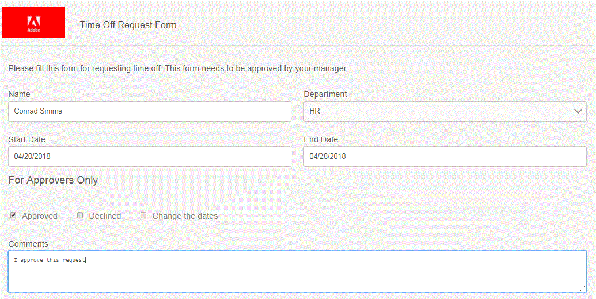

# Flusso di lavoro semplice per richiesta di indisponibilità a pagamento

In questo articolo viene esaminato un semplice flusso di lavoro utilizzato per richiedere il periodo di inattività retribuito. I requisiti aziendali sono i seguenti:

* L’utente A richiede un’indisponibilità compilando un modulo adattivo.
* Il modulo viene inviato all’utente amministratore di AEM (in tempo reale viene inviato al manager dell’autore dell’invio)
* L’amministratore apre il modulo. L’amministratore non deve essere in grado di modificare le informazioni compilate dall’autore dell’invio.
* La sezione Responsabile approvazione deve essere visibile all’approvatore (in questo caso si tratta dell’utente amministratore di AEM).

Per soddisfare questo requisito, nel modulo viene utilizzato un campo nascosto denominato **initialstep** e il relativo valore predefinito è impostato su Sì.Quando il modulo viene inviato, il primo passaggio del flusso di lavoro imposta il valore di initialstep su No. Il modulo include regole business per nascondere e visualizzare le sezioni appropriate in base al valore del passo iniziale.

**Configura modulo per attivare flusso di lavoro AEM**

>[!VIDEO](https://video.tv.adobe.com/v/329222?quality=12&learn=on&captions=ita)

**Procedura dettagliata sul flusso di lavoro**

>[!VIDEO](https://video.tv.adobe.com/v/329223?quality=12&learn=on&captions=ita)

**Visualizzazione del mittente del modulo di richiesta di indisponibilità**

**Visualizzazione approvatore del modulo**

Nella vista approvatore, l&#39;approvatore non è in grado di modificare i dati inviati. È inoltre presente una nuova sezione destinata esclusivamente agli approvatori.

Per testare questo flusso di lavoro sul tuo sistema, segui i passaggi indicati di seguito:
* [Scarica e distribuisci DevelopingWithServiceUserBundle](/help/forms/assets/common-osgi-bundles/DevelopingWithServiceUser.jar)
* [Scarica e distribuisci il bundle OSGI personalizzato SetValue](/help/forms/assets/common-osgi-bundles/SetValueApp.core-1.0-SNAPSHOT.jar)
* [Importa le risorse correlate a questo articolo in AEM](assets/helpxworkflow.zip)
* Apri il modulo di richiesta per [Indisponibilità](http://localhost:4502/content/dam/formsanddocuments/helpx/timeoffrequestform/jcr:content?wcmmode=disabled)
* Inserisci i dettagli e invia
* Apri la [casella in entrata](http://localhost:4502/mnt/overlay/cq/inbox/content/inbox.html). Dovresti vedere una nuova attività assegnata. Aprire il modulo. I dati del mittente devono essere di sola lettura e deve essere visibile una nuova sezione approvatore.
* Esplora il [modello di flusso di lavoro](http://localhost:4502/editor.html/conf/global/settings/workflow/models/helpxworkflow.html)
* Esplora il passaggio del processo. Questo passaggio imposta il valore di initialstep su No.
