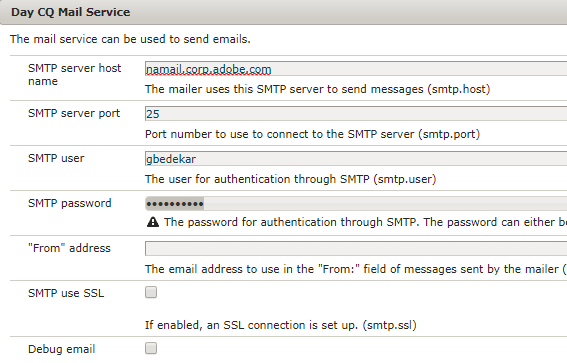

# Invio di e-mail con invio di moduli adattivi {#sending-email-on-adaptive-form-submission}

Una delle azioni comuni consiste nell’inviare un messaggio e-mail di conferma al mittente in seguito all’invio del modulo adattivo. A tal fine, selezioneremo l’azione &quot;Invia e-mail&quot; come azione di invio.

Puoi utilizzare il modello e-mail o semplicemente digitare il corpo dell’e-mail come mostrato nella schermata seguente.

Osserva la sintassi per inserire i valori del campo modulo nell&#39;e-mail. Abbiamo anche la possibilità di includere gli allegati del modulo nell&#39;e-mail, selezionando la casella di controllo &quot;include allegati&quot; nelle proprietà di configurazione.

All’invio del modulo adattivo, il destinatario riceverà un’e-mail.

## Configurazioni necessarie {#configurations-needed}

Sarà necessario configurare il servizio Day CQ Mail. Questa configurazione può essere effettuata puntando il browser verso [Felix Configuration Manager](http://localhost:4502/system/console/configMgr)

La schermata mostra le proprietà di configurazione per adobe mail server.

Per provare questo sul tuo server segui queste istruzioni:

* [Importare le risorse](assets/timeoffrequest.zip) associato a questo articolo in AEM utilizzando il gestore dei pacchetti.

* Apri [TimeOffRequestForm](http://localhost:4502/content/dam/formsanddocuments/helpx/timeoffrequestform/jcr:content?wcmmode=disabled).

* Compila i dettagli.Assicurati di fornire un indirizzo e-mail valido nel campo e-mail.

* Invia il modulo.
