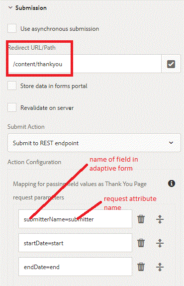

# Invio Alla Pagina Di Ringraziamento {#submitting-to-thank-you-page}

L&#39;opzione Invia a endpoint REST passa i dati compilati nel modulo a una pagina di conferma configurata come parte della richiesta di GET HTTP. Potete aggiungere il nome dei campi da richiedere. Il formato della richiesta è:

\{fieldName\} = \{parameterName\}. Ad esempio, submitterName è il nome di un campo modulo adattivo e submitter è il nome del parametro. Nella pagina di ringraziamento, potete accedere al parametro del relatore utilizzando request.getParameter(&quot;submitter&quot;) per acquisire il valore del campo del nome del relatore.

submitterName=submitter

Nella schermata seguente, stiamo inviando il modulo adattivo per ringraziarvi della pagina che si trova in /content/grankyou. A questa pagina di ringraziamento, trasmettiamo 3 attributi di richiesta che includeranno i valori dei campi del modulo.

Potete anche inviare l&#39;endpoint esterno tramite POST. A tal fine, è sufficiente selezionare la casella di controllo &quot;abilita post request&quot; e fornire l&#39;URL per l&#39;endpoint esterno. Quando si invia il modulo, si ottiene la pagina di ringraziamento e l&#39;endpoint POST viene richiamato contemporaneamente.

Per testare questa funzionalità sul server, seguire le istruzioni riportate di seguito:

* Importa il file di risorse [associato a questo articolo in AEM utilizzando il gestore pacchetti](assets/submittingtorestendpoint.zip)
* Puntare il browser sul [Modulo di richiesta di ora di disattivazione](http://localhost:4502/content/dam/formsanddocuments/helpx/timeoffrequestform/jcr:content?wcmmode=disabled)
* Compilare il campo richiesto e inviare il modulo
* Dovresti ottenere la pagina di ringraziamento con le tue informazioni popolate sulla pagina

