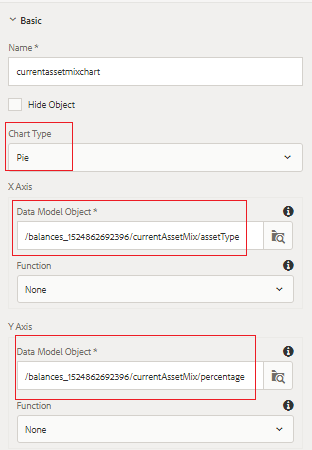

# Configurazione del pannello Mix investimenti

In questa parte, aggiungeremo grafici a torta per visualizzare il mix di investimenti attuale e di modelli.

* Accedi ad AEM Forms e passa a Adobe Experience Manager > Forms > Forms e documenti.

* Apri la cartella 401KStatement .

* Apri l&#39;istruzione 401KSin modalità di modifica.

* Aggiungeremo 2 grafici a torta per rappresentare il mix di investimenti attuale e modello del titolare del conto.

## Miscela di risorse corrente {#current-asset-mix}

* Tocca il pannello &quot;CurrentAssetMix&quot; a destra, seleziona l’icona &quot;+&quot; e inserisci il componente testo. Cambia il testo predefinito in &quot;Miscela risorsa corrente&quot;.

* Tocca il pannello &quot;CurrentAssetMix&quot;, seleziona l’icona &quot;+&quot; e inserisci il componente grafico. Tocca il componente grafico appena inserito e fai clic sull’icona &quot;chiave inglese&quot; per aprire il foglio delle proprietà di configurazione del grafico.

* Imposta le proprietà come mostrato nell&#39;immagine seguente. Assicurati che il tipo di grafico sia Grafico a torta.

* Si prega di notare l&#39;oggetto modello dati associato agli assi X e Y. È necessario selezionare l’elemento principale del modello dati del modulo, quindi approfondire la ricerca per selezionare l’elemento appropriato.

* 

## Modello Asset Mix {#model-asset-mix}

* Tocca il pannello &quot;ConsigliatoAssetMix&quot; a destra, seleziona l’icona &quot;+&quot; e inserisci il componente testo. Modificate il testo predefinito in &quot;Model Asset Mix&quot;.

* Tocca il pannello &quot;ConsigliatoAssetMix&quot; e seleziona l’icona &quot;+&quot; e inserisci il componente grafico. Tocca il componente grafico appena inserito e fai clic sull’icona &quot;chiave inglese&quot; per aprire il foglio delle proprietà di configurazione del grafico.

* Imposta le proprietà come mostrato nell&#39;immagine seguente. Assicurati che il tipo di grafico sia Grafico a torta.

* Si prega di notare l&#39;oggetto modello dati associato agli assi X e Y. È necessario selezionare l’elemento principale del modello dati del modulo, quindi approfondire la ricerca per selezionare l’elemento appropriato.

* 

## Passaggi successivi

[Preparare la consegna del documento del canale web](./parttwelve.md)
