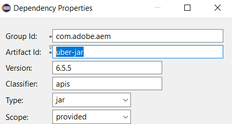
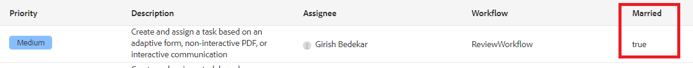

# Aggiungi colonne personalizzate

Per visualizzare i dati del flusso di lavoro nella inbox, dobbiamo definire e popolare le variabili nel flusso di lavoro. Il valore della variabile deve essere impostato prima che un&#39;attività venga assegnata a un utente. Per fornirti un primo avvio abbiamo fornito un flusso di lavoro di esempio pronto per essere distribuito sul server AEM.

* [Accedi a AEM](http://localhost:4502/crx/de/index.jsp)
* [Importa il flusso di lavoro di revisione](assets/review-workflow.zip)
* [Rivedi il flusso di lavoro](http://localhost:4502/editor.html/conf/global/settings/workflow/models/reviewworkflow.html)

Questo flusso di lavoro ha due variabili definite (isMarried e Revenue) e i suoi valori sono impostati utilizzando il componente della variabile impostata. Queste variabili sono rese disponibili come colonne da aggiungere AEM casella in entrata

## Crea servizio

Per ogni colonna che dobbiamo visualizzare nella nostra inbox dovremmo scrivere un servizio. Il servizio seguente consente di aggiungere una colonna per visualizzare il valore della variabile isMarried

```java
import com.adobe.cq.inbox.ui.column.Column;
import com.adobe.cq.inbox.ui.column.provider.ColumnProvider;

import com.adobe.cq.inbox.ui.InboxItem;
import org.osgi.service.component.annotations.Component;

import java.util.Map;

/**
 * This provider does not require any sightly template to be defined.
 * It is used to display the value of 'ismarried' workflow variable as a column in inbox
 */
@Component(service = ColumnProvider.class, immediate = true)
public class MaritalStatusProvider implements ColumnProvider {@Override
public Column getColumn() {
return new Column("married", "Married", Boolean.class.getName());
}

// Return True or False if 'ismarried' is set. Else returns null
private Boolean isMarried(InboxItem inboxItem) {
Boolean ismarried = null;

Map metaDataMap = inboxItem.getWorkflowMetadata();
if (metaDataMap != null) {
if (metaDataMap.containsKey("isMarried")) {
    ismarried = (Boolean) metaDataMap.get("isMarried");
}
}

return ismarried;
}

@Override
public Object getValue(InboxItem inboxItem) {
return isMarried(inboxItem);
}
}
```

>[!NOTE]
>
>Devi includere AEM 6.5.5 Uber.jar nel tuo progetto affinché il codice di cui sopra funzioni



## Test sul server

* [Accedi a AEM console Web](http://localhost:4502/system/console/bundles)
* [Distribuzione e avvio del bundle di personalizzazione della casella in entrata](assets/inboxcustomization.inboxcustomization.core-1.0-SNAPSHOT.jar)
* [Apri la inbox](http://localhost:4502/aem/inbox)
* Apri Admin Control facendo clic su _Vista a elenco_ accanto a _Crea_ pulsante
* Aggiungi colonna selezionata alla casella in entrata e salva le modifiche
* [Passa all’interfaccia utente di FormsAndDocuments](http://localhost:4502/aem/forms.html/content/dam/formsanddocuments)
* [Importare il modulo di esempio](assets/snap-form.zip) selezionando _Caricamento file_ da _Crea_ menu
* [Anteprima del modulo](http://localhost:4502/content/dam/formsanddocuments/snapform/jcr:content?wcmmode=disabled)
* Seleziona la _stato civile_ e invia il modulo
   [visualizza casella in entrata](http://localhost:4502/aem/inbox)

L’invio del modulo attiverà il flusso di lavoro e un’attività verrà assegnata all’utente &quot;amministratore&quot;. Dovresti visualizzare un valore nella colonna Sposato come mostrato in questa schermata



## Passaggi successivi

[Visualizza colonna sposata](./use-sightly-template.md)
