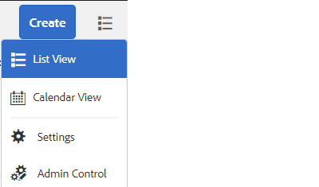

# Casella in entrata AEM

La Casella in entrata AEM consolida le notifiche e le attività da vari componenti AEM, inclusi i flussi di lavoro Forms. Quando viene attivato un flusso di lavoro dei moduli contenente un passaggio Assegna attività, l’applicazione associata viene elencata come attività nella casella in entrata dell’assegnatario.

L&#39;interfaccia utente Casella in entrata fornisce viste elenco e calendario per visualizzare le attività. È inoltre possibile configurare le impostazioni di visualizzazione. Puoi filtrare le attività in base a vari parametri.

È possibile personalizzare la casella in entrata di un Experience Manager per modificare il titolo predefinito di una colonna, riordinare la posizione di una colonna e visualizzare colonne aggiuntive in base ai dati di un flusso di lavoro.

>[!NOTE]
>
>Per personalizzare le colonne della casella in entrata, è necessario essere amministratori o amministratori del flusso di lavoro

## Personalizzazione delle colonne

[Avvia casella in entrata AEM](http://localhost:4502/aem/inbox)
Apri Admin Control facendo clic sul pulsante _Vista a elenco_ e quindi selezionando _Admin Control_ come mostrato nella schermata seguente

Nell’interfaccia utente di personalizzazione delle colonne puoi eseguire le seguenti operazioni

* Elimina colonne
* Riordinare le colonne
* Rinomina colonne

## Personalizzazione branding

Nella personalizzazione del branding è possibile effettuare le seguenti operazioni

* Aggiungi il logo della tua organizzazione
* Personalizza il testo dell’intestazione
* Personalizzare il collegamento della guida
* Nascondi opzioni di navigazione

## Passaggi successivi

[Aggiungi colonna sposata](./add-married-column.md)
