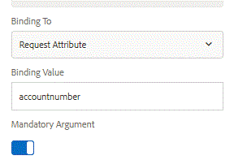

# Generazione del documento di comunicazione interattiva per il canale di stampa tramite il meccanismo di cartelle dell&#39;orologio

Dopo aver progettato e testato il documento del canale di stampa, in genere è necessario generare il documento effettuando una chiamata REST o generando documenti di stampa utilizzando il meccanismo della cartella di controllo.

Questo articolo spiega il caso d&#39;uso per la generazione di documenti del canale di stampa utilizzando il meccanismo di cartelle controllate.

Quando rilasci un file nella cartella controllata, viene eseguito uno script associato alla cartella controllata. Questo script è spiegato nell&#39;articolo sottostante.

Il file rilasciato nella cartella controllata presenta la seguente struttura. Il codice genera istruzioni per tutti i numeri di conto elencati nel documento XML.

&lt;accountnumbers>

&lt;accountnumber>509840&lt;/accountnumber>

&lt;accountnumber>948576&lt;/accountnumber>

&lt;accountnumber>398762&lt;/accountnumber>

&lt;accountnumber>291723&lt;/accountnumber>

&lt;/accountnumbers>

L&#39;elenco di codice seguente effettua le seguenti operazioni:

Linea 1 - Percorso del documento InteractiveCommunications

Linee 15-20: Ottenere l&#39;elenco dei numeri di account dal documento XML rilasciato nella cartella controllata

Linee 24 -25: Ottenere i canali PrintChannelService e Print Channel associati al documento.

Linea 30: Passa il numero di account come elemento chiave al modello dati del modulo.

Linee 32-36: Impostare le opzioni dati per il documento da generare.

Linea 38: Eseguire il rendering del documento.

Righe 39-40 - Salva il documento generato nel file system.

L’endpoint REST del modello dati modulo prevede un ID come parametro di input. questo id è mappato su un attributo di richiesta denominato account number come mostrato nella schermata seguente.



```java
var interactiveCommunicationsDocument = "/content/forms/af/retirementstatementprint/channels/print/";
var saveLocation =  new Packages.java.io.File("c:\\scrap\\loadtesting");

if(!saveLocation.exists())
{
 saveLocation.mkdirs();
}

var inputMap = processorContext.getInputMap();
var entry = inputMap.entrySet().iterator().next();
var inputDocument = inputMap.get(entry.getKey());
var aemDemoListings = sling.getService(Packages.com.mergeandfuse.getserviceuserresolver.GetResolver);
var resourceResolver = aemDemoListings.getServiceResolver();
var resourceResolverHelper = sling.getService(Packages.com.adobe.granite.resourceresolverhelper.ResourceResolverHelper);
var dbFactory = Packages.javax.xml.parsers.DocumentBuilderFactory.newInstance();
var dBuilder = dbFactory.newDocumentBuilder();
var xmlDoc = dBuilder.parse(inputDocument.getInputStream());
var nList = xmlDoc.getElementsByTagName("accountnumber");
for(var i=0;i<nList.getLength();i++)
{
 var accountnumber = nList.item(i).getTextContent();
resourceResolverHelper.callWith(resourceResolver, {call: function()
       {
   var printChannelService = sling.getService(Packages.com.adobe.fd.ccm.channels.print.api.service.PrintChannelService);
   var printChannel = printChannelService.getPrintChannel(interactiveCommunicationsDocument);
   var options = new Packages.com.adobe.fd.ccm.channels.print.api.model.PrintChannelRenderOptions();
   options.setMergeDataOnServer(true);
   options.setRenderInteractive(false);
   var map = new Packages.java.util.HashMap();
   map.put("accountnumber",accountnumber);
    // Required Data Options
   var dataOptions = new Packages.com.adobe.forms.common.service.DataOptions(); 
   dataOptions.setServiceName(printChannel.getPrefillService()); 
   dataOptions.setExtras(map); 
   dataOptions.setContentType(Packages.com.adobe.forms.common.service.ContentType.JSON);
   dataOptions.setFormResource(resourceResolver.resolve(interactiveCommunicationsDocument));
            options.setDataOptions(dataOptions); 
    var printDocument = printChannel.render(options);
   var statement = new Packages.com.adobe.aemfd.docmanager.Document(printDocument.getInputStream());
            statement.copyToFile(new Packages.java.io.File(saveLocation+"\\"+accountnumber+".pdf"));

      }
   });
}
```


**Per eseguire il test sul sistema locale, segui le seguenti istruzioni:**

* Imposta Tomcat come descritto in questo [articolo.](/help/forms/ic-print-channel-tutorial/set-up-tomcat.md) Tomcat ha il file war che genera i dati del campione.
* Imposta il servizio aka utente del sistema come descritto in questo [articolo](/help/forms/adaptive-forms/service-user-tutorial-develop.md).
Assicurati che questo utente di sistema abbia le autorizzazioni di lettura sul nodo seguente. Per assegnare le autorizzazioni di accesso a [amministratore utente](https://localhost:4502/useradmin) e cerca l&#39;utente di sistema &quot;dati&quot; e concedi le autorizzazioni di lettura sul nodo seguente tasto di tabulazione sulla scheda autorizzazioni
   * /content/dam/formsanddocuments
   * /content/dam/formsanddocuments-fdm
   * /content/forms/af
* Importa i seguenti pacchetti in AEM utilizzando il gestore pacchetti. Questo pacchetto contiene quanto segue:


* [Esempio di documento di comunicazione interattiva](assets/retirementstatementprint.zip)
* [Script cartelle controllate](assets/printchanneldocumentusingwatchedfolder.zip)
* [Configurazione origine dati](assets/datasource.zip)

* Apri il file /etc/fd/watchfolder/scripts/PrintPDF.ecma . Assicurarsi che il percorso del documento interattivoCommunicationsDocument nella riga 1 indichi il documento corretto che si desidera stampare

* Modifica saveLocation in base alle tue preferenze sulla Linea 2

* Crea il file accounts.xml con il seguente contenuto

```xml
<accountnumbers>
<accountnumber>1</accountnumber>
<accountnumber>100</accountnumber>
<accountnumber>101</accountnumber>
<accountnumber>1009</accountnumber>
<accountnumber>10009</accountnumber>
<accountnumber>11990</accountnumber>
</accountnumbers>
```


* Rilascia il file accounts.number.xml nella cartella C:\RenderPrintChannel\input folder.

* I file PDF generati vengono scritti in saveLocation come specificato nello script ecma.

>[!NOTE]
>
>Se si prevede di utilizzarlo su un sistema operativo non Windows, passare a
>
>/etc/fd/watchfolder /config/PrintChannelDocument e cambia folderPath secondo le tue preferenze
