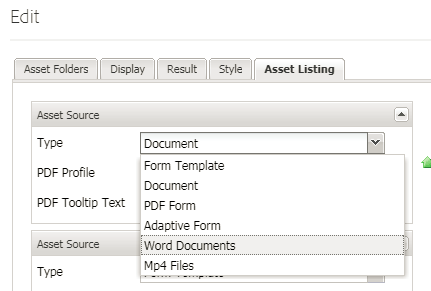

# Registrazione dei tipi di risorse personalizzate {#registering-custom-asset-types}

Abilitazione di tipi di risorse personalizzati per l&#39;elenco in AEMForms Portal

>[!NOTE]
>
>Assicurarsi di avere AEM 6.3 con SP1 e il corrispondente AEM Forms Add On  installato. Questa funzione funziona solo con  AEM Forms 6.3 SP1 e versioni successive

## Specificare il percorso di base {#specify-base-path}

Il percorso di base è il percorso del repository di livello principale che include tutte le risorse che un utente potrebbe desiderare elencare nel componente Cerca e ascolta. Se necessario, l&#39;utente può anche configurare posizioni specifiche all&#39;interno del percorso di base della finestra di dialogo di modifica del componente, in modo che la ricerca venga attivata in posizioni specifiche anziché cercare tutti i nodi all&#39;interno del percorso di base. Per impostazione predefinita, il percorso di base è utilizzato come criterio del percorso di ricerca per recuperare le risorse, a meno che l’utente non configuri un set di percorsi specifici dall’interno di tale posizione. È importante avere un valore ottimale di questo percorso per effettuare una ricerca performante. Il valore predefinito del percorso di base rimarrà uguale a **_/content/dam/formsanddocuments_**, perché tutte  risorse AEM Forms risiedono in **_/content/dam/formsanddocuments._**

Passaggi per configurare il percorso di base

1. Login a crx
1. Passare a **/libs/fd/fp/extensions/querybuilder/basepath**

1. Fare clic su &quot;Overlay Node&quot; nella barra degli strumenti
1. Verificate che il percorso della sovrapposizione sia &quot;/apps/&quot;
1. Fate clic su OK
1. Fai clic su Salva
1. Andate alla nuova struttura creata in **/apps/fd/fp/extensions/querybuilder/basepath**

1. Cambia il valore della proprietà path in **&quot;/content/dam&quot;**
1. Fai clic su Salva

Specificando la proprietà path su **&quot;/content/dam&quot;** si sta fondamentalmente impostando Base Path su /content/dam. Per verificarlo, aprite il componente Cerca e Controlla.

## Registrare i tipi di risorse personalizzate {#register-custom-asset-types}

È stata aggiunta una nuova scheda (Elenco risorse) nel componente Ricerca e Elenco. Questa scheda elenca i tipi di risorse elencati nella casella e i tipi di risorse aggiuntivi che configuri. Per impostazione predefinita, sono elencati i seguenti tipi di risorse

1. Moduli adattivi
1. Modelli per moduli
1. PDF forms
1. Documento(PDF statici)

**Passaggi per registrare il tipo di risorsa personalizzata**

1. Creare il nodo di sovrapposizione **/libs/fd/fp/extensions/querybuilder/assettypes**

1. Impostate il percorso della sovrapposizione su &quot;/apps&quot;
1. Andate alla nuova struttura creata in **/apps/fd/fp/extensions/querybuilder/assettypes **

1. In questa posizione, create un nodo &#39;nt:unstructure&#39; per il tipo da registrare, denominate il nodo **mp4files. Aggiungi le due seguenti proprietà al nodo mp4files**

   1. Aggiungete la proprietà jcr:title per specificare il nome visualizzato del tipo di risorsa. Impostate il valore di jcr:title su &quot;File Mp4&quot;.
   1. Aggiungete la proprietà &quot;type&quot; e impostatene il valore su &quot;video&quot;. Questo è il valore che usiamo nel nostro modello per elencare le risorse del tipo video. Salvare le modifiche.

1. Create un nodo di tipo &quot;nt:unstructure&quot; in mp4files. Denominate questo nodo &quot;criteri di ricerca&quot;
1. Aggiungete uno o più filtri in base ai criteri di ricerca. Supponiamo che, se l&#39;utente desidera avere un filtro di ricerca per elencare i file mp4Files il cui tipo mime è &quot;video/mp4&quot;, potete farlo qui
1. Create un nodo di tipo &quot;nt:unstructure&quot; in base ai criteri di ricerca dei nodi. Denominate questo nodo &quot;filetypes&quot;
1. Aggiungi le seguenti 2 proprietà al nodo &quot;filetypes&quot;

   1. name: ./jcr:content/metadata/dc:format
   1. value: video/mp4

1. Ciò significa che le risorse la cui proprietà dc:format è uguale a video/mp4 saranno considerate un tipo di risorsa &quot;Video Mp4&quot;. Potete utilizzare qualsiasi proprietà elencata nel nodo &quot;jcr:content/metadata&quot; per i criteri di ricerca

1. **Assicurarsi di salvare il lavoro**

Dopo aver eseguito i passaggi indicati, il nuovo tipo di risorsa (File Mp4) verrà visualizzato nell’elenco a discesa dei tipi di risorse del componente Cerca e Controlla come mostrato di seguito

[In caso di problemi durante il funzionamento, potete importare il pacchetto seguente.](assets/assettypeskt1.zip) Per il pacchetto sono definiti due tipi di risorse personalizzate. File Mp4 e documenti Worddocuments. Consigliamo di dare un&#39;occhiata a **/apps/fd/fp/extensions/querybuilder/assettypes**

[Installate il pacchetto](assets/customportalpage.zip) customPortal. Questo pacchetto contiene la pagina del portale di esempio. Questa pagina verrà utilizzata nella seconda parte dell&#39;esercitazione

