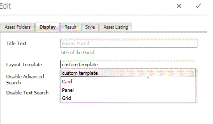

# Elenco dei tipi di risorse personalizzate in AEM Forms {#listing-custom-asset-types-in-aem-forms}

## Creazione di un modello personalizzato {#creating-custom-template}


Ai fini di questo articolo, creeremo un modello personalizzato per visualizzare i tipi di risorse personalizzate e i tipi di risorse OOTB sulla stessa pagina. Per creare un modello personalizzato segui le seguenti istruzioni

1. Crea un sling: sotto /apps. Denomina &quot; myportalcomponent &quot;
1. Aggiungi una proprietà &quot;fpContentType&quot;. Imposta il valore su &quot;**/libs/fd/ fp/formTemplate&quot;.**
1. Aggiungi una proprietà &quot;title&quot; e imposta il suo valore su &quot;modello personalizzato&quot;. Nome visualizzato nell’elenco a discesa del componente Ricerca e filtro
1. Crea un &quot;template.html&quot; sotto questa cartella. Questo file contiene il codice per personalizzare lo stile e visualizzare i vari tipi di risorse.


Il codice seguente elenca i vari tipi di risorse che utilizzano il componente Ricerca e Lister. Creiamo elementi html separati per ogni tipo di risorsa, come mostrato dal tag data-type = &quot;videos&quot; . Per il tipo di risorsa &quot;video&quot; utilizziamo il &lt;video> per riprodurre il video in linea. Per il tipo di risorsa &quot;documenti di parole&quot; utilizziamo contrassegni HTML diversi.

```html
<div class="__FP_boxes-container __FP_single-color">
   <div  data-repeatable="true">
     <div class = "__FP_boxes-thumbnail" style="float:left;margin-right:20px;" data-type = "videos">
   <video width="400" controls>
       <source src="${path}" type="video/mp4">
    </video>
         <h3 class="__FP_single-color" title="${name}" tabindex="0">${name}</h3>
     </div>
     <div class="__FP_boxes-thumbnail" style="float:left;margin-right:20px;" data-type = "worddocuments">
       <a href="/assetdetails.html${path}" target="_blank">
           
          </a>
          <h3 class="__FP_single-color" title="${name}" tabindex="0">${name}</h3>
     </div>
  <div class="__FP_boxes-thumbnail" style="float:left;margin-right:20px;" data-type = "xfaForm">
       <a href="/assetdetails.html${path}" target="_blank">
           
          </a>
          <h3 class="__FP_single-color" title="${name}" tabindex="0">${name}</h3>
                <a href="{formUrl}"></a><p>

     </div>
  <div class="__FP_boxes-thumbnail" style="float:left;margin-right:20px;" data-type = "printForm">
       <a href="/assetdetails.html${path}" target="_blank">
           
          </a>
          <h3 class="__FP_single-color" title="${name}" tabindex="0">${name}</h3>
                <a href="{pdfUrl}"></a><p>
     </div>
   </div>
</div>
```

>[!NOTE]
>
>Linea 11 - Cambiare l&#39;immagine src per puntare a un&#39;immagine scelta in DAM.
>
>Per elencare Adaptive Forms in questo modello, crea un nuovo div e imposta il suo attributo data-type su &quot;guide&quot;. È possibile copiare e incollare il div di cui data-type=&quot;printForm e impostare il tipo di dati del div appena copiato su &quot;guide&quot;

## Configura componente Ricerca E Registrazione {#configure-search-and-lister-component}

Una volta definito il modello personalizzato, dobbiamo ora associare questo modello personalizzato al componente &quot;Ricerca e filtro&quot;. Individua il browser [a questo url ](http://localhost:4502/editor.html/content/AemForms/CustomPortal.html).

Passa alla modalità Progettazione e configura il sistema paragrafo in modo da includere il componente Ricerca e tiene traccia nel gruppo di componenti consentiti. Il componente Ricerca e Registrazione fa parte del gruppo Document Services .

Passa alla modalità di modifica e aggiungi il componente Ricerca e filtro a ParSys.

Apri le proprietà di configurazione del componente &quot;Search and Lister&quot;. Assicurati che la scheda &quot;Cartelle risorse&quot; sia selezionata. Seleziona le cartelle da cui vuoi elencare le risorse nel componente Ricerca e ascoltatore . Ai fini del presente articolo, ho selezionato

* /content/dam/VideosAndWordDocuments
* /content/dam/formsanddocuments/assettypes


Passa alla scheda &quot;Visualizzazione&quot;. Qui puoi scegliere il modello per visualizzare le risorse nel componente Ricerca e Ascolto .

Seleziona &quot;modello personalizzato&quot; dal menu a discesa, come mostrato di seguito.



Configura i tipi di risorse da elencare nel portale. Per configurare i tipi di scheda della risorsa in &quot;Elenco risorse&quot; e i tipi di risorse, effettua le seguenti operazioni: In questo esempio è possibile configurare i seguenti tipi di risorse

1. File MP4
1. Documenti Word
1. Document(Questo è il tipo di risorsa OOTB)
1. Modello di modulo (tipo di risorsa OOTB)

La schermata seguente mostra i tipi di risorse configurati per l’elenco


Ora che hai configurato il componente Search and Lister Portal, è il momento di vedere il listener in azione. Individua il browser [a questo url ](http://localhost:4502/content/AemForms/CustomPortal.html?wcmmode=disabled). I risultati dovrebbero essere simili all&#39;immagine mostrata di seguito.

>[!NOTE]
>
>Se il tuo portale sta elencando tipi di risorse personalizzate su un server di pubblicazione, assicurati di concedere l&#39;autorizzazione &quot;read&quot; all&#39;utente &quot;fd-service&quot; sul nodo **/apps/fd/fp/extensions/querybuilder**


[Scarica e installa questo pacchetto utilizzando il gestore dei pacchetti.](assets/customassettypekt1.zip) Questo contiene documenti mp4 e Word di esempio e file xdp che verranno utilizzati come tipi di risorse da elencare utilizzando il componente di ricerca e ascolto
