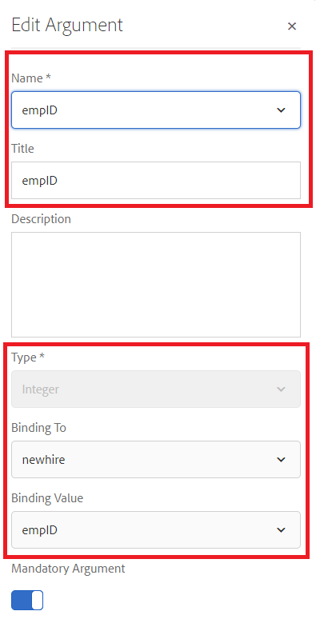

# Configurazione del modello dati del modulo

## Origine dati in pool di connessione Apache Sling

Il primo passaggio nella creazione del modello dati del modulo basato su RDBMS consiste nella configurazione dell’origine dati in pool di connessione Apache Sling. Per configurare l’origine dati, effettua le seguenti operazioni:

* Puntare il browser a [configMgr](http://localhost:4502/system/console/configMgr)
* Cerca **origine dati in pool di connessione Apache Sling**
* Aggiungi una nuova voce e fornisci i valori come mostrato nella schermata.
* 
* Salva le modifiche

>[!NOTE]
>L&#39;URI della connessione JDBC, il nome utente e la password cambieranno a seconda della configurazione del database MySQL.

## Creazione modello dati modulo

* Scegli il browser per [integrazioni dati](http://localhost:4502/aem/forms.html/content/dam/formsanddocuments-fdm)
* Fai clic su _Crea_->_Modello dati modulo_
* Fornisci nome e titolo significativi al modello dati del modulo, ad esempio **Dipendente**
* Fai clic su _Avanti_
* Seleziona l’origine dati creata nella sezione o nei forum precedenti
* Fai clic su _Crea_->Modifica per aprire il modello dati del modulo appena creato in modalità di modifica
* Espandi il nodo _forum_ per visualizzare lo schema dipendente. Espandere il nodo dipendente per visualizzare le 2 tabelle

## Aggiungere entità al modello

* Assicurarsi che il nodo dipendente sia espanso
* Seleziona le entità newhire e recipients e fai clic su _Aggiungi selezionati_

## Aggiungi servizio di lettura all&#39;entità newhire

* Seleziona entità nuova
* Fai clic su _Modifica proprietà_
* Seleziona Ottieni dall’elenco a discesa Servizio di lettura
* Fai clic sull’icona + per aggiungere il parametro al servizio GET
* Specifica i valori come mostrato nella schermata
* 
>[!NOTE]
> Il servizio get richiede un valore mappato alla colonna empID di newhire entity.Esistono diversi modi per trasmettere questo valore e in questa esercitazione l&#39;empID viene trasmesso attraverso il parametro di richiesta denominato empID.
>* Fai clic su _Fine_ per salvare gli argomenti per il servizio di recupero
>* Fai clic su _Fine_ per salvare le modifiche apportate al modello dati del modulo

## Aggiungi associazione tra 2 entità

Le associazioni definite tra le entità di database non vengono create automaticamente nel modello dati del modulo. Le associazioni tra entità devono essere definite utilizzando l’editor dei modelli di dati dei moduli. Ogni entità può avere uno o più beneficiari, è necessario definire un&#39;associazione uno-a-molti tra l&#39;entità newhire e le entità beneficiari.
I seguenti passaggi ti guideranno attraverso il processo di creazione dell’associazione uno-a-molti

* Seleziona un&#39;entità e fai clic su _Aggiungi associazione_
* Fornisci un titolo e un identificatore significativi all’associazione e alle altre proprietà, come illustrato nella schermata seguente
  

* Fai clic sull&#39;icona _modifica_ nella sezione Argomenti

* Specificate i valori come mostrato in questa schermata
* 
* **Stiamo collegando le due entità utilizzando la colonna empID dei beneficiari e delle nuove entità.**
* Fai clic su _Fine_ per salvare le modifiche

## Test del modello dati del modulo

Il nostro modello per dati modulo ora dispone del servizio **_get_** che accetta empID e restituisce i dettagli del newhire e dei relativi beneficiari. Per testare il servizio GET, segui i passaggi elencati di seguito.

* Seleziona entità nuova
* Fai clic su _Oggetto modello di test_
* Fornisci un empID valido e fai clic su _Test_
* Dovresti ottenere i risultati come mostrato nella schermata seguente
* 

## Passaggi successivi

[Ottieni empID dall’URL](./get-request-parameter.md)