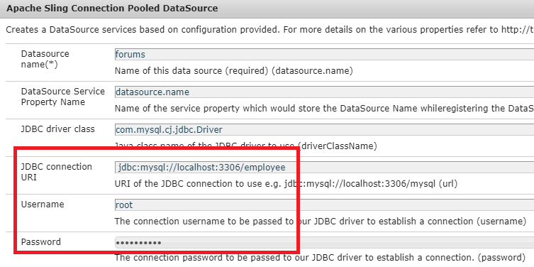

# Configurazione del modello dati del modulo

## Origine dati pool di connessione Apache Sling

Il primo passaggio nella creazione del modello dati del modulo basato su RDBMS consiste nella configurazione di Apache Sling Connection Pooled DataSource. Per configurare l&#39;origine dati, attenetevi alla procedura indicata di seguito:

* Posizionare il browser su [configMgr](http://localhost:4502/system/console/configMgr)
* Cerca **Apache Sling Connection Pooled DataSource**
* Aggiungete una nuova voce e fornite i valori come mostrato nella schermata.
* 
* Salvare le modifiche

>[!NOTE]
>L&#39;URI di connessione JDBC, il nome utente e la password cambieranno a seconda della configurazione del database MySQL.

## Creazione di un modello dati modulo

* Indirizzare il browser a Integrazioni [dati](http://localhost:4502/aem/forms.html/content/dam/formsanddocuments-fdm)
* Click _Create_->_Form Data Model_
* Fornire un nome e un titolo significativi al modello dati del modulo, ad esempio **Dipendente**
* Fai clic su _Avanti_
* Seleziona l&#39;origine dati creata nelle sezioni precedenti (forum)
* Fare clic su _Crea_->Modifica per aprire il modello dati del modulo appena creato in modalità di modifica
* Espandere il nodo _forum_ per visualizzare lo schema del dipendente. Espandi il nodo dipendente per visualizzare le 2 tabelle

## Aggiunta di entità al modello

* Assicurarsi che il nodo dipendente sia espanso
* Selezionate le entità newhire e beneficiarie e fate clic su _Aggiungi selezionati_

## Aggiungi servizio di lettura a entità nuova

* Seleziona nuova entità
* Fare clic su _Modifica proprietà_
* Selezionare Ottieni dall&#39;elenco a discesa Servizio di lettura
* Fate clic sull&#39;icona + per aggiungere il parametro al servizio get
* Specificate i valori come mostrato nello screenshot
* 
>[!NOTE]
> Il servizio get prevede un valore mappato alla colonna empID della nuova entità. Esistono diversi modi per trasmettere questo valore e in questa esercitazione l&#39;empID verrà trasmesso tramite il parametro di richiesta denominato empID.
* Fate clic su _Fine_ per salvare gli argomenti per il servizio get
* Fare clic su _Fine_ per salvare le modifiche al modello dati del modulo

## Aggiungi associazione tra 2 entità

Le associazioni definite tra le entità di database non vengono create automaticamente nel modello dati del modulo. Le associazioni tra entità devono essere definite utilizzando l&#39;editor del modello dati del modulo. Ogni nuova entità può avere uno o più beneficiari, dobbiamo definire un&#39;associazione uno-a-molti tra gli enti di nuova generazione e quelli beneficiari.
I passaggi seguenti illustrano il processo di creazione dell&#39;associazione uno-a-molti

* Selezionate la nuova entità e fate clic su _Aggiungi associazione_
* Fornire un titolo significativo e un identificatore all&#39;associazione e ad altre proprietà come mostrato nella schermata seguente
   

* Fate clic sull&#39;icona di _modifica_ nella sezione Argomenti

* Specificare i valori come mostrato nella schermata
* 
* **Stiamo collegando le due entità utilizzando la colonna empID dei beneficiari e delle entità nuove.**
* Click on _Done_ to save your changes

## Verificare il modello dati del modulo

Il nostro modello di dati del modulo ora dispone di un servizio **_get_** che accetta empID e restituisce i dettagli del nuovo e dei relativi beneficiari. Per testare il servizio get, attenetevi alla procedura indicata di seguito.

* Seleziona nuova entità
* Fare clic sull&#39;oggetto modello _di prova_
* Immetti un empID valido e fai clic su _Test_
* Dovreste ottenere risultati come mostrato nella schermata seguente
* 
