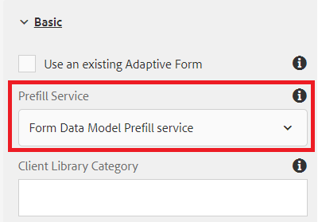

# Creare un modulo adattivo

Finora abbiamo creato quanto segue

* Database con 2 tabelle - `newhire` e `beneficiaries`
* Origine dati in pool di connessione Apache Sling configurata
* Modello dati modulo basato su RDBMS

Il passaggio successivo consiste nel creare e configurare un modulo adattivo per l’utilizzo del modello dati del modulo.  Per iniziare subito puoi: [scaricare e importare](assets/fdm-demo-af.zip) modulo di esempio. Il modulo di esempio include una sezione per visualizzare i dettagli del dipendente e un&#39;altra sezione per elencare i beneficiari del dipendente.

## Associa modulo a modello dati modulo

Il modulo di esempio fornito con questo corso non è associato ad alcun modello di dati del modulo. Per configurare il modulo per l’utilizzo del modello dati del modulo, è necessario effettuare le seguenti operazioni:

* Selezionare il modulo FDMDemo
* Fai clic su _Proprietà_->_Modello modulo_
* Seleziona modello dati modulo dall’elenco a discesa
* Cerca e seleziona il modello dati modulo creato nella lezione precedente.
* Fai clic su _Salva e chiudi_

## Configura servizio preriempimento

Il primo passaggio consiste nell’associare il servizio di precompilazione al modulo. Per associare il servizio di preriempimento, effettuare le seguenti operazioni

* Seleziona la `FDMDemo` modulo
* Clic _Modifica_ per aprire il modulo in modalità di modifica
* Seleziona Contenitore modulo nella gerarchia dei contenuti e fai clic sull’icona chiave inglese per aprire il relativo foglio delle proprietà
* Seleziona _Servizio di precompilazione modello dati modulo_ dall’elenco a discesa Servizio di precompilazione
* Fai clic su ☑ blu per salvare le modifiche

* 

## Configura dettagli dipendente

Il passaggio successivo consiste nell’associare i campi di testo del modulo adattivo agli elementi del modello dati del modulo. Dovrai aprire la finestra delle proprietà dei campi seguenti e impostarne bindRef come mostrato di seguito

| Nome campo | Associa rif |
|------------|--------------------|
| Nome | /newhire/FirstName |
| Cognome | /newhire/lastName |

>[!NOTE]
>
>Puoi aggiungere altri campi di testo e associarli agli elementi del modello dati del modulo appropriati

## Configura tabella beneficiari

Il passaggio successivo consiste nel visualizzare i beneficiari del dipendente sotto forma di tabella. Il modulo di esempio fornito contiene una tabella con 4 colonne e una singola riga. È necessario configurare la tabella in modo che aumenti a seconda del numero di beneficiari.

* Apri il modulo in modalità di modifica.
* Espandi pannello radice->beneficiari->tabella
* Selezionare Riga1 e fare clic sull&#39;icona chiave inglese per aprire la relativa finestra delle proprietà.
* Impostare il riferimento di associazione su **/newhire/GetEmployeeBeneficiaries**
* Impostare Repeat Settings (Impostazioni ripetizione) - Minimum Count (Conteggio minimo) su 1 e Maximum Count su 5.
* La configurazione Row1 deve essere simile alla schermata seguente
   
* Fai clic sul ☑ blu per salvare le modifiche

## Associa celle riga

Infine, è necessario associare le celle della riga agli elementi del modello dati del modulo.

* Espandere Pannello Radice->Beneficiari->Tabella->Riga1
* Impostare il riferimento di associazione di ogni cella di riga come indicato nella tabella seguente

| Cella riga | Riferimento bind |
|------------|----------------------------------------------|
| Nome | /newhire/GetEmployeeBeneficiaries/first name |
| Cognome | /newhire/GetEmployeeBeneficiaries/lastname |
| Relazione | /newhire/GetEmployeeBeneficiaries/relation |
| Percentuale | /newhire/GetEmployeeBeneficiaries/percentuale |

* Fai clic sul ☑ blu per salvare le modifiche

## Verifica il modulo

Ora è necessario aprire il modulo con l’empID appropriato nell’URL. I seguenti 2 collegamenti compileranno i moduli con le informazioni del database
[Modulo con empID=207](http://localhost:4502/content/dam/formsanddocuments/fdmdemo/jcr:content?wcmmode=disabled&amp;empID=207)
[Modulo con empID=208](http://localhost:4502/content/dam/formsanddocuments/fdmdemo/jcr:content?wcmmode=disabled&amp;empID=208)

## Risoluzione dei problemi

Il modulo è vuoto e non contiene dati

* Assicurati che il modello dati del modulo restituisca i risultati corretti.
* Il modulo è associato al modello dati del modulo corretto
* Verificare le associazioni dei campi
* Controllare il file di registro stdout. Dovresti visualizzare empID scritto nel file.Se non visualizzi questo valore, il modulo potrebbe non utilizzare il modello personalizzato fornito.

La tabella non è compilata

* Controlla l&#39;associazione Row1
* Verificare che le impostazioni di ripetizione per la riga 1 siano impostate correttamente (Min =1 e Max = 5 o più).
