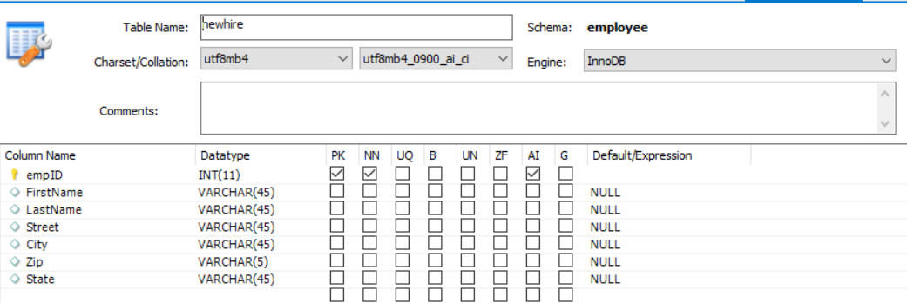

# Creare tabelle di database

Il modello dati del modulo può essere basato su origini RDBMS, RESTfull, SOAP o OData. Questo corso si concentra sulla pre-archiviazione di Moduli adattivi utilizzando il modello dati del modulo supportato dall&#39;origine dati RDBMS. Ai fini di questa esercitazione è stato utilizzato il database MYSQL. Abbiamo creato le due tabelle seguenti per illustrare il caso d’uso

* **** newhiretable - Questa tabella memorizza le informazioni necessarie

   

* **** fruibile - Consente di archiviare i nuovi beneficiari

   

È possibile importare il file [sql](assets/db-schema.sql) utilizzando MySQL workbench per creare tabelle con alcuni dati di esempio.