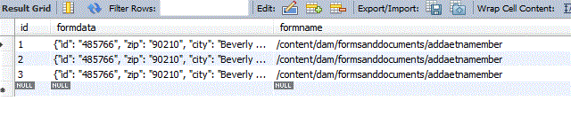

# Creare un modulo adattivo basato su uno schema JSON

Con AEM Forms 6.3 è stata introdotta la possibilità di creare Forms adattivo basato sullo schema JSON. I dettagli sulla creazione di Forms adattivo con schema JSON sono descritti in dettaglio in questo [articolo](https://experienceleague.adobe.com/docs/experience-manager-65/forms/adaptive-forms-advanced-authoring/adaptive-form-json-schema-form-model.html).

Una volta creato un modulo adattivo basato sullo schema JSON, il passaggio successivo consiste nell’archiviare i dati inviati nel database. A questo scopo utilizzeremo il nuovo tipo di dati JSON introdotto da vari fornitori di database. Ai fini di questo articolo utilizzeremo il database MySql 8 per memorizzare i dati inviati.

Database MySql 8 utilizzato per questo articolo. MySQL ha introdotto un nuovo tipo di dati denominato [JSON](https://dev.mysql.com/doc/refman/8.0/en/json.html). Questo semplifica l’archiviazione e la query degli oggetti JSON. Stiamo memorizzando i dati inviati in una colonna di tipo JSON nel nostro database.

La schermata seguente mostra i dati del modulo inviati memorizzati nel tipo di dati JSON. La colonna &quot;formdata&quot; è di tipo JSON. Abbiamo inoltre memorizzato il nome del modulo associato ai dati nel nome del modulo della colonna

>[!NOTE]
>
>Assicurati che il file di schema json sia denominato in modo appropriato. Ad esempio, deve essere denominato nel seguente formato &lt;name>schema.json. Quindi il file di schema può essere mutuo.schema.json o credit.schema.json.

[Schemi JSON di esempio che possono essere utilizzati per creare Forms adattivo.](assets/samplejsonschemas.zip). Scarica e decomprimi il file zip per ottenere gli schemi JSON
