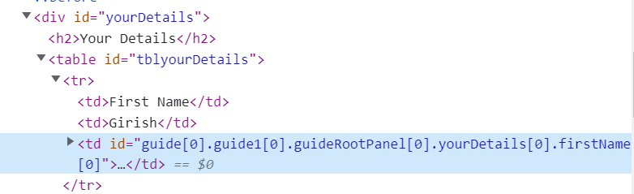

# Crea un componente per riepilogare i dati del modulo

È stato creato un componente semplice per elencare i dati del modulo per la revisione. Il [funzione di visita dell’API guidebridge](https://developer.adobe.com/experience-manager/reference-materials/6-5/forms/javascript-api/GuideBridge.html?q=visit) è stato utilizzato per eseguire iterazioni nei campi modulo. Il codice nella libreria client associato a questo componente genera i componenti pannello/tabella nel modulo. Dagli elementi secondari di questo pannello/componenti di tabella vengono estratti il titolo, il valore e l’espressione SOM dei campi modulo utilizzando i metodi API GuidBridge. Viene quindi creata una semplice tabella HTML con il titolo, il valore e l&#39;espressione SOM per consentire all&#39;utente finale di rivedere/modificare i dati del modulo prima di inviarlo.

Ad esempio, la schermata seguente mostra la tabella creata per elencare i campi e i relativi valori del **I tuoi dettagli**. L&#39;ultima TD nel TR viene utilizzata per modificare il valore del campo utilizzando l&#39;espressione SOM dei campi.

## Passaggi successivi

[Test della soluzione sul sistema locale](./deploy-on-your-system.md)
