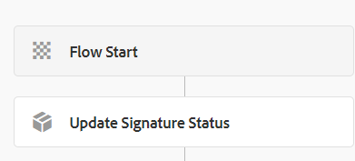

# Aggiorna lo stato della firma

Il flusso di lavoro UpdateSignatureStatus viene attivato quando l&#39;utente ha completato la cerimonia di firma. Il flusso di lavoro seguente



Aggiorna stato firma è un passaggio del processo personalizzato.
Il motivo principale per l’implementazione del passaggio del processo personalizzato è l’estensione di un flusso di lavoro AEM. Di seguito è riportato il codice personalizzato utilizzato per aggiornare lo stato della firma.
Il codice in questo passaggio del processo personalizzato fa riferimento al servizio SignMultipleForms.


```java
@Component(property = {
  Constants.SERVICE_DESCRIPTION + "=Update Signature Status in DB",
  Constants.SERVICE_VENDOR + "=Adobe Systems",
  "process.label" + "=Update Signature Status in DB"
})

public class UpdateSignatureStatusWorkflowStep implements WorkflowProcess {
  private static final Logger log = LoggerFactory.getLogger(UpdateSignatureStatusWorkflowStep.class);@Reference
  SignMultipleForms signMultipleForms;@Override
  public void execute(WorkItem workItem, WorkflowSession workflowSession, MetaDataMap args) throws WorkflowException {
    String payloadPath = workItem.getWorkflowData().getPayload().toString();
    String dataFilePath = payloadPath + "/Data.xml/jcr:content";
    Session session = workflowSession.adaptTo(Session.class);
    DocumentBuilderFactory factory = null;
    DocumentBuilder builder = null;
    Document xmlDocument = null;
    Node xmlDataNode = null;
    try {
      xmlDataNode = session.getNode(dataFilePath);
      InputStream xmlDataStream = xmlDataNode.getProperty("jcr:data").getBinary().getStream();
      factory = DocumentBuilderFactory.newInstance();
      builder = factory.newDocumentBuilder();
      xmlDocument = builder.parse(xmlDataStream);
      XPath xPath = javax.xml.xpath.XPathFactory.newInstance().newXPath();
      org.w3c.dom.Node node = (org.w3c.dom.Node) xPath.compile("/afData/afUnboundData/data/guid").evaluate(xmlDocument, javax.xml.xpath.XPathConstants.NODE);
      String guid = node.getTextContent();
      StringWriter writer = new StringWriter();
      IOUtils.copy(xmlDataStream, writer, StandardCharsets.UTF_8);
      System.out.println("After ioutils copy" + writer.toString());
      signMultipleForms.updateSignatureStatus(writer.toString(), guid);
    }
    catch(Exception e) {
      log.debug(e.getMessage());
    }

  }

}
```

## Assets

Il flusso di lavoro Aggiorna stato firma può essere [scaricato da qui](assets/update-signature-status-workflow.zip)

