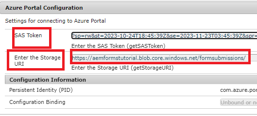

# Archivia gli invii di moduli nell’archiviazione Azure

Questo articolo illustra come effettuare chiamate REST per archiviare i dati AEM Forms inviati nell’archiviazione di Azure.
Per memorizzare i dati del modulo inviati nell’archiviazione di Azure, è necessario seguire la procedura seguente.

## Crea account di archiviazione Azure

[Accedi all’account del portale di Azure e crea un account di archiviazione](https://learn.microsoft.com/en-us/azure/storage/common/storage-account-create?tabs=azure-portal#create-a-storage-account-1). Assegnare un nome significativo all&#39;account di archiviazione, fare clic su Revisione e quindi su Crea. In questo modo viene creato l&#39;account di archiviazione con tutti i valori predefiniti. Ai fini di questo articolo abbiamo denominato il nostro account di archiviazione `aemformstutorial`.


## Crea contenitore

La prossima cosa da fare è creare un contenitore in cui memorizzare i dati provenienti dall’invio dei moduli.
Dalla pagina dell&#39;account di archiviazione, fare clic sulla voce di menu Contenitori a sinistra e creare un contenitore denominato `formssubmissions`. Assicurati che il livello di accesso pubblico sia impostato su privato


## Crea SAS sul contenitore

Per interagire con il contenitore di archiviazione Azure, verrà utilizzata la firma di accesso condiviso o il metodo SAS di autorizzazione.
Passa al contenitore nell’account di archiviazione, fai clic sui puntini di sospensione e seleziona l’opzione Genera SAS come mostrato nella schermata

Assicurarsi di specificare le autorizzazioni appropriate e la data di fine appropriata come mostrato nella schermata seguente e fare clic su Genera token SAS e URL. Copia il token SAS Blob e l’URL SAS Blob. Questi due valori verranno utilizzati per effettuare chiamate HTTP


## Fornisci il token SAS Blob e l’URI di archiviazione

Per rendere il codice più generico, le due proprietà possono essere configurate utilizzando la configurazione OSGi come mostrato di seguito. Il _**emformstutoriale**_ è il nome dell’account di archiviazione, _**moduli sottomissioni**_ è il contenitore in cui verranno memorizzati i dati.



## Crea richiesta PUT

Il passaggio successivo consiste nel creare una richiesta PUT per memorizzare i dati del modulo inviati nell’archiviazione di Azure. Ogni invio di moduli deve essere identificato da un ID BLOB univoco. L’ID BLOB univoco viene in genere creato nel codice e inserito nell’URL della richiesta PUT.
Di seguito è riportato l’URL parziale della richiesta PUT. Il `aemformstutorial` è il nome dell’account di archiviazione, formsubmissions è il contenitore in cui verranno memorizzati i dati con un ID BLOB univoco. Il resto dell’URL rimarrà invariato.
https://aemformstutorial.blob.core.windows.net/formsubmissions/blobid/sastoken Di seguito è riportata una funzione scritta per memorizzare i dati del modulo inviati nell&#39;archiviazione di Azure utilizzando una richiesta PUT. Osserva l’utilizzo del nome del contenitore e dell’UUID nell’URL. Puoi creare un servizio OSGi o un servlet Sling utilizzando il codice di esempio elencato di seguito e archiviare gli invii dei moduli nell’archiviazione di Azure.

```java
 public String saveFormDatainAzure(String formData) {
    log.debug("in SaveFormData!!!!!" + formData);
    String sasToken = azurePortalConfigurationService.getSASToken();
    String storageURI = azurePortalConfigurationService.getStorageURI();
    log.debug("The SAS Token is " + sasToken);
    log.debug("The Storage URL is " + storageURI);
    org.apache.http.impl.client.CloseableHttpClient httpClient = HttpClientBuilder.create().build();
    UUID uuid = UUID.randomUUID();
    String putRequestURL = storageURI + uuid.toString();
    putRequestURL = putRequestURL + sasToken;
    HttpPut httpPut = new HttpPut(putRequestURL);
    httpPut.addHeader("x-ms-blob-type", "BlockBlob");
    httpPut.addHeader("Content-Type", "text/plain");

    try {
        httpPut.setEntity(new StringEntity(formData));

        CloseableHttpResponse response = httpClient.execute(httpPut);
        log.debug("Response code " + response.getStatusLine().getStatusCode());
        if (response.getStatusLine().getStatusCode() == 201) {
            return uuid.toString();
        }
    } catch (IOException e) {
        log.error("Error: " + e.getMessage());
        throw new RuntimeException(e);
    }
    return null;

}
```

## Verifica dati memorizzati nel contenitore


## Testare la soluzione

* [Distribuire il bundle OSGi personalizzato](./assets/SaveAndFetchFromAzure.core-1.0.0-SNAPSHOT.jar)

* [Importa il modello di modulo adattivo personalizzato e il componente Pagina associato al modello](./assets/store-and-fetch-from-azure.zip)

* [Importare il modulo adattivo di esempio](./assets/bank-account-sample-form.zip)

* Specifica i valori appropriati nella configurazione del portale di Azure utilizzando la console di configurazione OSGi
* [Anteprima e invio del modulo BankAccount](http://localhost:4502/content/dam/formsanddocuments/azureportalstorage/bankaccount/jcr:content?wcmmode=disabled)

* Verifica che i dati siano archiviati nel contenitore di archiviazione Azure desiderato. Copia l’ID BLOB.
* [Anteprima del modulo BankAccount](http://localhost:4502/content/dam/formsanddocuments/azureportalstorage/bankaccount/jcr:content?wcmmode=disabled&amp;guid=dba8ac0b-8be6-41f2-9929-54f627a649f6) e specifica l’ID BLOB come parametro GUID nell’URL del modulo da precompilare con i dati dell’archiviazione Azure

