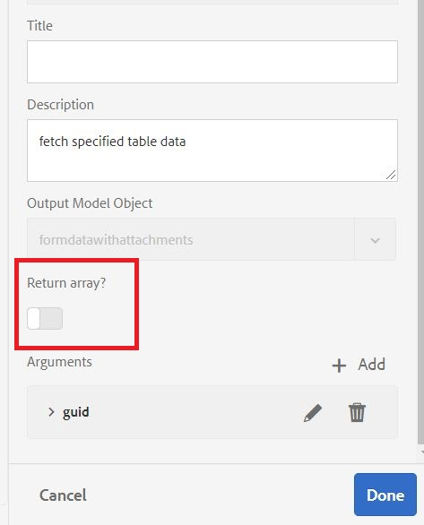

# Configura origine dati

Esistono molti modi in cui l’AEM consente l’integrazione con un database esterno. Una delle procedure più comuni e standard per l’integrazione del database è l’utilizzo delle proprietà di configurazione dell’origine dati in pool di connessione Apache Sling tramite [configMgr](http://localhost:4502/system/console/configMgr).
Il primo passaggio consiste nel scaricare e implementare la [Driver MySQL](https://mvnrepository.com/artifact/mysql/mysql-connector-java) all&#39;AEM.
Quindi, imposta le proprietà dell’origine dati in pool di connessione Sling specifiche per il database. La schermata seguente mostra le impostazioni utilizzate per questa esercitazione. Lo schema di database viene fornito come parte di queste risorse di esercitazione.

>[!NOTE]
>Assegna un nome all’origine dati `StoreAndRetrieveAfData` poiché questo è il nome utilizzato nel servizio OSGi.

| Nome proprietà | Valore proprietà |   |
|---------------------|------------------------------------------------------------------------------------|---|
| Nome origine dati | StoreAndRetrieveAfData |   |
| Classe unità JDBC | jdbc:mysql://localhost:3306/aemformstutorial |   |
| URI connessione JDBC | jdbc:mysql://localhost:3306/aemformstutorial?serverTimezone=UTC&amp;autoReconnect=true |   |
|                     |                                                                                    |   |

## Crea database

Ai fini di questo caso d’uso è stato utilizzato il seguente database. Il database ha una tabella denominata `formdatawithattachments` con le 4 colonne come mostrato nella schermata seguente.

* La colonna **afdata** conterrà i dati del modulo adattivo.
* La colonna **attachmentsInfo** conterrà le informazioni sugli allegati del modulo.
* Le colonne **phoneNumber** conterrà il numero di cellulare della persona che compila il modulo.

Creare il database importando [schema di database](assets/data-base-schema.sql)
utilizzo di MySQL Workbench.

## Crea modello dati modulo

Crea il modello dati del modulo e basalo sull’origine dati creata nel passaggio precedente.
Configurare **ottenere** servizio di questo modello di dati modulo come mostrato nella schermata seguente.
Assicurati di non restituire un array nella **ottenere** servizio.

Scopo del presente **ottenere** Il servizio deve recuperare il numero di telefono associato all&#39;id applicazione.

Questo modello di dati modulo verrà quindi utilizzato nel **ModuloAccount** per recuperare il numero di telefono associato all’id applicazione.

## Passaggi successivi

[Scrivi il codice per salvare gli allegati del modulo](./store-form-attachments.md)
