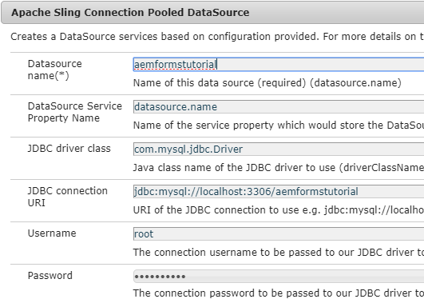

# Configura origine dati

Esistono diversi modi con cui AEM l&#39;integrazione con il database esterno. Una delle pratiche più comuni e standard dell&#39;integrazione del database è l&#39;utilizzo delle proprietà di configurazione DataSource pool di Apache Sling Connection tramite [configMgr](http://localhost:4502/system/console/configMgr).
Il primo passaggio consiste nel scaricare e distribuire i driver  My SQL appropriati in AEM.
Quindi impostare le proprietà DataSource del pool di connessioni Sling. Queste proprietà sono specifiche del database. La schermata seguente mostra le impostazioni utilizzate per questa esercitazione. Lo schema del database viene fornito come parte di questa esercitazione.

Nel database è presente una tabella denominata formdata con le 3 colonne come mostrato nella schermata sottostante
