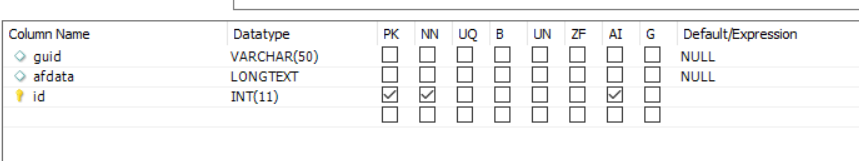

# Configurare Data Source

Esistono molti modi in cui l’AEM consente l’integrazione con il database esterno. Una delle procedure più comuni e standard per l&#39;integrazione del database consiste nell&#39;utilizzo delle proprietà di configurazione DataSource in pool di connessione Apache Sling tramite [configMgr](http://localhost:4502/system/console/configMgr).
Il primo passaggio consiste nel scaricare e distribuire i [driver MySql](https://mvnrepository.com/artifact/mysql/mysql-connector-java) appropriati in AEM.
Crea un’origine dati in pool di connessione Apache Sling e fornisci le proprietà come specificato nella schermata seguente. Lo schema di database viene fornito come parte di queste risorse di esercitazione.

Database dispone di una tabella denominata formdata con le tre colonne, come illustrato nella schermata seguente.

Il file SQL per creare lo schema può essere [scaricato da qui](assets/form-data-db.sql). Per creare lo schema e la tabella, è necessario importare il file utilizzando MySql Workbench.

>[!NOTE]
>Assicurati di denominare l&#39;origine dati **SaveAndContinue**. Il codice di esempio utilizza il nome per connettersi al database.

| Nome proprietà | Valore |
| ------------------------|---------------------------------------|
| Nome origine dati | `SaveAndContinue` |
| Classe driver JDBC | `com.mysql.cj.jdbc.Driver` |
| URI connessione JDBC | `jdbc:mysql://localhost:3306/aemformstutorial` |
