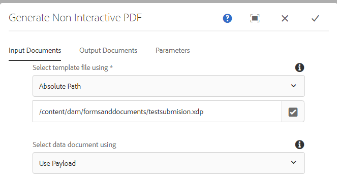

# Flusso di lavoro per rivedere e approvare il PDF inviato

L’ultimo e ultimo passaggio consiste nel creare un flusso di lavoro AEM che genererà un PDF statico o non interattivo da rivedere e approvare. Il flusso di lavoro viene attivato tramite un modulo di avvio di AEM configurato sul nodo `/content/formsubmissions`.

La schermata seguente mostra i passaggi coinvolti nel flusso di lavoro.


## Passaggio del flusso di lavoro Genera PDF non interattivo

Il modello XDP e i dati da unire con il modello sono specificati qui. I dati da unire sono i dati inviati da PDF. I dati inviati sono archiviati nel nodo ```/content/formsubmissions```



Il PDF generato è assegnato alla variabile del flusso di lavoro denominata `submittedPDF`.


### Assegna il PDF generato per la revisione e l’approvazione

Il componente Assegna flusso di lavoro attività viene utilizzato qui per assegnare il PDF generato per la revisione e l’approvazione. La variabile `submittedPDF` è utilizzata nella scheda Forms e Documenti del componente del flusso di lavoro Assegna attività.


## Passaggi successivi

[Distribuire le risorse nell’ambiente](./deploy-assets.md)
