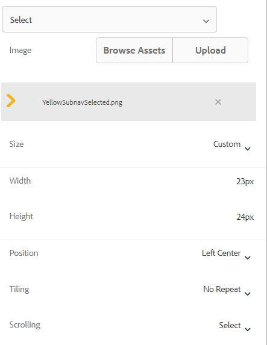

# Aggiungi icone per indicare le schede attive e completate

Se si dispone di un modulo adattivo con la barra di navigazione a sinistra, è possibile visualizzare icone per indicare lo stato della scheda. Ad esempio, desideri mostrare un’icona per indicare la scheda attiva e l’icona per indicare la scheda completata, come illustrato nella schermata seguente.

## Creare un modulo adattivo

Per creare il modulo di esempio è stato utilizzato un semplice modulo adattivo basato sul modello di base e sul tema Canvas 3.0 .
La [icone utilizzate in questo articolo](assets/icons.zip) può essere scaricato da qui.

## Personalizzare lo stile dello stato predefinito

Apri il modulo in modalità di modifica Assicurati di essere nel livello di stile e seleziona una scheda (ad esempio, scheda Generale).
Quando si apre l’editor di stili per la scheda , lo stato predefinito si trova come mostrato nella schermata sottostante

Imposta le proprietà CSS per lo stato predefinito come mostrato di seguito | Categoria | Nome proprietà | Valore proprietà | |:—|:—|:—| | Dimension e posizione | Larghezza | 50 px | | Testo | Peso font | Grassetto | | Testo | Colore | #FFF | |Testo | Altezza riga| 3 | |Testo | Allineamento testo | Sinistra | |Sfondo| Colore | #056dae |

Salva le modifiche

## Stile dello stato attivo

Assicurati di essere nello stato Attivo e di assegnare le seguenti proprietà CSS

| Categoria | Nome proprietà | Valore proprietà |
|:---|:---|:---|
| Dimension e posizione | Larghezza | 50 px |
| Testo | Spessore carattere | Grassetto |
| Testo | Colore | #FFF |
| Testo | Altezza riga | 3 |
| Testo | Allineamento testo | Sinistra |
| Sfondo | Colore | #056dae |

Assegna uno stile all’immagine di sfondo come mostrato nella schermata sottostante

Salva le modifiche.

## Personalizzare lo stile dello stato visitato

Assicurati di essere nello stato visitato e di assegnare le seguenti proprietà

| Categoria | Nome proprietà | Valore proprietà |
|:---|:---|:---|
| Dimension e posizione | Larghezza | 50 px |
| Testo | Spessore carattere | Grassetto |
| Testo | Colore | #FFF |
| Testo | Altezza riga | 3 |
| Testo | Allineamento testo | Sinistra |
| Sfondo | Colore | #056dae |

Assegna uno stile all’immagine di sfondo come mostrato nella schermata sottostante

Salva le modifiche

Visualizzare l’anteprima del modulo e verificare che le icone funzionino come previsto.
