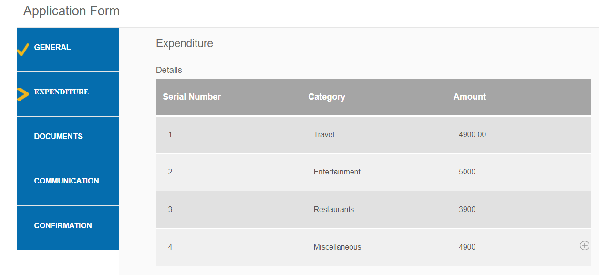

# Aggiungere icone per indicare le schede attive e completate

Se disponi di un modulo adattivo con navigazione a sinistra nella scheda, potrebbe essere utile visualizzare le icone per indicare lo stato della scheda. Ad esempio, vuoi mostrare un’icona per indicare la scheda attiva e l’icona per indicare la scheda completata come mostrato nella schermata seguente.

## Creare un modulo adattivo

Per creare il modulo di esempio è stato utilizzato un semplice modulo adattivo basato sul modello Base e sul tema Canvas 3.0.
Le [icone utilizzate in questo articolo](assets/icons.zip) possono essere scaricate da qui.

## Personalizzare lo stile dello stato predefinito

Apri il modulo in modalità di modifica
Accertatevi di trovarvi nel livello di stile e selezionate una scheda qualsiasi (ad esempio la scheda Generale).
Lo stato predefinito si trova quando apri l’editor di stili per la scheda, come illustrato nella schermata seguente

Imposta le proprietà CSS per lo stato predefinito come mostrato di seguito

| Categoria | Nome proprietà | Valore proprietà |
|:---|:---|:---|
| Dimensioni e posizione | Larghezza | 50 px |
| Testo | Spessore carattere | Grassetto |
| Testo | Colore | #FFF |
| Testo | Altezza riga | 3 |
| Testo | Allineamento testo | Sinistra |
| Esperienza pregressa | Colore | #056dae |

Salva le modifiche

## Personalizzare lo stile dello stato attivo

Assicurati di essere nello stato Attivo e di applicare lo stile alle seguenti proprietà CSS

| Categoria | Nome proprietà | Valore proprietà |
|:---|:---|:---|
| Dimensioni e posizione | Larghezza | 50 px |
| Testo | Spessore carattere | Grassetto |
| Testo | Colore | #FFF |
| Testo | Altezza riga | 3 |
| Testo | Allineamento testo | Sinistra |
| Esperienza pregressa | Colore | #056dae |

Personalizzare lo stile dell&#39;immagine di sfondo come mostrato nella schermata seguente

Salva le modifiche.

## Personalizzare lo stile dello stato visitato

Accertati di essere nello stato visitato e assegna uno stile alle seguenti proprietà

| Categoria | Nome proprietà | Valore proprietà |
|:---|:---|:---|
| Dimensioni e posizione | Larghezza | 50 px |
| Testo | Spessore carattere | Grassetto |
| Testo | Colore | #FFF |
| Testo | Altezza riga | 3 |
| Testo | Allineamento testo | Sinistra |
| Esperienza pregressa | Colore | #056dae |

Personalizzare lo stile dell&#39;immagine di sfondo come mostrato nella schermata seguente

Salva le modifiche

Visualizzare l&#39;anteprima del modulo e verificare che le icone funzionino come previsto.
