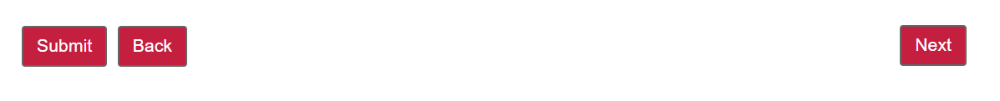

# Spazio sul pulsante della barra degli strumenti

Quando si aggiungono i pulsanti Successivo e Precedente alla barra degli strumenti in AEM Forms, per impostazione predefinita i pulsanti vengono posizionati uno accanto all&#39;altro. È possibile premere il pulsante Avanti all&#39;estrema destra della barra degli strumenti mantenendo il pulsante Indietro/Prec a sinistra

## Personalizzare lo stile della barra degli strumenti

Il caso d’uso precedente può essere facilmente realizzato utilizzando l’editor di stili. Dopo aver aggiunto il pulsante Precedente/Successivo alla barra degli strumenti, accertatevi di aver selezionato il livello Stile dal menu Modifica. Dopo aver selezionato la modalità di stile, selezionare la barra degli strumenti per aprire il relativo foglio delle proprietà di stile. Espandi la sezione Dimension e posizione e accertati di visualizzare tutte le proprietà. Imposta le seguenti proprietà
* Dimension e posizione
   * Larghezza: 100%
   * Posizione: relativa

Salva le modifiche

## Personalizzare lo stile del pulsante Avanti

Selezionare il pulsante Avanti e assicurarsi di aprire la finestra delle proprietà di stile del pulsante successivo (non il testo del pulsante successivo). Imposta le seguenti proprietà
* Dimension e posizione
   * position: absolute Top 1px Right 1px
* Bordo
   * Raggio bordo: 4px(superiore,destro,inferiore,sinistro)

Salva le modifiche
