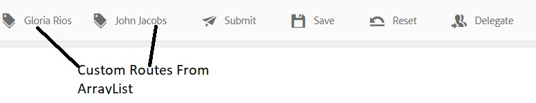

# Variabile ArrayList nel flusso di lavoro AEM

Variabili di tipo ArrayList sono state introdotte in AEM Forms 6.5. Un caso d’uso comune per l’utilizzo della variabile ArrayList consiste nel definire route personalizzate da utilizzare in AssignTask.

Per utilizzare la variabile ArrayList in un flusso di lavoro AEM, è necessario creare un modulo adattivo che generi elementi ripetuti nei dati inviati. Una pratica comune consiste nel definire uno schema contenente un elemento array. Ai fini di questo articolo, ho creato un semplice schema JSON contenente elementi di array. Il caso d’uso è quello di un dipendente che compila una nota spese. Nella nota spese vengono acquisiti il nome del responsabile dell&#39;autore della sottomissione e il nome del responsabile. I nomi dei manager vengono memorizzati in un array denominato managerchain. La schermata seguente mostra il modulo nota spese e i dati dell’invio di Adaptive Forms.


Di seguito sono riportati i dati dell’invio del modulo adattivo. Il modulo adattivo era basato su schema JSON e i dati associati allo schema vengono memorizzati nell’elemento dati dell’elemento afBoundData. Il managerchain è un array ed è necessario compilare ArrayList con l&#39;elemento name dell&#39;oggetto all&#39;interno dell&#39;array managerchain.

```json
{
    "afData": {
        "afUnboundData": {
            "data": {
                "numericbox_2762582281554154833426": 700
            }
        },
        "afBoundData": {
            "data": {
                "Employee": {
                    "Name": "Conrad Simms",
                    "Department": "IT",
                    "managerchain": [{
                        "name": "Gloria Rios"
                    }, {
                        "name": "John Jacobs"
                    }]
                },
                "expense": [{
                    "description": "Hotel",
                    "amount": 300
                }, {
                    "description": "Air Fare",
                    "amount": 400
                }]
            }
        },
        "afSubmissionInfo": {
            "computedMetaInfo": {},
            "stateOverrides": {},
            "signers": {},
            "afPath": "/content/dam/formsanddocuments/helpx/travelexpensereport",
            "afSubmissionTime": "20190402102953"
            }
        }
}
```

Per inizializzare la variabile ArrayList della stringa del sottotipo è possibile utilizzare la modalità di mappatura JSON Dot Notation o XPath. La schermata seguente mostra come popolare una variabile ArrayList denominata CustomRoutes utilizzando la notazione in punti JSON. Assicurati di puntare a un elemento in un oggetto array, come illustrato nella schermata seguente. Stiamo popolando il CustomRoutes ArrayList con i nomi dell’oggetto array managerchain.
Il componente CustomRoutes ArrayList viene quindi utilizzato per popolare i cicli di lavorazione nel componente AssignTask

Una volta inizializzata la variabile CustomRoutes ArrayList con i valori dei dati inviati, le route del componente AssignTask vengono quindi popolate utilizzando la variabile CustomRoutes. La schermata seguente mostra le route personalizzate in un oggetto AssignTask


Per testare questo flusso di lavoro sul sistema, segui i passaggi seguenti

* Scaricare e salvare il file ArrayListVariable.zip nel file system
* [Importa il file zip](assets/arraylistvariable.zip) utilizzo di Gestione pacchetti AEM
* [Aprire la maschera TravelExpenseReport](http://localhost:4502/content/dam/formsanddocuments/helpx/travelexpensereport/jcr:content?wcmmode=disabled)
* Inserire un paio di spese e i nomi dei due responsabili
* Premi il pulsante Invia
* [Apri la casella in entrata](http://localhost:4502/aem/inbox)
* Dovresti trovare una nuova attività denominata &quot;Assegna all’amministratore delle spese&quot;
* Apri il modulo associato all’attività
* Dovrebbero essere presenti due route personalizzate con i nomi del manager
  [Esplora il flusso di lavoro ReviewExpenseReportWorkflow.](http://localhost:4502/editor.html/conf/global/settings/workflow/models/ReviewExpenseReport.html) Questo flusso di lavoro utilizza la variabile ArrayList, la variabile di tipo JSON, l’editor di regole nel componente Or-Split
