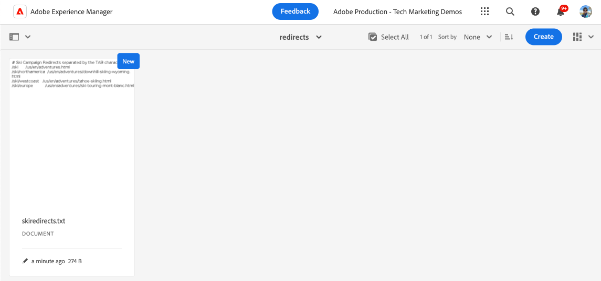

# Implementazione dei reindirizzamenti URL privi di pipeline

Scopri come implementare [reindirizzamenti URL senza pipeline](https://experienceleague.adobe.com/en/docs/experience-manager-cloud-service/content/implementing/content-delivery/pipeline-free-url-redirects) in AEM as a Cloud Service per consentire al team marketing di gestire i reindirizzamenti senza dover ricorrere a uno sviluppatore.

Esistono diverse opzioni per gestire i reindirizzamenti URL in AEM. Per ulteriori informazioni, vedi [Reindirizzamenti URL](url-redirection.md).

L&#39;esercitazione si concentra sulla creazione di reindirizzamenti URL come coppie chiave-valore in un file di testo come [Apache RewriteMap](https://httpd.apache.org/docs/2.4/rewrite/rewritemap.html) e utilizza la configurazione specifica di AEM as a Cloud Service per caricarli nel modulo Apache/Dispatcher.

## Prerequisiti

Per completare questa esercitazione, è necessario:

- Ambiente AEM as a Cloud Service con versione **18311 o successiva**.

- Il progetto [WKND Sites](https://github.com/adobe/aem-guides-wknd) di esempio deve essere distribuito su di esso.

## Caso di utilizzo del tutorial

Ai fini della demo, supponiamo che il team di marketing WKND stia lanciando una nuova campagna di sci. Vorrebbe creare brevi URL per le pagine di avventura sciistica e gestirle in modo autonomo, come nel caso di come gestiscono il contenuto. Hanno deciso di utilizzare l&#39;approccio [reindirizzamenti URL senza pipeline](https://experienceleague.adobe.com/en/docs/experience-manager-cloud-service/content/implementing/content-delivery/pipeline-free-url-redirects) per gestire i reindirizzamenti URL.

In base ai requisiti del team di marketing, di seguito sono riportati i reindirizzamenti URL da creare.

| URL SOURCE | URL destinazione |
|------------|------------|
| /ski | /us/en/adventures.html |
| /ski/northamerica | /us/en/adventures/downhill-skiing-wyoming.html |
| /ski/westcoast | /us/en/adventures/tahoe-skiing.html |
| /ski/europe | /us/en/adventures/ski-touring-mont-blanc.html |

Ora vediamo come gestire questi reindirizzamenti URL e le configurazioni Dispatcher una tantum richieste nell’ambiente AEM as a Cloud Service.

## Come gestire i reindirizzamenti URL{#manage-redirects}

Per gestire i reindirizzamenti URL sono disponibili più opzioni, esaminiamole.

### File di testo in DAM

I reindirizzamenti URL possono essere gestiti come coppie chiave-valore in un file di testo e caricati in AEM Digital Asset Management (DAM).

Ad esempio, i reindirizzamenti URL di cui sopra possono essere salvati in un file di testo denominato `skicampaign.txt` e caricati nella cartella DAM @ `/content/dam/wknd/redirects`. Dopo la revisione e l’approvazione, il team di marketing può pubblicare il file di testo.

```
# Ski Campaign Redirects separated by the TAB character
/ski      /us/en/adventures.html
/ski/northamerica  /us/en/adventures/downhill-skiing-wyoming.html
/ski/westcoast   /us/en/adventures/tahoe-skiing.html
/ski/europe          /us/en/adventures/ski-touring-mont-blanc.html
```



### ACS Commons - Gestione mappa di reindirizzamento

Il [ACS Commons - Redirect Map Manager](https://adobe-consulting-services.github.io/acs-aem-commons/features/redirect-map-manager/index.html) fornisce un&#39;interfaccia intuitiva per gestire i reindirizzamenti URL.

Ad esempio, il team marketing può creare una nuova pagina *Mappe di reindirizzamento* denominata `SkiCampaign` e aggiungere i reindirizzamenti URL precedenti utilizzando la scheda **Modifica voci**. I reindirizzamenti URL sono disponibili in `/etc/acs-commons/redirect-maps/skicampaign/jcr:content.redirectmap.txt`.


>[!IMPORTANT]
>
>Per utilizzare il gestore delle mappe di reindirizzamento è necessario disporre della versione di ACS Commons **6.7.0 o successiva**. Per ulteriori informazioni, vedere [ACS Commons - Redirect Manager](https://adobe-consulting-services.github.io/acs-aem-commons/features/redirect-manager/index.html).

### ACS Commons - Gestione reindirizzamento

In alternativa, [ACS Commons - Redirect Manager](https://adobe-consulting-services.github.io/acs-aem-commons/features/redirect-manager/index.html) fornisce anche un&#39;interfaccia intuitiva per gestire i reindirizzamenti URL.

Ad esempio, il team marketing può creare una nuova configurazione denominata `/conf/wknd` e aggiungere i reindirizzamenti URL precedenti utilizzando il pulsante **+ Configurazione reindirizzamento**. I reindirizzamenti URL sono disponibili in `/conf/wknd/settings/redirects.txt`.


>[!IMPORTANT]
>
>Per utilizzare Redirect Manager è necessario disporre della versione di ACS Commons **6.10.0 o successiva**. Per ulteriori informazioni, vedere [ACS Commons - Redirect Manager](https://adobe-consulting-services.github.io/acs-aem-commons/features/redirect-manager/subpages/rewritemap.html).

## Come configurare Dispatcher

Per caricare i reindirizzamenti URL come RewriteMap e applicarli alle richieste in ingresso, sono necessarie le seguenti configurazioni di Dispatcher.

### Abilita modulo Dispatcher per la modalità flessibile

Verificare innanzitutto che il modulo Dispatcher sia abilitato per la _modalità flessibile_. La presenza del file `USE_SOURCES_DIRECTLY` nella cartella `dispatcher/src/opt-in` indica che Dispatcher è in modalità flessibile.

### Carica reindirizzamenti URL come RewriteMap

Creare quindi un nuovo file di configurazione `managed-rewrite-maps.yaml` nella cartella `dispatcher/src/opt-in` con la seguente struttura.

```yaml
maps:
- name: <MAPNAME>.map # e.g. skicampaign.map
    path: <ABSOLUTE_PATH_TO_URL_REDIRECTS_FILE> # e.g. /content/dam/wknd/redirects/skicampaign.txt, /etc/acs-commons/redirect-maps/skicampaign/jcr:content.redirectmap.txt, /conf/wknd/settings/redirects.txt
    wait: false # Optional, default is false, when true, the Apache waits for the map to be loaded before starting
    ttl: 300 # Optional, default is 300 seconds, the reload interval for the map
```

Durante la distribuzione, Dispatcher crea il file `<MAPNAME>.map` nella cartella `/tmp/rewrites`.

>[!IMPORTANT]
>
> Il nome file (`managed-rewrite-maps.yaml`) e la posizione (`dispatcher/src/opt-in`) devono corrispondere esattamente a quanto indicato sopra. Consideralo come una convenzione da seguire.

### Applicare i reindirizzamenti URL alle richieste in ingresso

Infine, crea o aggiorna il file di configurazione di riscrittura Apache per utilizzare la mappa precedente (`<MAPNAME>.map`). Ad esempio, utilizziamo il file `rewrite.rules` della cartella `dispatcher/src/conf.d/rewrites` per applicare i reindirizzamenti URL.

```
...
# Use the RewriteMap to define the URL redirects
RewriteMap <MAPALIAS> dbm=sdbm:/tmp/rewrites/<MAPNAME>.map

RewriteCond ${<MAPALIAS>:$1} !=""
RewriteRule ^(.*)$ ${<MAPALIAS>:$1|/} [L,R=301]    
...
```

### Esempi di configurazioni

Esaminiamo le configurazioni di Dispatcher per ciascuna delle opzioni di gestione del reindirizzamento URL [sopra](#manage-redirects).

>[!BEGINTABS]

>[!TAB File di testo in DAM]

Quando i reindirizzamenti URL vengono gestiti come coppie chiave-valore in un file di testo e caricati in DAM, le configurazioni sono le seguenti.

[!BADGE dispatcher/src/opt-in/managed-rewrite-maps.yaml]{type=Neutral tooltip="Nome del file dell’esempio di codice riportato di seguito."}

```yaml
maps:
- name: skicampaign.map
  path: /content/dam/wknd/redirects/skicampaign.txt
```

[!BADGE dispatcher/src/conf.d/rewrites/rewrite.rules]{type=Neutral tooltip="Nome del file dell’esempio di codice riportato di seguito."}

```
...

# The DAM-managed skicampaign.txt file as skicampaign.map
RewriteMap skicampaign dbm=sdbm:/tmp/rewrites/skicampaign.map

# Apply the RewriteMap for matching request URIs
RewriteCond ${skicampaign:$1} !=""
RewriteRule ^(.*)$ ${skicampaign:$1|/} [L,R=301]

...
```

>[!TAB ACS Commons - Gestione mappe di reindirizzamento]

Quando i reindirizzamenti URL vengono gestiti utilizzando ACS Commons - Redirect Map Manager, le configurazioni sono le seguenti.

[!BADGE dispatcher/src/opt-in/managed-rewrite-maps.yaml]{type=Neutral tooltip="Nome del file dell’esempio di codice riportato di seguito."}

```yaml
maps:
- name: skicampaign.map
  path: /etc/acs-commons/redirect-maps/skicampaign/jcr:content.redirectmap.txt
```

[!BADGE dispatcher/src/conf.d/rewrites/rewrite.rules]{type=Neutral tooltip="Nome del file dell’esempio di codice riportato di seguito."}

```
...

# The Redirect Map Manager-managed skicampaign.map
RewriteMap skicampaign dbm=sdbm:/tmp/rewrites/skicampaign.map

# Apply the RewriteMap for matching request URIs
RewriteCond ${skicampaign:$1} !=""
RewriteRule ^(.*)$ ${skicampaign:$1|/} [L,R=301]

...
```

>[!TAB Commoni ACS - Responsabile reindirizzamento]

Quando i reindirizzamenti URL vengono gestiti utilizzando ACS Commons - Redirect Manager, le configurazioni sono le seguenti.

[!BADGE dispatcher/src/opt-in/managed-rewrite-maps.yaml]{type=Neutral tooltip="Nome del file dell’esempio di codice riportato di seguito."}

```yaml
maps:
- name: skicampaign.map
  path: /conf/wknd/settings/redirects.txt
```

[!BADGE dispatcher/src/conf.d/rewrites/rewrite.rules]{type=Neutral tooltip="Nome del file dell’esempio di codice riportato di seguito."}

```
...

# The Redirect Manager-managed skicampaign.map
RewriteMap skicampaign dbm=sdbm:/tmp/rewrites/skicampaign.map

# Apply the RewriteMap for matching request URIs
RewriteCond ${skicampaign:$1} !=""
RewriteRule ^(.*)$ ${skicampaign:$1|/} [L,R=301]

...
```

>[!ENDTABS]

## Come distribuire le configurazioni

>[!IMPORTANT]
>
>Il termine *senza pipeline* viene utilizzato per sottolineare che le configurazioni sono *distribuite una sola volta* e che il team di marketing può gestire i reindirizzamenti URL aggiornando il file di testo.

Per distribuire le configurazioni, utilizzare la pipeline [full-stack](https://experienceleague.adobe.com/en/docs/experience-manager-cloud-service/content/implementing/using-cloud-manager/cicd-pipelines/introduction-ci-cd-pipelines#full-stack-pipeline) o [configurazione a livello web](https://experienceleague.adobe.com/en/docs/experience-manager-cloud-service/content/implementing/using-cloud-manager/cicd-pipelines/introduction-ci-cd-pipelines#web-tier-config-pipelines) in [Cloud Manager](https://my.cloudmanager.adobe.com/).


Una volta completata la distribuzione, i reindirizzamenti URL sono attivi e il team marketing può gestirli senza dover ricorrere a uno sviluppatore.

## Come verificare i reindirizzamenti URL

Verifichiamo i reindirizzamenti URL utilizzando il browser o il comando `curl`. Accedere all&#39;URL `/ski/westcoast` e verificare che venga reindirizzato a `/us/en/adventures/tahoe-skiing.html`.

## Riepilogo

In questa esercitazione hai imparato a gestire i reindirizzamenti URL utilizzando configurazioni prive di pipeline nell’ambiente AEM as a Cloud Service.

Il team marketing può gestire i reindirizzamenti URL come coppie chiave-valore in un file di testo e caricarli in DAM oppure utilizzare ACS Commons - Redirect Map Manager o Redirect Manager. Le configurazioni di Dispatcher vengono aggiornate per caricare i reindirizzamenti URL come RewriteMap e applicarle alle richieste in ingresso.

## Risorse aggiuntive

- [Reindirizzamenti URL senza pipeline](https://experienceleague.adobe.com/en/docs/experience-manager-cloud-service/content/implementing/content-delivery/pipeline-free-url-redirects)
- [Reindirizzamenti URL](url-redirection.md)
