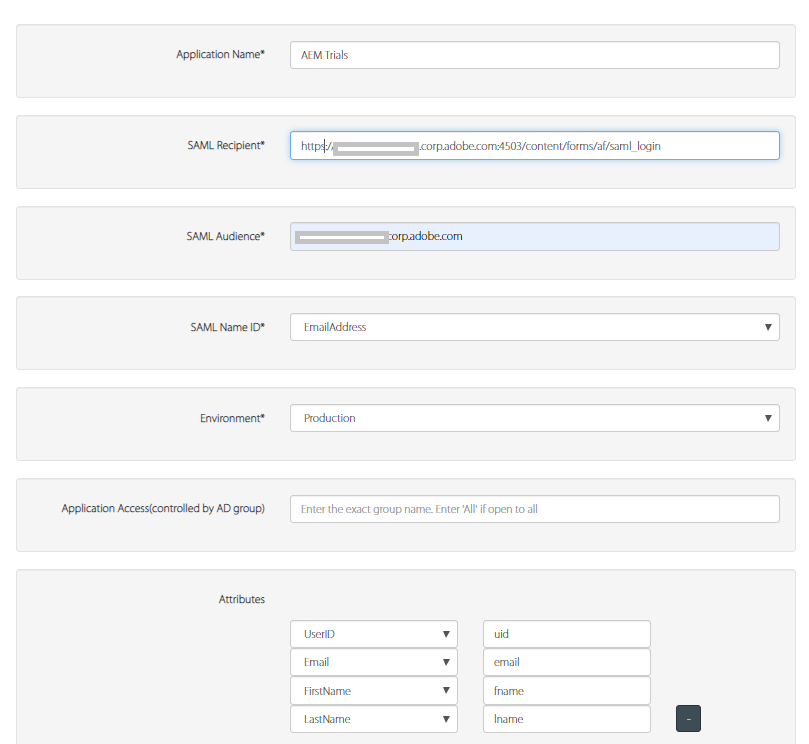

# Autenticazione per l’authoring AEM con OKTA

> Per istruzioni su come impostare OKTA con AEM as a Cloud Service, consulta [autenticazione SAML 2.0](https://experienceleague.adobe.com/docs/experience-manager-learn/cloud-service/authentication/saml-2-0.html?lang=it).

Il primo passaggio consiste nel configurare l’app sul portale OKTA. Una volta approvata l’app dall’amministratore OKTA, potrai accedere al certificato IdP e all’URL di accesso single sign-on. Di seguito sono riportate le impostazioni utilizzate in genere per la registrazione di una nuova applicazione.

* **Nome applicazione:** Questo è il nome dell&#39;applicazione. Assicurati di assegnare un nome univoco all’applicazione.
* **Destinatario SAML:** Dopo l&#39;autenticazione da OKTA, questo è l&#39;URL che verrebbe visualizzato nell&#39;istanza AEM con la risposta SAML. Il gestore di autenticazione SAML intercetta normalmente tutti gli URL con / saml_login, ma sarebbe preferibile aggiungerli dopo la radice dell’applicazione.
* **Pubblico SAML**: questo è l&#39;URL di dominio dell&#39;applicazione. Non utilizzare il protocollo (http o https) nell’URL del dominio.
* **ID nome SAML:** Selezionare Email dall&#39;elenco a discesa.
* **Ambiente**: scegli l&#39;ambiente appropriato.
* **Attributi**: questi sono gli attributi ottenuti dall&#39;utente nella risposta SAML. Specificali in base alle tue esigenze.

## Aggiungere il certificato OKTA (IdP) all’archivio fonti attendibili AEM

Poiché le asserzioni SAML sono crittografate, è necessario aggiungere il certificato IdP (OKTA) all’archivio fonti attendibili dell’AEM per consentire una comunicazione sicura tra OKTA e AEM.
[Inizializzare l&#39;archivio fonti attendibili](http://localhost:4502/libs/granite/security/content/truststore.html), se non già inizializzato.
Memorizza la password dell&#39;archivio fonti attendibili. La password dovrà essere utilizzata più avanti in questo processo.

* Passa a [Archivio attendibilità globale](http://localhost:4502/libs/granite/security/content/truststore.html).
* Fare clic su &quot;Aggiungi certificato da file CER&quot;. Aggiungi il certificato IdP fornito da OKTA e fai clic su invia.

  >[!NOTE]
  >
  >Non mappare il certificato ad alcun utente

Quando aggiungi il certificato all’archivio fonti attendibili, devi ottenere l’alias del certificato come mostrato nella schermata seguente. Il nome dell&#39;alias potrebbe essere diverso nel tuo caso.

**Prendere nota dell&#39;alias del certificato. Questo è necessario nei passaggi successivi.**

### Configura gestore autenticazione SAML

Passare a [configMgr](http://localhost:4502/system/console/configMgr).
Cerca e apri &quot;Adobe Granite SAML 2.0 Authentication Handler&quot;.
Fornisci le seguenti proprietà come specificato di seguito
Di seguito sono riportate le proprietà chiave da specificare:

* **percorso** - Percorso in cui viene attivato il gestore di autenticazione
* **Url IdP**:Questo è l&#39;URL IdP fornito da OKTA
* **Alias certificato IDP**: alias ottenuto quando si aggiunge il certificato IdP all&#39;archivio attendibilità AEM
* **ID entità provider di servizi**: questo è il nome del server AEM
* **Password dell&#39;archivio chiavi**:è la password dell&#39;archivio chiavi utilizzata
* **Reindirizzamento predefinito**: questo è l&#39;URL a cui reindirizzare in caso di autenticazione riuscita
* Attributo **UserID**:uid
* **Usa crittografia**:false
* **Crea automaticamente utenti CRX**:true
* **Aggiungi a gruppi**:true
* **Gruppi predefiniti**:oktausers(Questo è il gruppo a cui vengono aggiunti gli utenti. È possibile fornire qualsiasi gruppo esistente all’interno di AEM)
* **NamedIDPolicy**: specifica i vincoli per l&#39;identificatore del nome da utilizzare per rappresentare l&#39;oggetto richiesto. Copia e incolla la seguente stringa evidenziata **urn:oasis:names:tc:SAML:2.0:nameidformat:emailAddress**
* **Attributi sincronizzati** - Si tratta degli attributi che vengono memorizzati dall&#39;asserzione SAML nel profilo AEM

### Configurare il filtro Referrer Apache Sling

Passare a [configMgr](http://localhost:4502/system/console/configMgr).
Cerca e apri &quot;Apache Sling Referrer Filter&quot;.Imposta le seguenti proprietà come specificato di seguito:

* **Consenti vuoto**: false
* **Consenti host**: nome host IdP (nel tuo caso è diverso)
* **Consenti host Regexp**: nome host IdP (nel tuo caso è diverso)
Schermata delle proprietà di Sling Referrer Filter Referrer (Referente filtro Sling)

#### Configurare la registrazione DEBUG per l’integrazione OKTA

Quando si imposta l’integrazione OKTA su AEM, può essere utile rivedere i registri DEBUG per il gestore di autenticazione SAML dell’AEM. Per impostare il livello di registro su DEBUG, crea una nuova configurazione Sling Logger tramite la console web OSGi dell’AEM.

Ricorda di rimuovere o disattivare il logger in Stage e Production per ridurre il disturbo del registro.

Quando si imposta l’integrazione OKTA su AEM, può essere utile rivedere i registri DEBUG per il gestore di autenticazione SAML dell’AEM. Per impostare il livello di registro su DEBUG, crea una nuova configurazione Sling Logger tramite la console web OSGi dell’AEM.
**Ricorda di rimuovere o disabilitare il logger in Stage e Production per ridurre il disturbo del registro.**
* Passa a [configMgr](http://localhost:4502/system/console/configMgr)

* Cerca e apri &quot;Configurazione logger registrazione Sling Apache&quot;
* Crea un logger con la seguente configurazione:
   * **Livello registro**: debug
   * **File di registro**: logs/saml.log
   * **Logger**: com.adobe.granite.auth.saml
* Fai clic su Salva per salvare le impostazioni

#### Verifica la configurazione OKTA

Esci dall’istanza AEM. Prova ad accedere al collegamento. Dovresti vedere l’SSO OKTA in azione.
