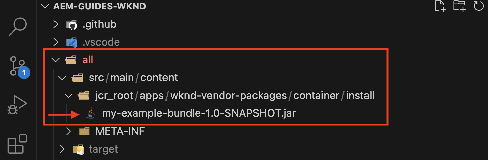

# Installare artefatti di terze parti - non disponibile nell’archivio Maven pubblico

Scopri come installare artefatti di terze parti *non disponibili nell’archivio Maven pubblico* durante la creazione e la distribuzione di un progetto AEM.

I **artefatti di terze parti** possono essere:

- [Bundle OSGi](https://www.osgi.org/resources/architecture/): un bundle OSGi è un file di archivio Java™ che contiene classi Java, risorse e un manifesto che descrive il bundle e le relative dipendenze.
- [Java jar](https://docs.oracle.com/javase/tutorial/deployment/jar/basicsindex.html): file di archivio Java™ contenente classi e risorse Java.
- [Pacchetto](https://experienceleague.adobe.com/en/docs/experience-manager-65/content/sites/administering/contentmanagement/package-manager#what-are-packages): un pacchetto è un file zip contenente il contenuto del repository nel modulo di serializzazione del file system.

## Scenario standard

In genere si installa il bundle di terze parti, pacchetto che *è disponibile* nell&#39;archivio Maven pubblico come dipendenza nel file `pom.xml` del progetto AEM.

Ad esempio:

- [AEM WCM Core Components](https://github.com/adobe/aem-core-wcm-components) **bundle** è stato aggiunto come dipendenza nel file [&#x200B; &#x200B;](https://github.com/adobe/aem-guides-wknd/blob/main/pom.xml#L747-L753) del progetto `pom.xml`WKND. In questo caso, l&#39;ambito `provided` viene utilizzato poiché il bundle dei Componenti core WCM AEM viene fornito dal runtime AEM. Se il bundle non viene fornito dal runtime di AEM, viene utilizzato l&#39;ambito `compile` che è l&#39;ambito predefinito.

- [Pacchetto &#x200B;](https://github.com/adobe/aem-guides-wknd-shared)pacchetto **condiviso WKND** aggiunto come dipendenza nel file [&#x200B; del progetto &#x200B;](https://github.com/adobe/aem-guides-wknd/blob/main/pom.xml#L767-L773)WKND`pom.xml`.


## Scenario raro

Talvolta, durante la creazione e la distribuzione di un progetto AEM, potrebbe essere necessario installare un bundle, un file jar o un pacchetto di terze parti **non disponibile** nell&#39;[archivio centrale Maven](https://mvnrepository.com/) o nell&#39;[archivio pubblico Adobe](https://repo.adobe.com/index.html).

I motivi potrebbero essere:

- Il bundle o il pacchetto è fornito da un team interno o da un fornitore di terze parti e _non è disponibile nell&#39;archivio Maven pubblico_.

- Il file Java™ jar _non è un bundle OSGi_ e potrebbe non essere disponibile nell&#39;archivio Maven pubblico.

- È necessaria una funzione non ancora rilasciata nell’ultima versione del pacchetto di terze parti disponibile nell’archivio Maven pubblico. Si è deciso di installare la versione Release o SNAPSHOT creata localmente.

## Prerequisiti

Per seguire questa esercitazione, è necessario:

- Configurazione di [ambiente di sviluppo AEM locale](https://experienceleague.adobe.com/en/docs/experience-manager-learn/cloud-service/local-development-environment-set-up/overview) o [ambiente di sviluppo rapido (RDE)](https://experienceleague.adobe.com/en/docs/experience-manager-learn/cloud-service/developing/rde/overview).

- Il [progetto AEM WKND](https://github.com/adobe/aem-guides-wknd) _per aggiungere il bundle, il file jar o il pacchetto di terze parti_ e verificare le modifiche.

## Configurazione

- Configura l’ambiente di sviluppo locale o l’ambiente RDE di AEM 6.X o AEM as a Cloud Service (AEMCS).

- Clona e implementa il progetto AEM WKND.

  ```
  $ git clone git@github.com:adobe/aem-guides-wknd.git
  $ cd aem-guides-wknd
  $ mvn clean install -PautoInstallPackage 
  ```

  Verifica che il rendering delle pagine del sito WKND sia corretto.

## Installare un bundle di terze parti in un progetto AEM{#install-third-party-bundle}

Installiamo e utilizziamo un OSGi [my-example-bundle](./assets/install-third-party-articafcts/my-example-bundle.zip) demo che _non è disponibile nell&#39;archivio Maven pubblico_ per il progetto WKND di AEM.

Il **my-example-bundle** esporta il servizio OSGi `HelloWorldService`. Il relativo metodo `sayHello()` restituisce il messaggio `Hello Earth!`.

Per ulteriori dettagli, fare riferimento al file README.md nel file [my-example-bundle.zip](./assets/install-third-party-articafcts/my-example-bundle.zip).

### Aggiungi il bundle al modulo `all`

Il primo passaggio consiste nell&#39;aggiungere `my-example-bundle` al modulo `all` del progetto WKND di AEM.

- Scarica ed estrai il file [my-example-bundle.zip](./assets/install-third-party-articafcts/my-example-bundle.zip).

- Nel modulo `all` del progetto WKND di AEM, creare la struttura di directory `all/src/main/content/jcr_root/apps/wknd-vendor-packages/container/install`. La directory `/all/src/main/content` esiste. È sufficiente creare le directory `jcr_root/apps/wknd-vendor-packages/container/install`.

- Copiare il file `my-example-bundle-1.0-SNAPSHOT.jar` dalla directory `target` estratta nella directory `all/src/main/content/jcr_root/apps/wknd-vendor-packages/container/install` precedente.

  

### Utilizza il servizio dal bundle

Utilizziamo il servizio OSGi `HelloWorldService` di `my-example-bundle` nel progetto AEM WKND.

- Nel modulo `core` del progetto WKND di AEM, crea il servlet Sling `SayHello.java` @ `core/src/main/java/com/adobe/aem/guides/wknd/core/servlet`.

  ```java
  package com.adobe.aem.guides.wknd.core.servlet;
  
  import java.io.IOException;
  
  import javax.servlet.Servlet;
  import javax.servlet.ServletException;
  
  import org.apache.sling.api.SlingHttpServletRequest;
  import org.apache.sling.api.SlingHttpServletResponse;
  import org.apache.sling.api.servlets.HttpConstants;
  import org.apache.sling.api.servlets.ServletResolverConstants;
  import org.apache.sling.api.servlets.SlingSafeMethodsServlet;
  import org.osgi.service.component.annotations.Component;
  import org.osgi.service.component.annotations.Reference;
  import com.example.services.HelloWorldService;
  
  @Component(service = Servlet.class, property = {
      ServletResolverConstants.SLING_SERVLET_PATHS + "=/bin/sayhello",
      ServletResolverConstants.SLING_SERVLET_METHODS + "=" + HttpConstants.METHOD_GET
  })
  public class SayHello extends SlingSafeMethodsServlet {
  
          private static final long serialVersionUID = 1L;
  
          // Injecting the HelloWorldService from the `my-example-bundle` bundle
          @Reference
          private HelloWorldService helloWorldService;
  
          @Override
          protected void doGet(SlingHttpServletRequest request, SlingHttpServletResponse response) throws ServletException, IOException {
              // Invoking the HelloWorldService's `sayHello` method
              response.getWriter().write("My-Example-Bundle service says: " + helloWorldService.sayHello());
          }
  }
  ```

- Nel file radice `pom.xml` del progetto AEM WKND, aggiungi `my-example-bundle` come dipendenza.

  ```xml
  ...
  <!-- My Example Bundle -->
  <dependency>
      <groupId>com.example</groupId>
      <artifactId>my-example-bundle</artifactId>
      <version>1.0-SNAPSHOT</version>
      <scope>system</scope>
      <systemPath>${maven.multiModuleProjectDirectory}/all/src/main/content/jcr_root/apps/wknd-vendor-packages/container/install/my-example-bundle-1.0-SNAPSHOT.jar</systemPath>
  </dependency>
  ...
  ```

  Qui:
   - L&#39;ambito `system` indica che la dipendenza non deve essere cercata nell&#39;archivio Maven pubblico.
   - `systemPath` è il percorso del file `my-example-bundle` nel modulo `all` del progetto WKND di AEM.
   - `${maven.multiModuleProjectDirectory}` è una proprietà Maven che punta alla directory principale del progetto con più moduli.

- Nel file `core` del modulo `core/pom.xml` del progetto WKND di AEM, aggiungi `my-example-bundle` come dipendenza.

  ```xml
  ...
  <!-- My Example Bundle -->
  <dependency>
      <groupId>com.example</groupId>
      <artifactId>my-example-bundle</artifactId>
  </dependency>
  ...
  ```

- Genera e distribuisci il progetto AEM WKND utilizzando il seguente comando:

  ```
  $ mvn clean install -PautoInstallPackage
  ```

- Verificare che il servlet `SayHello` funzioni come previsto accedendo all&#39;URL `http://localhost:4502/bin/sayhello` nel browser.

- Apporta le modifiche precedenti all’archivio del progetto AEM WKND. Verifica quindi le modifiche nell’ambiente RDE o AEM eseguendo la pipeline Cloud Manager.

  

Il ramo [tutorial/install-3rd-party-bundle](https://github.com/adobe/aem-guides-wknd/compare/main...tutorial/install-3rd-party-bundle) del progetto WKND di AEM presenta le modifiche precedenti per riferimento.

### Apprendimenti chiave{#key-learnings-bundle}

I bundle OSGi che non sono disponibili nell’archivio Maven pubblico possono essere installati in un progetto AEM seguendo questi passaggi:

- Copiare il bundle OSGi nella directory `all` del modulo `jcr_root/apps/<PROJECT-NAME>-vendor-packages/container/install`. Questo passaggio è necessario per creare un pacchetto e distribuire il bundle nell’istanza di AEM.

- Aggiorna i file `pom.xml` del modulo radice e core per aggiungere il bundle OSGi come dipendenza con l&#39;ambito `system` e `systemPath` che puntano al file del bundle. Questo passaggio è necessario per compilare il progetto.

## Installare un file jar di terze parti in un progetto AEM

In questo esempio, `my-example-jar` non è un bundle OSGi, ma un file Java JAR.

Installiamo e utilizziamo una demo [my-example-jar](./assets/install-third-party-articafcts/my-example-jar.zip) che _non è disponibile nell&#39;archivio Maven pubblico_ per il progetto WKND di AEM.

**my-example-jar** è un file Java jar che contiene una classe `MyHelloWorldService` con un metodo `sayHello()` che restituisce il messaggio `Hello World!`.

Per ulteriori dettagli, fare riferimento al file README.md nel file [my-example-jar.zip](./assets/install-third-party-articafcts/my-example-jar.zip).

### Aggiungi il file jar al modulo `all`

Il primo passaggio consiste nell&#39;aggiungere `my-example-jar` al modulo `all` del progetto WKND di AEM.

- Scarica ed estrai il file [my-example-jar.zip](./assets/install-third-party-articafcts/my-example-jar.zip).

- Nel modulo `all` del progetto WKND di AEM, creare la struttura di directory `all/resource/jar`.

- Copiare il file `my-example-jar-1.0-SNAPSHOT.jar` dalla directory `target` estratta nella directory `all/resource/jar` precedente.

  

### Utilizza il servizio dal file jar

Usiamo `MyHelloWorldService` da `my-example-jar` nel progetto WKND di AEM.

- Nel modulo `core` del progetto WKND di AEM, crea il servlet Sling `SayHello.java` @ `core/src/main/java/com/adobe/aem/guides/wknd/core/servlet`.

  ```java
  package com.adobe.aem.guides.wknd.core.servlet;
  
  import java.io.IOException;
  
  import javax.servlet.Servlet;
  import javax.servlet.ServletException;
  
  import org.apache.sling.api.SlingHttpServletRequest;
  import org.apache.sling.api.SlingHttpServletResponse;
  import org.apache.sling.api.servlets.HttpConstants;
  import org.apache.sling.api.servlets.ServletResolverConstants;
  import org.apache.sling.api.servlets.SlingSafeMethodsServlet;
  import org.osgi.service.component.annotations.Component;
  
  import com.my.example.MyHelloWorldService;
  
  @Component(service = Servlet.class, property = {
          ServletResolverConstants.SLING_SERVLET_PATHS + "=/bin/sayhello",
          ServletResolverConstants.SLING_SERVLET_METHODS + "=" + HttpConstants.METHOD_GET
  })
  public class SayHello extends SlingSafeMethodsServlet {
  
      private static final long serialVersionUID = 1L;
  
      @Override
      protected void doGet(SlingHttpServletRequest request, SlingHttpServletResponse response)
              throws ServletException, IOException {
  
          // Creating an instance of MyHelloWorldService
          MyHelloWorldService myHelloWorldService = new MyHelloWorldService();
  
          // Invoking the MyHelloWorldService's `sayHello` method
          response.getWriter().write("My-Example-JAR service says: " + myHelloWorldService.sayHello());
      }
  }    
  ```

- Nel file radice `pom.xml` del progetto AEM WKND, aggiungi `my-example-jar` come dipendenza.

  ```xml
  ...
  <!-- My Example JAR -->
  <dependency>
      <groupId>com.my.example</groupId>
      <artifactId>my-example-jar</artifactId>
      <version>1.0-SNAPSHOT</version>
      <scope>system</scope>
      <systemPath>${maven.multiModuleProjectDirectory}/all/resource/jar/my-example-jar-1.0-SNAPSHOT.jar</systemPath>
  </dependency>            
  ...
  ```

  Qui:
   - L&#39;ambito `system` indica che la dipendenza non deve essere cercata nell&#39;archivio Maven pubblico.
   - `systemPath` è il percorso del file `my-example-jar` nel modulo `all` del progetto WKND di AEM.
   - `${maven.multiModuleProjectDirectory}` è una proprietà Maven che punta alla directory principale del progetto con più moduli.

- Nel file `core` del modulo `core/pom.xml` del progetto WKND di AEM, apporta due modifiche:

   - Aggiungi `my-example-jar` come dipendenza.

     ```xml
     ...
     <!-- My Example JAR -->
     <dependency>
         <groupId>com.my.example</groupId>
         <artifactId>my-example-jar</artifactId>
     </dependency>
     ...
     ```

   - Aggiorna la configurazione `bnd-maven-plugin` per includere `my-example-jar` nel bundle OSGi (aem-guides-wknd.core) in fase di generazione.

     ```xml
     ...
     <plugin>
         <groupId>biz.aQute.bnd</groupId>
         <artifactId>bnd-maven-plugin</artifactId>
         <executions>
             <execution>
                 <id>bnd-process</id>
                 <goals>
                     <goal>bnd-process</goal>
                 </goals>
                 <configuration>
                     <bnd><![CDATA[
                 Import-Package: javax.annotation;version=0.0.0,*
                 <!-- Include the 3rd party jar as inline resource-->
                 -includeresource: \
                 lib/my-example-jar.jar=my-example-jar-1.0-SNAPSHOT.jar;lib:=true
                         ]]></bnd>
                 </configuration>
             </execution>
         </executions>
     </plugin>        
     ...
     ```

- Genera e distribuisci il progetto AEM WKND utilizzando il seguente comando:

  ```
  $ mvn clean install -PautoInstallPackage
  ```

- Verificare che il servlet `SayHello` funzioni come previsto accedendo all&#39;URL `http://localhost:4502/bin/sayhello` nel browser.

- Apporta le modifiche precedenti all’archivio del progetto AEM WKND. Verifica quindi le modifiche nell’ambiente RDE o AEM eseguendo la pipeline Cloud Manager.

  

Il ramo [tutorial/install-3rd-party-jar](https://github.com/adobe/aem-guides-wknd/compare/main...tutorial/install-3rd-party-jar) del progetto AEM WKND presenta le modifiche precedenti per riferimento.

Negli scenari in cui il file Java jar _è disponibile nell&#39;archivio Maven pubblico ma NON è un bundle OSGi_, puoi seguire i passaggi precedenti eccetto l&#39;ambito `<dependency>` di `system` e gli elementi `systemPath` non sono necessari.

### Apprendimenti chiave{#key-learnings-jar}

I Java JAR che non sono bundle OSGi e che possono essere o meno disponibili nell’archivio Maven pubblico possono essere installati in un progetto AEM seguendo questi passaggi:

- Aggiorna la configurazione `bnd-maven-plugin` nel file `pom.xml` del modulo core per includere il file jar Java come risorsa in linea nel bundle OSGi in fase di generazione.

I passaggi seguenti sono necessari solo se Java jar non è disponibile nell’archivio Maven pubblico:

- Copiare il file jar Java nella directory `all` del modulo `resource/jar`.

- Aggiorna i file `pom.xml` del modulo radice e core per aggiungere il file Java jar come dipendenza con l&#39;ambito `system` e `systemPath` che punta al file jar.

## Installare un pacchetto di terze parti in un progetto AEM

Installiamo la versione [ACS AEM Commons](https://adobe-consulting-services.github.io/acs-aem-commons/) _SNAPSHOT_ generata localmente dal ramo principale.

Questa operazione viene eseguita solo per illustrare i passaggi necessari per installare un pacchetto AEM non disponibile nell’archivio Maven pubblico.

Il pacchetto ACS AEM Commons è disponibile nell’archivio Maven pubblico. Fai riferimento a [Aggiungi ACS AEM Commons al tuo progetto AEM Maven](https://adobe-consulting-services.github.io/acs-aem-commons/pages/maven.html) per aggiungerlo al tuo progetto AEM.

### Aggiungi il pacchetto al modulo `all`

Il primo passaggio consiste nell&#39;aggiungere il pacchetto al modulo `all` del progetto WKND di AEM.

- Commenta o rimuovi la dipendenza di rilascio ACS AEM Commons dal file POM. Fai riferimento a [Aggiungi ACS AEM Commons al tuo progetto AEM Maven](https://adobe-consulting-services.github.io/acs-aem-commons/pages/maven.html) per identificare la dipendenza.

- Clona il ramo `master` dell&#39;archivio [ACS AEM Commons](https://github.com/Adobe-Consulting-Services/acs-aem-commons) nel computer locale.

- Crea la versione SNAPSHOT di ACS AEM Commons utilizzando il seguente comando:

  ```
  $mvn clean install
  ```

- Il pacchetto generato localmente si trova in `all/target`, sono presenti due file .zip, uno che termina con `-cloud` è destinato ad AEM as a Cloud Service e l&#39;altro è per AEM 6.X.

- Nel modulo `all` del progetto WKND di AEM, creare la struttura di directory `all/src/main/content/jcr_root/apps/wknd-vendor-packages/container/install`. La directory `/all/src/main/content` esiste. È sufficiente creare le directory `jcr_root/apps/wknd-vendor-packages/container/install`.

- Copiare il file del pacchetto creato localmente (zip) nella directory `/all/src/main/content/jcr_root/apps/mysite-vendor-packages/container/install`.

- Genera e distribuisci il progetto AEM WKND utilizzando il seguente comando:

  ```
  $ mvn clean install -PautoInstallPackage
  ```

- Verifica il pacchetto ACS AEM Commons installato:

   - Gestione pacchetti CRX alle `http://localhost:4502/crx/packmgr/index.jsp`

     

   - La console OSGi alle `http://localhost:4502/system/console/bundles`

     

- Apporta le modifiche precedenti all’archivio del progetto AEM WKND. Verifica quindi le modifiche nell’ambiente RDE o AEM eseguendo la pipeline Cloud Manager.

### Apprendimenti chiave{#key-learnings-package}

I pacchetti AEM che non sono disponibili nell’archivio Maven pubblico possono essere installati in un progetto AEM seguendo questi passaggi:

- Copiare il pacchetto nella directory `all` del modulo `jcr_root/apps/<PROJECT-NAME>-vendor-packages/container/install`. Questo passaggio è necessario per creare un pacchetto e distribuirlo all’istanza di AEM.


## Riepilogo

In questa esercitazione hai imparato a installare artefatti di terze parti (bundle, Java Jar e pacchetto) che non sono disponibili nell’archivio Maven pubblico durante la creazione e la distribuzione di un progetto AEM.
